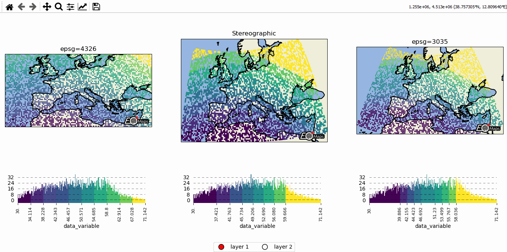
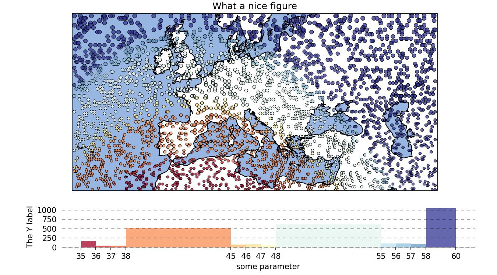

.. include:: substitutions.rst

🌐 EOmaps examples
==================

... a collection of examples that show how to create beautiful interactive maps.

🐣 Quickly visualize your data
------------------------------

There are 3 basic steps required to visualize your data:

1. Initialize a Maps-object with ``m = Maps()``
2. Set the data and its specifications via ``m.set_data`` (or ``m.set_data_specs``)
3. Call ``m.plot_map()`` to generate the map!

|toggleStart|

.. code-block:: python

    from eomaps import Maps
    import pandas as pd
    import numpy as np

    # ----------- create some example-data
    lon, lat = np.meshgrid(np.arange(-20, 40, .25), np.arange(30, 60, .25))
    data = pd.DataFrame(dict(lon=lon.flat, lat=lat.flat, data_variable=np.sqrt(lon**2 + lat**2).flat))
    data = data.sample(15000) # take 15000 random datapoints from the dataset
    # ------------------------------------

    m = Maps()
    m.set_data(data = data,               # a pandas-DataFrame holding the data & coordinates
               parameter="data_variable", # the DataFrame-column you want to plot
               xcoord="lon",              # the name of the DataFrame-column representing the x-coordinates
               ycoord="lat",              # the name of the DataFrame-column representing the y-coordinates
               crs=4326)                  # the coordinate-system of the x- and y- coordinates

    m.plot_map()
    m.cb.pick.attach.annotate()  # attach a basic pick-annotation (on left-click)

|toggleEnd|

.. image:: _static/fig1.gif

.. raw:: html

   

🌍 Data-classification and multiple Maps in one figure
------------------------------------------------------

-  Create grids of maps via ``MapsGrid``
-  | Classify your data via ``m.set_classify_specs(scheme, **kwargs)``
   | (using classifiers provided by the ``mapclassify`` module)
-  | Add individual callback functions to each subplot via
   | ``m.cb.click.attach``, ``m.cb.pick.attach``
-  | Share events between Maps-objects of the MapsGrid via
   | ``mg.share_click_events()`` and ``mg.share_pick_events()``

|toggleStart|

.. code-block:: python

    from eomaps import MapsGrid, Maps
    import pandas as pd
    import numpy as np

    # ----------- create some example-data
    lon, lat = np.meshgrid(np.arange(-20, 40, .5), np.arange(30, 60, .5))
    data = pd.DataFrame(dict(lon=lon.flat, lat=lat.flat, data_variable=np.sqrt(lon**2 + lat**2).flat))
    data = data.sample(4000) # take 4000 random datapoints from the dataset
    # ------------------------------------

    mg = MapsGrid(1, 3)  # initialize a grid of Maps objects
    # set the data on ALL maps-objects of the grid
    mg.set_data(data=data, xcoord="lon", ycoord="lat", in_crs=4326)

    # --------- set specs for the first axes
    mg.m_0_0.set_plot_specs(crs=4326, title="epsg=4326")
    mg.m_0_0.set_classify_specs(scheme="EqualInterval", k=10)

    # --------- set specs for the second axes
    mg.m_0_1.set_plot_specs(crs=Maps.crs_list.Stereographic(), title="Stereographic")
    mg.m_0_1.set_shape.rectangles()
    mg.m_0_1.set_classify_specs(scheme="Quantiles", k=4)

    # --------- set specs for the third axes
    mg.m_0_2.set_plot_specs(crs=3035, title="epsg=3035")
    mg.m_0_2.set_classify_specs(scheme="StdMean", multiples=[-1, -.75, -.5, -.25, .25, .5, .75, 1])

    # --------- plot all maps and rotate the ticks of the colorbar
    for m in mg:
        m.plot_map()
        m.figure.ax_cb.tick_params(rotation=90, labelsize=8)

    # --------- set figsize and use a "tight_layout"
    mg.f.set_figheight(5)
    mg.f.tight_layout()

    # --------- add some callbacks to indicate the clicked data-point to all maps
    for m in mg:
        m.cb.pick.attach.mark(fc="r", ec="none", buffer=1, permanent=True, shape=m.shape.name)
        m.cb.pick.attach.mark(fc="none", ec="r", lw=1, buffer=5, permanent=True, shape=m.shape.name)

        m.cb.click.attach.mark(fc="none", ec="k", lw=2, buffer=10, permanent=False, shape=m.shape.name)

    # add a specific annotation-callback to the second map
    # (put it on a layer > 10 (the default for markers) so that it appears above the markers)
    mg.m_0_1.cb.pick.attach.annotate(layer=11, text="the closest point is here!")

    # share click & pick-events between all Maps-objects of the MapsGrid
    mg.share_click_events()
    mg.share_pick_events()

|toggleEnd|

🗺 Customize the appearance of the plot
---------------------------------------

-  use ``m.set_plot_specs()`` to set the general appearance of the plot
-  after creating the plot, you can access individual objects via ``m.figure.<...>`` … most importantly:

   -  ``f`` : the matplotlib figure
   -  ``ax``, ``ax_cb``, ``ax_cb_plot`` : the axes used for plotting the map, colorbar and histogram
   -  ``gridspec``, ``cb_gridspec`` : the matplotlib GridSpec instances for the plot and the colorbar
   -  ``coll`` : the collection representing the data on the map

|toggleStart|

.. code-block:: python

    from eomaps import Maps
    import pandas as pd
    import numpy as np

    # ----------- create some example-data
    lon, lat = np.meshgrid(np.arange(-30, 60, .25), np.arange(30, 60, .3))
    data = pd.DataFrame(dict(lon=lon.flat, lat=lat.flat, data_variable=np.sqrt(lon**2 + lat**2).flat))
    data = data.sample(3000) # take 3000 random datapoints from the dataset
    # ------------------------------------

    m = Maps()
    m.set_data(data=data, xcoord="lon", ycoord="lat", in_crs=4326)

    # --------- set the appearance of the plot
    m.set_plot_specs(
        label="some parameter",      # set the label of the colorbar
        title="What a nice figure",  # set the title of the figure
        cmap="RdYlBu",               # set the colormap
        crs=3857,                    # plot the map in a pseudo-mercator (epsg3857) projection
        histbins="bins",             # use the histogram-bins as set by the classification scheme
        vmin=35,                     # set all values below vmin to vmin
        vmax=60,                     # set all values above vmax to vmax
        cpos="c",                    # the pixel-coordinates represent the "center-position"
        cpos_radius=None,             # radius (in in_crs) to shift the center-position if "cpos" is not "c"
        alpha=.75,                   # add some transparency
        density=True,                # make the histogram values represent the "probability-density"
    )

    m.set_shape.geod_circles(radius=30000)  # plot geodesic-circles with 30 km radius

    # set the classification scheme that should be applied to the data
    m.set_classify_specs(scheme="UserDefined",
                         bins=[35, 36, 37, 38, 45, 46, 47, 48, 55, 56, 57, 58])

    m.plot_map(edgecolor="k", linewidth=0.5) # pass some additional arguments to the plotted collection

    # ------------------ change the appearance of the figure
    m.figure.f.set_figwidth(9)    # set figure width
    m.figure.f.set_figheight(5)   # set figure height
    _ = m.figure.ax_cb_plot.set_ylabel("The Y label")    # add a y-label to the histogram

    m.figure.gridspec.update(bottom=0.1, top=.95, left=0.075, right=.95, hspace=0.2)  # adjust the padding
    m.figure.set_colorbar_position(pos=[0.125, 0.1 , .83, .15], ratio=999) # manually re-position the colorbar

|toggleEnd|

🛸 Turn your plot into a powerful data-analysis tool
----------------------------------------------------

-  **Callback functions** can easily be attached to the plot to turn it
   into an interactive plot-widget!

   - | there’s a nice list of (customizeable) pre-defined callbacks accessible via:
     | ``m.cb.click``, ``m.cb.pick``, ``m.cb.keypress`` and ``m.cb.dynamic``

      -  use ``annotate`` (and ``clear_annotations``) to create text-annotations
      -  use ``mark`` (and ``clear_markers``) to add markers
      -  use ``peek_layer`` (and ``switch_layer``) to compare multiple layers of data
      -  ... and many more: ``plot``, ``print_to_console``, ``get_values``, ``load`` ...

   -  | ... but you can also define a custom one and connect it via
      | ``m.cb.click.attach(<my custom function>)`` (works also with ``pick`` and ``keypress``)!

|toggleStart|

.. code-block:: python

    from eomaps import Maps
    import pandas as pd
    import numpy as np

    # create some data
    #lon, lat = np.mgrid[-20:40, 30:60]
    lon, lat = np.meshgrid(np.linspace(-20,40, 50),
                           np.linspace(30,60, 50))

    data = pd.DataFrame(dict(lon=lon.flat, lat=lat.flat, data=np.sqrt(lon**2 + lat**2).flat))

    # --------- initialize a Maps object and plot a basic map
    m = Maps()
    m.set_data(data = data, xcoord="lon", ycoord="lat", in_crs=4326)
    m.set_plot_specs(plot_crs=3035,
                      title="A clickable widget!",
                      histbins="bins")
    m.set_shape.rectangles()
    m.set_classify_specs(scheme="EqualInterval", k=5)
    m.plot_map()
    m.figure.f.set_figheight(8)

    # --------- attach pre-defined CALLBACK funcitons ---------

    ### add a temporary annotation and a marker if you left-click on a pixel
    m.cb.pick.attach.mark(button=1, permanent=False, fc=[0,0,0,.5], ec="w", ls="--", buffer=2.5, shape="ellipses", layer=1)
    m.cb.pick.attach.annotate(button=1, permanent=False, bbox=dict(boxstyle="round", fc="w", alpha=0.75), layer=10)
    ### save all picked values to a dict accessible via m.cb.get.picked_vals
    cid = m.cb.pick.attach.get_values(button=1)

    ### add a permanent marker if you right-click on a pixel
    m.cb.pick.attach.mark(button=3, permanent=True, facecolor=[1, 0,0,.5], edgecolor="k", buffer=1, shape="rectangles", layer=1)

    ### add a customized permanent annotation if you right-click on a pixel
    def text(m, ID, val, pos, ind):
        return f"ID={ID}"
    cid = m.cb.pick.attach.annotate(button=3, permanent=True, bbox=dict(boxstyle="round", fc="r"), text=text, xytext=(10, 10),
                                layer=9, # put the permanent annotations on a layer below the temporary annotations
                                )

    ### remove all permanent markers and annotations if you middle-click anywhere on the map
    cid = m.cb.pick.attach.clear_annotations(button=2)
    cid = m.cb.pick.attach.clear_markers(button=2)

    # --------- define a custom callback to update some text to the map
    txt = m.figure.f.text(.5, .35, "You clicked on 0 pixels so far",
                          fontsize=15, horizontalalignment="center",
                          verticalalignment="top",
                          color="w", fontweight="bold", animated=True)
    txt2 = m.figure.f.text(.18, .9, "   lon    /    lat " + "\n",
                          fontsize=12, horizontalalignment="right",
                          verticalalignment="top",
                          fontweight="bold", animated=True)

    # add the custom text objects to the blit-manager (m.BM) to avoid re-drawing the whole
    # image if the text changes. (use a high layer number to draw the texts above all other things)
    m.BM.add_artist(txt, layer=20)
    m.BM.add_artist(txt2, layer=20)

    def cb1(self, pos, ID, val, **kwargs):
        # update the text that indicates how many pixels we've clicked
        nvals = len(self.cb.pick.get.picked_vals['ID'])
        txt.set_text(f"You clicked on {nvals} pixel" +
                      ("s" if nvals > 1 else "") +
                      "!\n... and the " +
                      ("average" if nvals > 1 else "") +
                      f"value is {np.mean(self.cb.pick.get.picked_vals['val']):.3f}")

        # update the list of lon/lat coordinates on the top left of the figure
        d = self.data.loc[ID]
        lonlat_list = txt2.get_text().splitlines()
        if len(lonlat_list) > 10:
            lonlat_txt = lonlat_list[0] + "\n" + "\n".join(lonlat_list[-10:]) + "\n"
        else:
            lonlat_txt = txt2.get_text()
        txt2.set_text(lonlat_txt + f"{d['lon']:.2f}  /  {d['lat']:.2f}" + "\n")

    cid = m.cb.pick.attach(cb1, button=1)

    def cb2(self, pos, ID, val, **kwargs):
        # plot a marker at the pixel-position
        l, = self.figure.ax.plot(*pos, marker="*", animated=True)
        # print the value at the pixel-position
        t = self.figure.ax.text(pos[0], pos[1]-150000, f"{val:.2f}", horizontalalignment="center", verticalalignment="bottom", color=l.get_color(), animated=True)
        # add the artists to the Blit-Manager (m.BM) to avoid triggering a re-draw of the whole figure each time the callback triggers

        # use layer=11 to make sure the marker is drawn ABOVE the temporary annotations (by default drawn on layer 10)
        self.BM.add_artist(l, layer=11)
        # use layer=1 to draw the text BELOW the annotations
        self.BM.add_artist(t, layer=1)
    cid = m.cb.pick.attach(cb2, button=3)

    # add some static text
    _ = m.figure.f.text(.7, .85, "Left-click: temporary annotations\nRight-click: permanent annotations\nMiddle-click: clear permanent annotations",
                         fontsize=10, horizontalalignment="left",
                         verticalalignment="top",
                         color="k", fontweight="bold")

    m.cb.click.attach.mark(fc="r", ec="none", radius=10000, shape="geod_circles", permanent=False)
    m.cb.click.attach.mark(fc="none", ec="r", radius=50000, shape="geod_circles", permanent=False)

|toggleEnd|

.. image:: _static/fig4.gif

🌲 🏡🌳 Add overlays and indicators
-----------------------------------

(… plot-generation might take a bit longer since overlays need to be downloaded first!)

- add basic overlays with `m.add_overlay`
- add static annotations / markers with `m.add_annotation` and `m.add_marker`
- use “connected” Maps-objects to get multiple interactive data-layers!

|toggleStart|

.. code-block:: python

    from eomaps import Maps
    import pandas as pd
    import numpy as np
    import matplotlib.pyplot as plt

    # create some data
    lon, lat = np.meshgrid(np.linspace(-20,40, 100),
                           np.linspace(30,60, 100))
    data = pd.DataFrame(dict(lon=lon.flat, lat=lat.flat, param=(((lon - lon.mean())**2 - (lat - lat.mean())**2)).flat))
    data_OK = data[data.param >= 0]
    data_OK.var = np.sqrt(data_OK.param)
    data_mask = data[data.param < 0]

    # --------- initialize a Maps object and plot a basic map
    m = Maps()
    m.set_data(data = data_OK, xcoord="lon", ycoord="lat", in_crs=4326)
    m.set_plot_specs(crs=m.crs_list.Orthographic(),
                     title="Wooohoo, a flashy map-widget with static indicators!",
                     histbins=200,
                     cmap="Spectral_r")
    m.set_shape.rectangles(mesh=True)
    m.set_classify_specs(scheme="Quantiles", k=10)

    m.plot_map()
    m.figure.f.set_figheight(7)

    # ... add a basic "annotate" callback
    cid = m.cb.click.attach.annotate(bbox=dict(alpha=0.75), color="w")

    # --------- add another layer of data to indicate the values in the masked area
    #           (copy all defined specs but the classification)
    m2 = m.copy(connect=True, copy_classify_specs=False)
    m2.data_specs.data = data_mask
    m2.set_shape.rectangles(mesh=False)
    m2.plot_specs.cmap="magma"
    m2.plot_map()

    # --------- add another layer with data that is dynamically updated if we click on the masked area
    m3 = m.copy(connect=True, copy_classify_specs=False)
    m3.data_specs.data = data_OK.sample(1000)
    m3.set_shape.ellipses(radius=25000, radius_crs=3857)
    m3.set_plot_specs(cmap="gist_ncar")
    # plot the map and assign a "dynamic_layer_idx" to allow dynamic updates of the collection
    m3.plot_map(edgecolor="w", linewidth=0.25, layer=10, dynamic=True)

    # --------- define a callback that will change the position and data-values of the additional layer
    def callback(self, **kwargs):
        selection = np.random.randint(0, len(m3.data), 1000)
        m3.figure.coll.set_array(data_OK.param.iloc[selection])

    # attach the callback to the second Maps object such that it triggers when we click on the masked-area
    m2.cb.click.attach(callback)

    # --------- add some basic overlays from NaturalEarth
    m.add_overlay(dataspec=dict(resolution='10m',
                                category='physical',
                                name='lakes'),
                  styledict=dict(ec="none", fc="b"))
    m.add_overlay(dataspec=dict(resolution='10m',
                                category='cultural',
                                name='admin_0_countries'),
                  styledict=dict(ec=".75", fc="none", lw=0.5))
    m.add_overlay(dataspec=dict(resolution='10m',
                                category='cultural',
                                name='urban_areas'),
                  styledict=dict(ec="none", fc="r"))
    m.add_overlay(dataspec=dict(resolution='10m',
                                category='physical',
                                name='rivers_lake_centerlines'),
                  styledict=dict(ec="b", fc="none", lw=0.25))

    # --------- add a customized legend for the overlays
    m.add_overlay_legend(ncol=2, loc="lower center", facecolor="w", framealpha=1,
                         update_hl={"admin_0_countries":       [plt.Line2D([], [], c=".75"), "Country boarders"],
                                    "rivers_lake_centerlines": [plt.Line2D([], [], c="b", alpha=0.5), "Rivers"],
                                    "lakes":                   [None, "Lakes"],
                                    "urban_areas":             [None, "Urban Areas"]},
                         sort_order=["lakes", "rivers_lake_centerlines", "urban_areas", "admin_0_countries"])

    # --------- add some fancy (static) indicators for selected pixels
    mark_id = 6060
    for buffer in np.linspace(1, 5, 10):
        m.add_marker(ID=mark_id, shape="ellipses", radius="pixel", fc=[1,0,0,.1], ec="r", buffer=buffer*5)
    m.add_marker(ID=mark_id, shape="rectangles", radius="pixel", fc="g", ec="y", buffer=3, alpha=0.5)
    m.add_marker(ID=mark_id, shape="ellipses", radius="pixel", fc="k", ec="none", buffer=.2)
    m.add_annotation(ID=mark_id, text=f"Here's Vienna!\n... the data-value is={m.data.param.loc[mark_id]:.2f}",
                     xytext=(80, 85), textcoords="offset points", bbox=dict(boxstyle="round", fc="w", ec="r"), horizontalalignment="center",
                     arrowprops=dict(arrowstyle="fancy", facecolor="r", connectionstyle="arc3,rad=0.35"))

    mark_id = 3324
    m.add_marker(ID=mark_id, shape="ellipses", radius=3 ,fc="none", ec="g", ls="--", lw=2)
    m.add_annotation(ID=mark_id, text="", xytext=(0, 98), textcoords="offset points",
                     arrowprops=dict(arrowstyle="fancy", facecolor="g", connectionstyle="arc3,rad=-0.25"))

    m.add_marker(ID=mark_id, shape="geod_circles", radius=500000, radius_crs=3857, fc="none", ec="b", ls="--", lw=2)
    m.add_annotation(ID=mark_id, text="Here's the center of:\n    $\\bullet$ a blue 'circle' with 50km radius\n    $\\bullet$ a green 'circle' with 3deg radius",
                     xytext=(-80, 100), textcoords="offset points", bbox=dict(boxstyle="round", fc="w", ec="k"), horizontalalignment="left",
                     arrowprops=dict(arrowstyle="fancy", facecolor="w", connectionstyle="arc3,rad=0.35"))

|toggleEnd|

.. image:: _static/fig5.gif

🛰 WebMap services and layer-switching
--------------------------------------

- add WebMap services using ``m.add_wms`` and ``m.add_wmts``
- compare different data-layers and WebMap services using ``m.cb.click.peek_layer`` and ``m.cb.keypress.switch_layer``

|toggleStart|

.. code-block:: python

    from eomaps import Maps
    import numpy as np
    import pandas as pd

    # create some data
    lon, lat = np.meshgrid(np.linspace(-50, 50, 150), np.linspace(30,60, 150))
    data = pd.DataFrame(dict(lon=lon.flat, lat=lat.flat, data=np.sqrt(lon**2 + lat**2).flat))
    # --------------------------------

    m = Maps()
    # set the crs to GOOGLE_MERCATOR to avoid reprojecting the WebMap data
    # (makes it a lot faster and it will also look much nicer!)
    m.plot_specs.crs = Maps.CRS.GOOGLE_MERCATOR

    # ------------- LAYER 0
    # add S1GBM as a base-layer
    wms1 = m.add_wms.S1GBM
    wms1.add_layer.vv()

    # ------------- LAYER 1
    # add OpenStreetMap on the currently invisible layer (1)
    wms2 = m.add_wms.OpenStreetMap.OSM_mundialis
    wms2.add_layer.OSM_WMS(layer=1)

    # ------------- LAYER 2
    # create a connected maps-object and plot some data on a new layer (2)
    m2 = m.copy(connect=True, layer=2)
    m2.set_data(data=data.sample(5000), xcoord="lon", ycoord="lat", crs=4326)
    m2.set_shape.geod_circles(radius=20000)
    m2.plot_map(coastlines=False)
    m2.add_wms.S1GBM.add_layer.vv()  # add S1GBM as background on layer 2 as well

    # ------------ CALLBACKS
    # on a left-click, show layer 1 in a rectangle (with a size of 20% of the axis)
    m.cb.click.attach.peek_layer(layer=1, how=(.2, .2))

    # on a right-click, "swipe" layer (2) from the left
    m.cb.click.attach.peek_layer(layer=2, how="left", button=3)

    m.cb.keypress.attach.switch_layer(layer=0, key="0")
    m.cb.keypress.attach.switch_layer(layer=1, key="1")
    m.cb.keypress.attach.switch_layer(layer=2, key="2")

    # ------------------------------
    m.figure.f.set_size_inches(9, 4)
    m.figure.gridspec.update(left=0.01, right=0.99, bottom=0.01, top=0.99)

|toggleEnd|

.. image:: _static/fig6.gif

The data displayed in the above gif is taken from:
    - Sentinel-1 Global Backscatter Model (https://researchdata.tuwien.ac.at/records/n2d1v-gqb91)
    - OpenStreetMap hosted by Mundialis (https://www.mundialis.de/en/ows-mundialis/)

🛰 using geopandas - interactive shapes!
----------------------------------------

geopandas.GeoDataFrames can be used to assign callbacks with EOmaps.
    - to make a GeoDataFrame pickable, first use ``m.add_gdf(picker_name="MyPicker")``
        - now you can assign callbacks via ``m.cb.MyPicker.attach...`` just as you
          would do with the ordinary ``m.cb.click`` or ``m.cb.pick`` callbacks

.. Note::
    If the GeoDataFrame contains multiple different geometry types
    (e.g. Lines, Patches, etc.) a unique pick-collection will be assigned
    for each of the geometry types!

|toggleStart|

.. code-block:: python

    from eomaps import Maps, MapsGrid
    from cartopy.feature import shapereader
    import geopandas as gpd
    import pandas as pd
    import numpy as np

    # ----------- create some example-data
    lon, lat = np.meshgrid(np.linspace(-180,180, 25), np.linspace(-90,90, 25))
    data = pd.DataFrame(dict(lon=lon.flat, lat=lat.flat, data=np.sqrt(lon**2 + lat**2).flat))

    # ----------- load some data from NaturalEarth and put in in a geopandas.GeoDataFrame
    path = shapereader.natural_earth(resolution="10m",
                                     category="cultural",
                                     name="admin_0_countries")
    r = shapereader.Reader(path)
    gdf = gpd.GeoDataFrame(dict(name=[i.attributes["NAME_EN"] for i in r.records()]),
                           geometry=[*r.geometries()],
                           crs=4326)

    # -----------  define a callback to color picked objects
    def cb(self, ind, **kwargs):
        if ind is not None:
            # get the selected geometry and re-project it to the desired crs
            geom = self.cb.pick["countries"].data.loc[[ind]].geometry
            # add the geometry to the map
            art = self.figure.ax.add_geometries(geom,
                                                self.figure.ax.projection,
                                                fc="r",
                                                alpha=0.75)
            # make the geometry temporary (e.g. remove it on the next pick event)
            self.cb.pick["countries"].add_temporary_artist(art, layer=2)

    # -----------  define a callback to get the name of the picked object
    def txt(m, ID, val, pos, ind):
        if ind is not None:
            return(gdf.loc[ind]["name"])

    # ----------- setup some maps objects and assign datasets and the plot-crs
    mg = MapsGrid(1,2)
    mg.m_0_0.set_data(data=data.sample(100), xcoord="lon", ycoord="lat", crs=4326)
    mg.m_0_0.plot_specs.crs = 4326

    mg.m_0_1.set_data(data=data, xcoord="lon", ycoord="lat", crs=4326)
    mg.m_0_1.plot_specs.crs = Maps.CRS.Orthographic(45, 45)

    for m in mg:
        # plot a geopandas GeoDataFrame and attach some callbacks to it
        m.add_gdf(gdf,
                  picker_name="countries",
                  fc="none",
                  lw=0.5,
                  zorder=10,
                  )
        m.cb.pick["countries"].attach(cb)
        m.cb.pick["countries"].attach.annotate(text=txt)

        # plot the attached dataset and attach callbacks to it
        m.set_shape.rectangles(radius=3, radius_crs=4326)
        m.plot_map(alpha=0.75, ec=(1,1,1,.5), pick_distance=25, coastlines=True)

        m.cb.pick.attach.mark(permanent=False,
                              shape="rectangles",
                              fc="none",
                              ec="b",
                              lw=2,
                              layer=1)

    mg.share_pick_events()            # share default pick events
    mg.share_pick_events("countries") # share the events of the "countries" picker
    mg.f.set_figheight(6)
    mg.f.tight_layout()

|toggleEnd|

.. image:: _static/fig7.gif

The data displayed in the above gif is taken from:
    - NaturalEarth (https://www.naturalearthdata.com/)
