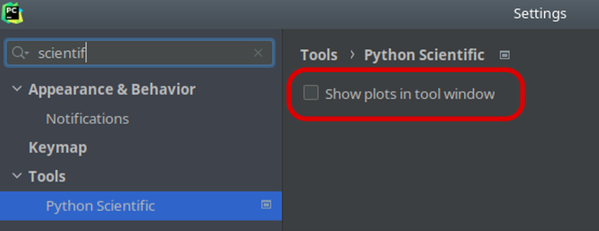

👀 FAQ
=======

.. contents:: Contents:
  :local:
  :depth: 1

.. include:: introduction.rst

.. _configuring_the_editor:

💻 Configuring the editor (IDE)
*******************************

.. _config_spyder:

🕷 Spyder IDE
-------------

To use the whole potential of EOmaps with the awesome `Spyder IDE <https://www.spyder-ide.org>`_  ,
the plot-settings must be adjusted to ensure that ``matplotlib`` plots remain interactive.

- By default, plots are rendered as static images into the "plots-pane"... to avoid this and create
  interactive ``matplotlib`` widgets instead, go to the preferences and set the "Graphics backend" to "Automatic" :

.. image:: _static/spyder_preferences.png

.. _config_pycharm:

🗖 PyCharm IDE
--------------

The `PyCharm IDE <https://www.jetbrains.com/pycharm/>`_  automatically registers its own matplotlib backend
which (for some unknown reason) freezes on interactive plots.

To my knowledge there are 2 possibilities to force ``pycharm`` to use the original ``matplotlib`` backends:

- | 🚲 The "manual" way:
  | Add the following lines to the start of each script:
  | (for more info and alternative backends see `matplotlib docs <https://matplotlib.org/stable/users/explain/backends.html>`_)

  .. code-block:: python

    import matplotlib
    matplotlib.use("Qt5Agg")

- | 🚗 The "automatic" way:
  | Go to the preferences and add the aforementioned lines to the *"Starting script"*
  | (to ensure that the ``matplotlib`` backend is always set prior to running a script)

  .. image:: _static/pycharm_preferences.png

In addition, if you use a **commercial version** of PyCharm, make sure to **disable** *"Show plots in tool window"*
in the **Python Scientific** preferences since it forces plots to be rendered as static images.

.. _config_jupyter_notebook:

📓 Jupyter Notebooks
--------------------

While EOmaps works best with matplotlib's ``Qt5Agg`` backend, most of the functionalities work
reasonably well if you want the figures embedded in a Jupyter Notebook.

🔸 For jupyter-lab (and classic notebooks) you can use the ``ipympl`` backend

- To install, simply use ``conda install -c conda-forge ipympl``
- Once it's installed, (and before you start plotting) use the magic ``%matplotlib widget`` to activate the backend.
- See here for more details: https://github.com/matplotlib/ipympl

🔸 For classical notebooks, there's also the ``nbagg`` backend provided by matplotlib

- To use it, simply execute the magic ``%matplotlib notebook`` before starting to plot.

🔸 Finally, you can also use the magic ``%matplotlib qt`` and use the ``qt5agg`` backend within Jupyter Notebooks!

- This way the plots will NOT be embedded in the notebook but they are created as separate widgets.

.. note::

  It is possible to plot **static snapshots** of the current state of a map to a Jupyter Notebook
  irrespective of the used backend by using `m.snapshot()`, e.g.:

  .. code-block:: python

    m = Maps()
    m.add_feature.preset.coastline()
    m.snapshot()

Checkout the `matplotlib doc <https://matplotlib.org/stable/users/explain/interactive.html#jupyter-notebooks-jupyterlab>`_
for more info!

📸 Record interactive maps to create animations
************************************************

The best way to record interactions on a EOmaps map is with the
free and open source `ScreenToGif <https://www.screentogif.com/>`_ software.

All animated gifs in this documentation have been created with this awesome piece of software.

⚠️ Important changes between major versions
********************************************

⚙ From EOmaps v3.x to v4.x
---------------------------

Changes between **EOmaps v3.x** and **EOmaps v4.0**:

- the following properties and functions have been removed:

  - ❌ ``m.plot_specs.``
  - ❌ ``m.set_plot_specs()``
  - | arguments are now directly passed to relevant functions:
    | ``m.plot_map()``, ``m.add_colorbar()`` and ``m.set_data()``

- 🔶 ``m.set_shape.voroni_diagram()`` is renamed to ``m.set_shape.voronoi_diagram()``
- | 🔷 custom callbacks are no longer bound to the Maps-object
  | the call-signature of custom callbacks has changed to:
  | ``def cb(self, *args, **kwargs)`` >> ``def cb(*args, **kwargs)``

Porting a script from v3.x to v4.x is quick and easy and involves the following steps:

1. Search your script for all occurrences of the words ``.plot_specs`` and ``.set_plot_specs(``,
   move the affected arguments to the correct functions (and remove the calls once you're done):

    - | ``vmin``, ``vmax`` ``alpha`` and ``cmap`` are now set in
      | ``m.plot_map(vmin=..., vmax=..., alpha=..., cmap=...)``
    - | ``histbins``, ``label``, ``tick_precision`` and ``density`` are now set in
      | ``m.add_colorbar(histbins=..., label=..., tick_precision=..., density=...)``
    - | ``cpos`` and ``cpos_radius`` are now (optionally) set in
      | ``m.set_data(data, x, y, cpos=..., cpos_radius=...)``

2. Search your script for all occurrences of the words ``xcoord`` and ``ycoord`` and replace them with ``x`` and ``y``

3. **ONLY** if you used **voronoi diagrams**:

  - search in your script for all occurrences of the word ``voroni_diagram`` and replace it with ``voronoi_diagram``

4. **ONLY** if you used **custom callback functions**:

  - the first argument of custom callbacks is no longer identified as the ``Maps`` object.
  - if you really need access to the ``Maps`` object within the callback, pass it as an explicit argument!

**EOmaps v3.x:**

.. code-block:: python

  m = Maps()
  m.set_data(data=..., xcoord=..., ycoord=...)
  m.set_plot_specs(vmin=1, vmax=20, cmap="viridis", histbins=100, cpos="ul", cpos_radius=1)
  m.set_shape.voroni_diagram()
  m.add_colorbar()
  m.plot_map()

  # ---------------------------- custom callback signature:
  def custom_cb(m, asdf=1):
      print(asdf)

  m.cb.click.attach(custom_cb)

**EOmaps v4.x:**

.. code-block:: python

  m = Maps()
  m.set_data(data=..., x=..., y=..., cpos="ul", cpos_radius=1)
  m.plot_map(vmin=1, vmax=20, cmap="viridis")
  m.set_shape.voronoi_diagram()
  m.add_colorbar(histbins=100)

  # ---------------------------- custom callback signature:
  def custom_cb(**kwargs, asdf=None):
      print(asdf)

  m.cb.click.attach(custom_cb, asdf=1)

Note: if you really need access to the maps-object within custom callbacks,
simply provide it as an explicit argument!

.. code-block:: python

  def custom_cb(**kwargs, m=None, asdf=None):
      ...

  m.cb.click.attach(custom_cb, m=m, asdf=1)

⚙ From EOmaps v5.x to v6.x
---------------------------

General changes in behavior
+++++++++++++++++++++++++++

- | 🔶 Starting with EOmaps v6.0 multiple calls to ``m.plot_map()``
  | **on the same Maps-object completely remove (and replace)** the previous dataset!
  | (use a new Maps-object on the same layer for datasets that should be visible at the same time!)
- | 🔶 WebMap services are no longer re-fetched by default when exporting images with ``m.savefig()``
  | To force a re-fetch of WebMap services prior to saving the image at the desired dpi, use ``m.savefig(refetch_wms=True)``
  | (see ``m.refetch_wms_on_size_change()`` for more details)
- | 🔷 ``m.add_gdf`` now uses only valid geometries
  | (to revert to the old behavior, use: ``m.add_gdf(..., only_valid=False)``)
- 🔷 the order at which multi-layers are combined now determines the stacking of the artists

  - ``m.show_layer("A|B")`` plots all artists of the layer ``"A"`` **on top of** the layer ``"B"``
  - the ordering of artists inside a layer is determined by their ``zorder``  (e.g. ``m.plot_map(zorder=123)``)

Removed (previously depreciated) functionalities
++++++++++++++++++++++++++++++++++++++++++++++++
- ❌ the ``m.figure`` accessor has been removed!

  - Use ``m.ax``, ``m.f``, ``m.colorbar.ax_cb``, ``m.colorbar.ax_cb_plot`` instead

- ❌ kwargs for ``m.plot_map(...)``

  - ``"coastlines"`` use ``m.add_feature.preset.coastline()`` instead

- ❌ kwargs for ``m.set_data(...)``

   - ``"in_crs"`` use ``"crs"`` instead
   - ``"xcoord"`` use ``"x"`` instead
   - ``"ycoord"`` use ``"y"`` instead

- ❌ kwargs for ``Maps(...)``

  - ``"parent"`` ... no longer needed
  - ``"gs_ax"`` use ``"ax"`` instead

- ❌ kwargs for ``m.new_inset_maps(...)``

  - ``"edgecolor"`` and ``"facecolor"`` use ``boundary=dict(ec=..., fc=...)`` instead

- ❌ kwargs for ``m.add_colorbar(...)``

  - ``"histbins"`` use ``"hist_bins"`` instead
  - ``"histogram_size"`` use ``"hist_size"`` instead
  - ``"density"`` use ``"hist_kwargs=dict(density=...)"`` instead
  - ``"top", "bottom", "left", "right"`` use ``margin=dict(top=..., bottom=..., left=..., right=...)`` instead
  - ``"add_extend_arrows"``

- ❌ ``m.indicate_masked_points()`` has been removed, use ``m.plot_map(indicate_masked_points=True)`` instead
- ❌ ``m.shape.get_transformer`` is now a private (e.g. ``m.shape._get_transformer``)
- ❌ ``m.shape.radius_estimation_range`` is now a private (e.g. ``m.shape._radius_estimation_range``)
