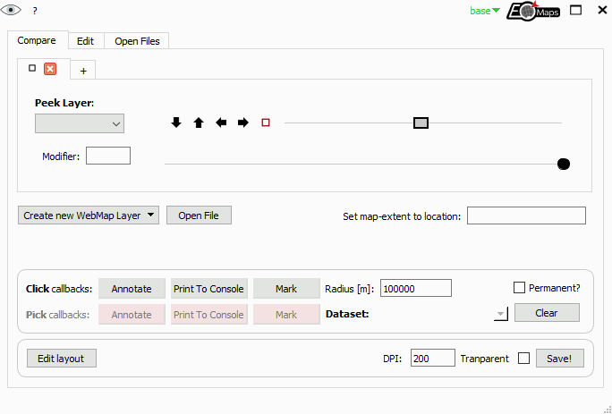

⚙ Usage
=========

🚀 Basics
---------

🌐 Initialization of Maps objects
~~~~~~~~~~~~~~~~~~~~~~~~~~~~~~~~~

| EOmaps is all about ``Maps`` objects.
| To start creating a new map (in this case a plot in ``epsg=4326``, e.g. lon/lat), simply use:

.. code-block:: python

    from eomaps import Maps
    m = Maps(crs=4326, layer="first layer", figsize=(10, 5))  # initialize a Maps-object
    m.add_feature.preset.coastline()                          # add coastlines to the map

- ``crs`` represents the projection used for plotting
- ``layer`` represents the name of the layer associated with the Maps-object (see below)
- all additional keyword arguments are forwarded to the creation of the matplotlib-figure
  (e.g.: ``figsize``, ``frameon``, ``edgecolor`` etc).

Possible ways for specifying the ``crs`` for plotting are:

- If you provide an integer, it is identified as an epsg-code (e.g. ``4326``, ``3035``, etc.)

  - 4326 defaults to `PlateCarree` projection

- All other CRS usable for plotting are accessible via ``Maps.CRS``,
  e.g.: ``crs=Maps.CRS.Orthographic()``, ``crs=Maps.CRS.GOOGLE_MERCATOR`` or ``crs=Maps.CRS.Equi7_EU``.
  (``Maps.CRS`` is just an accessor for ``cartopy.crs``.

  - For a full list of available projections see: `Cartopy projections <https://scitools.org.uk/cartopy/docs/v0.15/crs/projections.html>`_)

.. currentmodule:: eomaps

.. autosummary::
    :toctree: generated
    :nosignatures:
    :template: only_names_in_toc.rst

    Maps
    Maps.CRS

▤ Layers
~~~~~~~~~

| A map can have multiple plot-layers.
| Each ``Maps`` object represents a collection of features **on the assigned layer**.

Once you have created your first ``Maps`` object, you can:

- Create **additional** ``Maps`` **objects on the same layer** by using ``m2 = m.new_layer()``

  - If no explicit layer-name is provided, ``m2`` will use the same layer as ``m``
  - This is especially useful if you want to plot multiple datasets **on the same layer**

- Create **a NEW layer** named ``"my_layer"`` by using ``m2 = m.new_layer("my_layer")``

.. code-block:: python

    m = Maps()                           # same as `m = Maps(crs=4326, layer="base")`
    m.add_feature.preset.coastline()     # add coastlines to the "base" layer

    m_ocean = m.new_layer(layer="ocean") # create a new layer named "ocean"
    m_ocean.add_feature.preset.ocean()   # features on this layer will only be visible if the "ocean" layer is visible!

    m2 = m_ocean.new_layer()             # "m2" is just another Maps-object on the same layer as "m_ocean"!
    m2.set_data(data=[.14,.25,.38],      # assign a dataset to this Maps-object
                x=[1,2,3], y=[3,5,7],
                crs=4326)
    m2.set_shape.ellipses()              # set the shape that is used to represent the datapoints
    m2.plot_map()                        # plot the data

    m.show_layer("ocean")                # show the "ocean" layer
    m.util.layer_selector()              # get a utility widget to quickly switch between existing layers

.. admonition:: Map-features, colorbars and callbacks are layer-sensitive!

    - Features, colorbars etc. added to a ``Maps`` object are only visible if the associated layer is visible
    - Callbacks are only executed if the associated layer is visible

    To switch between layers, use ``m.show_layer("the layer name")``, call ``m.show()`` or have a look at the :ref:`utility` and the :ref:`companion_widget`.

.. admonition:: The "all" layer

    | There is one layer-name that has a special meaning... the ``"all"`` layer.
    | Any callbacks and features added to this layer will be **executed on ALL other layers** as well!

    You can add features and callbacks to the ``all`` layer via:

    - using the shortcut ``m.all. ...``
    - creating a dedicated ``Maps`` object via ``m_all = Maps(layer="all")`` or ``m_all = m.new_layer("all")``
    - using the "layer" kwarg of functions e.g. ``m.plot_map(layer="all")``

    .. code-block:: python

        m = Maps()
        m.all.add_feature.preset.coastline() # add coastlines to ALL layers of the map

        m_ocean = m.new_layer(layer="ocean") # create a new layer named "ocean"
        m_ocean.add_feature.preset.ocean()   # add ocean-coloring to the "ocean" layer
        m.show_layer("ocean")                # show the "ocean" layer (note that it has coastlines as well!)

🗗 Combine & compare multiple layers
************************************

To create a layer that represents a **combination of multiple existing layers**, separate the individual layer-names
with a ``"|"`` character.

- ``m.show_layer("A|B")`` will overlay all features of the layer ``B`` on top of the layer ``A``.

It is also possible to assign a **global transparency** when combining multiple layers via ``"<layer-name>{<transparency>}"``.

- ``m.show_layer("A|B{0.5}")`` will overlay the layer ``B`` with 50% transparency on top of the layer ``A``.

.. admonition:: The "stacking order" of features and layers

    The stacking order of features at the **same layer** is controlled by the ``zorder`` argument.

      - e.g. ``m.plot_map(zorder=1)`` or ``m.add_feature.cultural.urban_areas(zorder=10)``

    If you stack **multiple layers** on top of each other, the stacking is determined by the order of the layer-names (from right to left)

      - e.g. ``m.show_layer("A|B")`` will show the layer ``"B"`` on top of the layer ``"A"``
      - you can stack as many layers as you like! ``m.show_layer("A|B|C|D")``

.. admonition:: Using the :ref:`companion_widget`

    Usually it is most convenient to combine and compare layers via the :ref:`companion_widget` via one
    of the following options:

    - Use the **dropdown-list** at the top-right to select a single layer or overlay multiple layers.

      - Click on a single layer to make it the visible layer.
      - Hold down ``control`` or ``shift`` to overlay multiple layers.

    .. image:: _static/minigifs/select_layers_dropdown.gif

    |

    - Select one or more layers and dynamically adjust the stacking-order via the **layer-tabs** of the **Compare** and **Edit** views.

      - Hold down ``control`` while clicking on a tab to make it the visible layer.
      - Hold down ``shift`` while clicking on a tab to overlay multiple layers.
      - Re-arrange the tabs to change the stacking-order of the layers.

    .. image:: _static/minigifs/rearrange_layers.gif

.. code-block:: python

    m = Maps(layer="first")
    m.add_feature.preset.ocean(alpha=0.75, zorder=2)

    m2 = m.new_layer("second")                # create a new layer and plot some data
    m2.set_data(data=[.14,.25,.38],
                x=[1,2,3], y=[3,5,7],
                crs=4326)
    m2.set_shape.ellipses(n=100)
    m2.plot_map(zorder=1)                     # plot the data "below" the ocean

    m.show_layer("first|second")  # show all features of the two layers

    # you can even create Maps-objects representing combined layers!
    # (the features will only be visible if all sub-layers are visible)
    m_combined = m.new_layer("first|second")
    m_combined.add_annotation(xy=(2, 5), xy_crs=4326, text="some text")

.. currentmodule:: eomaps

.. autosummary::
    :toctree: generated
    :nosignatures:
    :template: only_names_in_toc.rst

    Maps.new_layer
    Maps.all
    Maps.show
    Maps.show_layer
    Maps.fetch_layers

🔴 Visualizing data
~~~~~~~~~~~~~~~~~~~~

To visualize a dataset, first assign the dataset to the ``Maps``-object,
then select how you want to visualize the data and finally call ``m.plot_map()``.

1. Assign the data to a ``Maps`` object via ``m.set_data()``
2. (optional) set the shape used to represent the data via  ``m.set_shape.< shape >(...)``
3. (optional) assign a classification scheme for the data via  ``m.set_classify.< scheme >(...)``
4. Plot the data by calling ``m.plot_map(...)``

🗃 Assign the data
******************

To assign a dataset to a ``Maps`` object, use ``m.set_data(...)``.

.. currentmodule:: eomaps

.. autosummary::
    :toctree: generated
    :nosignatures:
    :template: only_names_in_toc.rst

    Maps.set_data

A dataset is fully specified by setting the following properties:

- ``data`` : The data-values
- ``x``, ``y``: The coordinates of the provided data
- ``crs``: The coordinate-reference-system of the provided coordinates
- ``parameter`` (optional): The parameter name
- ``encoding`` (optional): The encoding of the data
- ``cpos``, ``cpos_radius`` (optional): the pixel offset

.. note::

    Make sure to use a individual ``Maps`` object (e.g. with ``m2 = m.new_layer()`` for each dataset!
    Calling ``m.plot_map()`` multiple times on the same ``Maps`` object will remove
    and override the previously plotted dataset!

.. admonition:: A note on data-reprojection...

    EOmaps handles the reprojection of the data from the input-crs to the plot-crs.

    - Plotting data in its native crs will omit the reprojection step and is therefore a lot faster!
    - If your dataset is 2D (e.g. a raster), it is best (for speed and memory) to provide the coordinates as 1D vectors!

       - Note that reprojecting 1D coordinate vectors to a different crs will result in (possibly very large) 2D coordinate arrays!

The following data-types are accepted as input:

+---------------------------------------------------------------------+------------------------------------------------------------------------------------+
| **pandas DataFrames**                                               | .. code-block:: python                                                             |
|                                                                     |                                                                                    |
| - ``data``: ``pandas.DataFrame``                                    |     from eomaps import Maps                                                        |
| - ``x``, ``y``: The column-names to use as coordinates (``string``) |     import pandas as pd                                                            |
| - ``parameter``: The column-name to use as data-values (``string``) |                                                                                    |
|                                                                     |     df = pd.DataFrame(dict(lon=[1,2,3], lat=[2,5,4], data=[12, 43, 2]))            |
|                                                                     |     m = Maps()                                                                     |
|                                                                     |     m.set_data(df, x="lon", y="lat", crs=4326, parameter="data")                   |
|                                                                     |     m.plot_map()                                                                   |
+---------------------------------------------------------------------+------------------------------------------------------------------------------------+
| **pandas Series**                                                   | .. code-block:: python                                                             |
|                                                                     |                                                                                    |
| - ``data``, ``x``, ``y``: ``pandas.Series``                         |     from eomaps import Maps                                                        |
| - ``parameter``: (optional) parameter name (``string``)             |     import pandas as pd                                                            |
|                                                                     |                                                                                    |
|                                                                     |     x, y, data = pd.Series([1,2,3]), pd.Series([2, 5, 4]), pd.Series([12, 43, 2])  |
|                                                                     |     m = Maps()                                                                     |
|                                                                     |     m.set_data(data, x=x, y=y, crs=4326, parameter="param_name")                   |
|                                                                     |     m.plot_map()                                                                   |
+---------------------------------------------------------------------+------------------------------------------------------------------------------------+
| **1D** or **2D** data **and** coordinates                           | .. code-block:: python                                                             |
|                                                                     |                                                                                    |
| - ``data``, ``x``, ``y``: equal-size ``numpy.array`` (or ``list``)  |     from eomaps import Maps                                                        |
| - ``parameter``: (optional) parameter name (``string``)             |     import numpy as np                                                             |
|                                                                     |                                                                                    |
|                                                                     |     x, y = np.mgrid[-20:20, -40:40]                                                |
|                                                                     |     data = x + y                                                                   |
|                                                                     |     m = Maps()                                                                     |
|                                                                     |     m.set_data(data=data, x=x, y=y, crs=4326, parameter="param_name")              |
|                                                                     |     m.plot_map()                                                                   |
+---------------------------------------------------------------------+------------------------------------------------------------------------------------+
| **1D** coordinates and **2D** data                                  | .. code-block:: python                                                             |
|                                                                     |                                                                                    |
| - ``data``: ``numpy.array`` (or ``list``) with shape ``(n, m)``     |     from eomaps import Maps                                                        |
| - ``x``: ``numpy.array`` (or ``list``) with shape ``(n,)``          |     import numpy as np                                                             |
| - ``y``: ``numpy.array`` (or ``list``) with shape ``(m,)``          |                                                                                    |
| - ``parameter``: (optional) parameter name (``string``)             |     x = np.linspace(10, 50, 100)                                                   |
|                                                                     |     y = np.linspace(10, 50, 50)                                                    |
|                                                                     |     data = np.random.normal(size=(100, 50))                                        |
|                                                                     |                                                                                    |
|                                                                     |     m = Maps()                                                                     |
|                                                                     |     m.set_data(data=data, x=x, y=y, crs=4326, parameter="param_name")              |
|                                                                     |     m.plot_map()                                                                   |
+---------------------------------------------------------------------+------------------------------------------------------------------------------------+

💠 Set the shape used to represent the data
********************************************

To specify how the data is represented on the map, you have to set the *"plot-shape"* via ``m.set_shape``.

.. currentmodule:: eomaps

.. autosummary::
    :toctree: generated
    :nosignatures:
    :template: only_names_in_toc.rst

    Maps.set_shape

.. admonition:: A note on speed and performance

    Some *"plot-shapes"* require more computational effort than others!
    Make sure to select an appropriate shape based on the size of the dataset you want to plot!

    EOmaps dynamically pre-selects the data with respect to the current plot-extent before the actual plot is created!
    If you do not need to see the whole extent of the data, make sure to **set the desired plot-extent**
    via ``m.set_extent(...)`` or ``m.set_shape_to_extent(...)`` **BEFORE** calling ``m.plot_map()`` to get a (possibly huge) speedup!

    The numbers of datapoints mentioned in the following always refer to the number of datapoints that are
    visible in the desired plot-extent.

Possible shapes that work nicely for datasets with up to ~500 000 data-points:

.. currentmodule:: eomaps._shapes.shapes

.. autosummary::
    :toctree: generated
    :nosignatures:
    :template: only_names_in_toc.rst

    geod_circles
    ellipses
    rectangles
    voronoi_diagram
    delaunay_triangulation

Possible shapes that work nicely for up to a few million data-points:

.. autosummary::
    :toctree: generated
    :nosignatures:
    :template: only_names_in_toc.rst

    raster

While ``raster`` can still be used for datasets with a few million datapoints, for extremely large datasets
(> 10 million datapoints) it is recommended to use "shading" to **greatly speed-up plotting**.
If shading is used, a dynamic averaging of the data based on the screen-resolution and the
currently visible plot-extent is performed (resampling based on the mean-value is used by default).

Possible shapes that can be used to quickly generate a plot for extremely large datasets are:

.. autosummary::
    :toctree: generated
    :nosignatures:
    :template: only_names_in_toc.rst

    shade_points
    shade_raster

.. code-block:: python

    from eomaps import Maps
    data, x, y = [.3,.64,.2,.5,1], [1,2,3,4,5], [2,5,3,7,5]

    m = Maps()                                # create a Maps-object
    m.set_data(data, x, y)                    # assign some data to the Maps-object
    m.set_shape.rectangles(radius=1,          # represent the datapoints as 1x1 degree rectangles
                            radius_crs=4326)  # (in epsg=4326 projection)
    m.plot_map(cmap="viridis", zorder=1)      # plot the data

    m2 = m.new_layer()                        # create a new Maps-object on the same layer
    m2.set_data(data, x, y)                   # assign another dataset to the new Maps object
    m2.set_shape.geod_circles(radius=50000,   # draw geodetic circles with 50km radius
                            n=100)          # use 100 intermediate points to represent the shape
    m2.plot_map(ec="k", cmap="Reds",          # plot the data
                zorder=2, set_extent=False)   # (and avoid resetting the plot-extent)

.. note::

    The "shade"-shapes require the additional ``datashader`` dependency!
    You can install it via:
    ``mamba install -c conda-forge datashader``

.. admonition:: What's used by default?

    By default, the plot-shape is assigned based on the associated dataset.

    - For datasets with less than 500 000 pixels, ``m.set_shape.ellipses()`` is used.
    - | For larger 2D datasets ``m.set_shape.shade_raster()`` is used
      | ... and ``m.set_shape.shade_points()`` is used for the rest.

To get an overview of the existing shapes and their main use-cases, here's a simple decision-tree:
(... and don't forget to set the plot-extent if you only want to see a subset of the data!)

.. image:: _static/shapes_decision_tree.png

.. image:: _static/minigifs/plot_shapes.gif

📊 Classify the data
*********************

EOmaps provides an interface for `mapclassify <https://github.com/pysal/mapclassify>`_ to classify datasets prior to plotting.

There are 2 (synonymous) ways to assign a classification-scheme:

- ``m.set_classify_specs(scheme=..., ...)``: set classification scheme by providing name and relevant parameters.
- ``m.set_classify.<SCHEME>(...)``: use autocompletion to get available classification schemes (with appropriate docstrings)

  - The big advantage of this method is that it supports autocompletion (once the Maps-object has been instantiated)
    and provides relevant docstrings to get additional information on the classification schemes.

Available classifier names are also accessible via ``Maps.CLASSIFIERS``.

.. currentmodule:: eomaps

.. autosummary::
    :toctree: generated
    :nosignatures:
    :template: only_names_in_toc.rst

    Maps.set_classify
    Maps.set_classify_specs

The preferred way for assigning a classification-scheme to a ``Maps`` object is via ``m.set_classify``:

.. code-block:: python

    m = Maps()
    m.set_data(...)
    m.set_shape.ellipses(...)
    m.set_classify.Quantiles(k=5)
    m.plot_map()

Alternatively, one can also use ``m.set_classify_specs(...)`` to assign a classification scheme:

.. code-block:: python

    m = Maps()
    m.set_data(...)
    m.set_shape.ellipses(...)

    m.set_classify_specs(scheme="Quantiles", k=5)
    m.classify_specs.k = 10 # alternative way for setting classify-specs
    m.plot_map()

Currently available classification-schemes are (see `mapclassify <https://github.com/pysal/mapclassify>`_ for details):

- BoxPlot (hinge)
- EqualInterval (k)
- FisherJenks (k)
- FisherJenksSampled (k, pct, truncate)
- HeadTailBreaks ()
- JenksCaspall (k)
- JenksCaspallForced (k)
- JenksCaspallSampled (k, pct)
- MaxP (k, initial)
- MaximumBreaks (k, mindiff)
- NaturalBreaks (k, initial)
- Quantiles (k)
- Percentiles (pct)
- StdMean (multiples)
- UserDefined (bins)

🖨 Plot the data
*****************

If you want to plot a map based on a dataset, first set the data and then
call ``m.plot_map()``.

Any additional keyword-arguments passed to ``m.plot_map()`` are forwarded to the actual
plot-command for the selected shape.

Useful arguments that are supported by all shapes are:

    - "cmap" : the colormap to use
    - "vmin", "vmax" : the range of values used when assigning the colors
    - "alpha" : the alpha-transparency
    - "zorder" : the "stacking-order" of the feature

Arguments that are supported by all shapes except ``shade`` shapes are:
    - "fc" or "facecolor" : set the face-color for the whole dataset
    - "ec" or "edgecolor" : set the edge-color for the whole dataset
    - "lw" or "linewidth" : the linewidth of the shapes

By default, the plot-extent of the axis is adjusted to the extent of the data **if the extent has not been set explicitly before**.
To always keep the extent as-is, use ``m.plot_map(set_extent=False)``.

.. code-block:: python

    from eomaps import Maps
    m = Maps()
    m.add_feature.preset.coastline(lw=0.5)

    m.set_data([1,2,3,4,5], [10,20,40,60,70], [10,20,50,70,30], crs=4326)
    m.set_shape.geod_circles(radius=7e5)
    m.plot_map(cmap="viridis", ec="b", lw=1.5, alpha=0.85, set_extent=False)

You can then continue to add :ref:`colorbar`, :ref:`annotations_and_markers`,
:ref:`scalebar`, :ref:`compass`,  :ref:`webmap_layers`, :ref:`ne_features` or :ref:`geodataframe` to the map,
or you can start to :ref:`shape_drawer`, add :ref:`utility` and :ref:`callbacks`.

.. currentmodule:: eomaps

.. autosummary::
    :toctree: generated
    :nosignatures:
    :template: only_names_in_toc.rst

    Maps.plot_map
    Maps.savefig

🗺 Exporting the map as jpeg/png, etc.
~~~~~~~~~~~~~~~~~~~~~~~~~~~~~~~~~~~~~~~

Once the map is ready, an image of the map can be saved at any time by using:

.. code-block:: python

    m.savefig("snapshot1.png", dpi=100, transparent=False, ...)

To adjust the margins of the subplots, use ``m.subplots_adjust()``, ``m.f.tight_layout()`` or
have a look at the :ref:`layout_editor`!

.. code-block:: python

    from eomaps import Maps
    m = Maps()
    m.subplots_adjust(left=0.1, right=0.9, bottom=0.05, top=0.95)

.. currentmodule:: eomaps

.. autosummary::
    :toctree: generated
    :nosignatures:
    :template: only_names_in_toc.rst

    Maps.subplots_adjust

.. admonition:: Notes on exporting high-dpi figures

    EOmaps tries its best to follow the WYSIWYG concept (e.g. *"What You See Is What You Get"*).
    However, if you export the map with a dpi-value other than ``100``, there are certain circumstances
    where the final image might look different.
    To summarize:

    - Changing the dpi of the figure requires a re-draw of all plotted datasets.

      - if you use ``shade`` shapes to represent the data, using a higher dpi-value can result in a very different appearance of the data!

    - WebMap services usually come as image-tiles with 96 dpi

      - by default, images are not re-fetched when saving the map to keep the original appearance
      - If you want to re-fetch the WebMap based on the export-dpi, use ``m.savefig(refetch_wms=True)``.

        - Note: increasing the dpi will result in an increase in the number of tiles that have to be fetched. If the number of required tiles is too large, the server might reject the request and the map might have gaps or no tiles at all.

🎨 Customizing the plot
~~~~~~~~~~~~~~~~~~~~~~~

All arguments to customize the appearance of a dataset are passed to ``m.plot_map(...)``.

In general, the colors assigned to the shapes are specified by

- selecting a colormap (``cmap``)

  - either a name of a pre-defined ``matplotlib`` colormap (e.g. ``"viridis"``, ``"RdYlBu"`` etc.)
  - or a general ``matplotlib`` colormap object (see `matplotlib-docs <https://matplotlib.org/stable/tutorials/colors/colormaps.html>`_ for more details)

- (optionally) setting appropriate data-limits via ``vmin`` and ``vmax``.

  - ``vmin`` and ``vmax`` set the range of data-values that are mapped to the colorbar-colors
  - Any values outside this range will get the colormaps ``over`` and ``under`` colors assigned.

.. code-block:: python

    m = Maps()
    m.set_data(...)
    m.plot_map(cmap="viridis", vmin=0, vmax=1)

------

Colors can also be set **manually** by providing one of the following arguments to ``m.plot_map(...)``:

- to set both **facecolor** AND **edgecolor** use ``color=...``
- to set the **facecolor** use ``fc=...`` or ``facecolor=...``
- to set the **edgecolor** use ``ec=...`` or ``edgecolor=...``

.. note::

    - Manual color specifications do **not** work with the ``shade_raster`` and ``shade_points`` shapes!
    - Providing manual colors will **override** the colors assigned by the ``cmap``!
    - The ``colorbar`` does **not** represent manually defined colors!

Uniform colors
**************

To apply a uniform color to all datapoints, you can use matpltolib's color-names or pass an RGB or RGBA tuple.

.. code-block:: python

    m.plot_map(fc="r")
    m.plot_map(fc="orange")
    m.plot_map(fc=(1, 0, 0.5))
    m.plot_map(fc=(1, 0, 0.5, .25))
    # for grayscale use a string of a number between 0 and 1
    m.plot_map(fc="0.3")

Explicit colors
***************

To explicitly color each datapoint with a pre-defined color, simply provide a list or array of the aforementioned types.

.. code-block:: python

    m.plot_map(fc=["r", "g", "orange"])
    # for grayscale use a string of a number between 0 and 1
    m.plot_map(fc=[".1", ".2", "0.3"])
    # or use RGB / RGBA tuples
    m.plot_map(fc=[(1, 0, 0.5), (.3, .4, .5), (1, 1, 0)])
    m.plot_map(fc=[(1, 0, 0.5, .25), (1, 0, 0.5, .75), (.1, .2, 0.5, .5)])

RGB composites
**************

To create an RGB or RGBA composite from 3 (or 4) datasets, pass the datasets as tuple:

- the datasets must have the same size as the coordinate arrays!
- the datasets must be scaled between 0 and 1

.. code-block:: python

    # if you pass a tuple of 3 or 4 arrays, they will be used to set the
    # RGB (or RGBA) colors of the shapes
    m.plot_map(fc=(<R-array>, <G-array>, <B-array>))
    m.plot_map(fc=(<R-array>, <G-array>, <B-array>, <A-array>))

    # you can fix individual color channels by passing a list with 1 element
    m.plot_map(fc=(<R-array>, [0.12345], <B-array>, <A-array>))

🍱 Multiple Maps (and/or plots) in one figure
~~~~~~~~~~~~~~~~~~~~~~~~~~~~~~~~~~~~~~~~~~~~~~

It is possible to combine multiple ``EOmaps`` maps and/or ordinary ``matpltolib`` plots in one figure.

The **figure** used by a ``Maps`` object is set via the ``f`` argument, e.g.: ``m = Maps(f=...)``

- If no figure is provided, a new figure is created whenever you initialize a ``Maps`` object.
- The figure-instance of an existing ``Maps`` object is accessible via ``m.f``

The **initial position of the axes** used by a ``Maps`` object is set via the ``ax`` argument, e.g.: ``m = Maps(ax=...)``

- The syntax for positioning axes is similar to matplotlibs ``f.add_subplot()`` or ``f.add_axes()``
- The axis-instance of an existing ``Maps`` object is accessible via ``m.ax``
- ...for more information, checkout the matplotlib tutorial: `Customizing Figure Layouts <https://matplotlib.org/3.1.1/tutorials/intermediate/gridspec.html#sphx-glr-tutorials-intermediate-gridspec-py>`_

.. note::

    Make sure to have a look at the :ref:`layout_editor` on how to re-position and re-scale axes to arbitrary positions!

In the following, the most commonly used cases are introduced:

Grid positioning
****************
To position the map in a (virtual) grid, one of the following options are possible:

- Three integers ``(nrows, ncols, index)`` (or 2 integers and a tuple).

  - The map will take the ``index`` position on a grid with ``nrows`` rows and ``ncols`` columns.
  - ``index`` starts at 1 in the upper left corner and increases to the right.
  - ``index`` can also be a two-tuple specifying the (first, last)
    indices (1-based, and including last) of the map, e.g., Maps(ax=(3, 1, (1, 2))) makes a map that spans the upper 2/3 of the figure.

.. table::

    +----------------------------------------------------+------------------------------------+
    | .. code-block:: python                             | .. image:: _static/grids/grid1.png |
    |                                                    |   :align: center                   |
    |     from eomaps import Maps                        |                                    |
    |     # ----- initialize a figure with an EOmaps map |                                    |
    |     # position = item 1 of a 2x1 grid              |                                    |
    |     m = Maps(ax=(2, 1, 1))                         |                                    |
    |     # ----- add a normal matplotlib axes           |                                    |
    |     # position = item 2 of a 2x1 grid              |                                    |
    |     ax = m.f.add_subplot(2, 1, 2)                  |                                    |
    +----------------------------------------------------+------------------------------------+

.. table::

    +----------------------------------------------------+------------------------------------+
    | .. code-block:: python                             | .. image:: _static/grids/grid2.png |
    |                                                    |   :align: center                   |
    |     from eomaps import Maps                        |                                    |
    |     # ----- initialize a figure with an EOmaps map |                                    |
    |     # position = item 1 of a 2x2 grid              |                                    |
    |     m = Maps(ax=(2, 2, 1))                         |                                    |
    |     # ----- add another Map to the same figure     |                                    |
    |     # position = item 3 of a 2x2 grid              |                                    |
    |     m2 = Maps(f=m.f, ax=(2, 2, 3))                 |                                    |
    |     # ----- add a normal matplotlib axes           |                                    |
    |     # position = second item of a 1x2 grid         |                                    |
    |     ax = m.f.add_subplot(1, 2, 2)                  |                                    |
    +----------------------------------------------------+------------------------------------+

.. table::

    +----------------------------------------------------+------------------------------------+
    | .. code-block:: python                             | .. image:: _static/grids/grid3.png |
    |                                                    |   :align: center                   |
    |     from eomaps import Maps                        |                                    |
    |     # ----- initialize a figure with an EOmaps map |                                    |
    |     # position = span 2 rows of a 3x1 grid         |                                    |
    |     m = Maps(ax=(3, 1, (1, 2)))                    |                                    |
    |     # ----- add a normal matplotlib axes           |                                    |
    |     # position = item 3 of a 3x1 grid              |                                    |
    |     ax = m.f.add_subplot(3, 1, 3)                  |                                    |
    +----------------------------------------------------+------------------------------------+

- A 3-digit integer.

  - The digits are interpreted as if given separately as three single-digit integers, i.e. Maps(ax=235) is the same as Maps(ax=(2, 3, 5)).
  - Note that this can only be used if there are no more than 9 subplots.

.. table::

    +----------------------------------------------------+------------------------------------+
    | .. code-block:: python                             | .. image:: _static/grids/grid4.png |
    |                                                    |   :align: center                   |
    |     from eomaps import Maps                        |                                    |
    |     # ----- initialize a figure with an EOmaps map |                                    |
    |     m = Maps(ax=211)                               |                                    |
    |     # ----- add a normal matplotlib axes           |                                    |
    |     ax = m.f.add_subplot(212)                      |                                    |
    +----------------------------------------------------+------------------------------------+

.. table::

    +----------------------------------------------------+------------------------------------+
    | .. code-block:: python                             | .. image:: _static/grids/grid5.png |
    |                                                    |   :align: center                   |
    |     from eomaps import Maps                        |                                    |
    |     # ----- initialize a figure with an EOmaps map |                                    |
    |     m = Maps(ax=221)                               |                                    |
    |     # ----- add 2 more Maps to the same figure     |                                    |
    |     m2 = Maps(f=m.f, ax=222)                       |                                    |
    |     m3 = Maps(f=m.f, ax=223)                       |                                    |
    |     # ----- add a normal matplotlib axes           |                                    |
    |     ax = m.f.add_subplot(224)                      |                                    |
    +----------------------------------------------------+------------------------------------+

- A matplotlib `GridSpec <https://matplotlib.org/stable/api/_as_gen/matplotlib.gridspec.GridSpec.html>`_

.. table::

    +----------------------------------------------+------------------------------------+
    | .. code-block:: python                       | .. image:: _static/grids/grid6.png |
    |                                              |   :align: center                   |
    |     from matplotlib.gridspec import GridSpec |                                    |
    |     from eomaps import Maps                  |                                    |
    |                                              |                                    |
    |     gs = GridSpec(2, 2)                      |                                    |
    |     m = Maps(ax=gs[0,0])                     |                                    |
    |     m2 = Maps(f= m.f, ax=gs[0,1])            |                                    |
    |     ax = m.f.add_subplot(gs[1,:])            |                                    |
    +----------------------------------------------+------------------------------------+

Absolute positioning
********************

To set the absolute position of the map, provide a list of 4 floats representing ``(left, bottom, width, height)``.

  - The absolute position of the map expressed in relative figure coordinates (e.g. ranging from 0 to 1)
  - NOTE: Since the effective size of the Map is dependent on the current zoom-region, the position always
    represents the **maximal area** that can be occupied by the map!

.. table::

    +----------------------------------------------------+------------------------------------+
    | .. code-block:: python                             | .. image:: _static/grids/grid7.png |
    |                                                    |   :align: center                   |
    |     from eomaps import Maps                        |                                    |
    |     # ----- initialize a figure with an EOmaps map |                                    |
    |     m = Maps(ax=(.07, 0.53, .6, .3))               |                                    |
    |     # ----- add a normal matplotlib axes           |                                    |
    |     ax = m.f.add_axes((.35, .15, .6, .2))          |                                    |
    +----------------------------------------------------+------------------------------------+

Using already existing figures / axes
*************************************

It is also possible to insert an EOmaps map into an existing figure or re-use an existing axes.

  - To put a map on an existing figure, provide the figure-instance via ``m = Maps(f= <the figure instance>)``
  - To use an existing axes, provide the axes-instance via ``m = Maps(ax= <the axes instance>)``

    - NOTE: The axes **MUST** be a cartopy-``GeoAxes``!

.. code-block:: python

    import matplotlib.pyplot as plt
    import cartopy
    from eomaps import Maps

    f = plt.figure(figsize=(10, 7))
    ax = f.add_subplot(projection=cartopy.crs.Mollweide())
    m = Maps(f=f, ax=ax)

Dynamic updates of plots in the same figure
*******************************************

    As soon as a ``Maps``-object is attached to a figure, EOmaps will handle re-drawing of the figure!
    Therefore **dynamically updated** artists must be added to the "blit-manager" (``m.BM``) to ensure
    that they are correctly updated.

    - use ``m.BM.add_artist(artist, layer=...)`` if the artist should be re-drawn on **any event** in the figure
    - use ``m.BM.add_bg_artist(artist, layer=...)`` if the artist should **only** be re-drawn if the extent of the map changes

.. note::

    In most cases it is sufficient to simply add the whole axes-object as artist via ``m.BM.add_artist(...)``.

    This ensures that all artists of the axes are updated as well!

Here's an example to show how it works:

.. table::

    +-------------------------------------------------------------------------------------+------------------------------------------------------+
    | .. code-block:: python                                                              | .. image:: _static/minigifs/dynamic_axes_updates.gif |
    |                                                                                     |   :align: center                                     |
    |         from eomaps import Maps                                                     |                                                      |
    |                                                                                     |                                                      |
    |         # Initialize a new figure with an EOmaps map                                |                                                      |
    |         m = Maps(ax=223)                                                            |                                                      |
    |         m.ax.set_title("click me!")                                                 |                                                      |
    |         m.add_feature.preset.coastline()                                            |                                                      |
    |         m.cb.click.attach.mark(radius=20, fc="none", ec="r", lw=2)                  |                                                      |
    |                                                                                     |                                                      |
    |         # Add another map to the figure                                             |                                                      |
    |         m2 = Maps(f=m.f, ax=224, crs=Maps.CRS.Mollweide())                          |                                                      |
    |         m2.add_feature.preset.coastline()                                           |                                                      |
    |         m2.add_feature.preset.ocean()                                               |                                                      |
    |         m2.cb.click.attach.mark(radius=20, fc="none", ec="r", lw=2, n=200)          |                                                      |
    |                                                                                     |                                                      |
    |         # Add a "normal" matplotlib plot to the figure                              |                                                      |
    |         ax = m.f.add_subplot(211)                                                   |                                                      |
    |         # Since we want to dynamically update the data on the axis, it must be      |                                                      |
    |         # added to the BlitManager to ensure that the artists are properly updated. |                                                      |
    |         # (EOmaps handles interactive re-drawing of the figure)                     |                                                      |
    |         m.BM.add_artist(ax, layer=m.layer)                                          |                                                      |
    |                                                                                     |                                                      |
    |         # plot some static data on the axis                                         |                                                      |
    |         ax.plot([10, 20, 30, 40, 50], [10, 20, 30, 40, 50])                         |                                                      |
    |                                                                                     |                                                      |
    |         # define a callback that plots markers on the axis if you click on the map  |                                                      |
    |         def cb(pos, **kwargs):                                                      |                                                      |
    |             ax.plot(*pos, marker="o")                                               |                                                      |
    |                                                                                     |                                                      |
    |         m.cb.click.attach(cb)        # attach the callback to the first map         |                                                      |
    |         m.cb.click.share_events(m2)  # share click events between the 2 maps        |                                                      |
    +-------------------------------------------------------------------------------------+------------------------------------------------------+

𝄜 MapsGrid objects
*******************

``MapsGrid`` objects can be used to create (and manage) multiple maps in one figure.

.. note::

    While ``MapsGrid`` objects provide some convenience, starting with EOmaps v6.x,
    the preferred way of combining multiple maps and/or matplotlib axes in a figure
    is by using one of the options presented in the previous sections!

A ``MapsGrid`` creates a grid of ``Maps`` objects (and/or ordinary ``matpltolib`` axes),
and provides convenience-functions to perform actions on all maps of the figure.

.. code-block:: python

    from eomaps import MapsGrid
    mg = MapsGrid(r=2, c=2, crs=..., layer=..., ... )
    # you can then access the individual Maps-objects via:
    mg.m_0_0
    mg.m_0_1
    mg.m_1_0
    mg.m_1_1

    m2 = mg.m_0_0.new_layer("newlayer")
    ...

    # there are many convenience-functions to perform actions on all Maps-objects:
    mg.add_feature.preset.coastline()
    mg.add_compass()
    ...

    # to perform more complex actions on all Maps-objects, simply loop over the MapsGrid object
    for m in mg:
        ...

    # set the margins of the plot-grid
    mg.subplots_adjust(left=0.1, right=0.9, bottom=0.05, top=0.95, hspace=0.1, wspace=0.05)

Make sure to checkout the :ref:`layout_editor` which greatly simplifies the arrangement of multiple axes within a figure!

Custom grids and mixed axes
+++++++++++++++++++++++++++

Fully customized grid-definitions can be specified by providing ``m_inits`` and/or ``ax_inits`` dictionaries
of the following structure:

- The keys of the dictionary are used to identify the objects
- The values of the dictionary are used to identify the position of the associated axes
- The position can be either an integer ``N``, a tuple of integers or slices ``(row, col)``
- Axes that span over multiple rows or columns, can be specified via ``slice(start, stop)``

.. code-block:: python

    dict(
        name1 = N  # position the axis at the Nth grid cell (counting firs)
        name2 = (row, col), # position the axis at the (row, col) grid-cell
        name3 = (row, slice(col_start, col_end)) # span the axis over multiple columns
        name4 = (slice(row_start, row_end), col) # span the axis over multiple rows
        )

- ``m_inits`` is used to initialize ``Maps`` objects
- ``ax_inits`` is used to initialize ordinary ``matplotlib`` axes

The individual ``Maps``-objects and ``matpltolib-Axes`` are then accessible via:

.. code-block:: python

    mg = MapsGrid(2, 3,
                  m_inits=dict(left=(0, 0), right=(0, 2)),
                  ax_inits=dict(someplot=(1, slice(0, 3)))
                  )
    mg.m_left   # the Maps object with the name "left"
    mg.m_right   # the Maps object with the name "right"

    mg.ax_someplot   # the ordinary matplotlib-axis with the name "someplot"

❗ NOTE: if ``m_inits`` and/or ``ax_inits`` are provided, ONLY the explicitly defined objects are initialized!

- The initialization of the axes is based on matplotlib's `GridSpec <https://matplotlib.org/stable/api/_as_gen/matplotlib.gridspec.GridSpec.html>`_ functionality.
  All additional keyword-arguments (``width_ratios, height_ratios, etc.``) are passed to the initialization of the ``GridSpec`` object.

- To specify unique ``crs`` for each ``Maps`` object, provide a dictionary of ``crs`` specifications.

.. code-block:: python

    from eomaps import MapsGrid

    # initialize a grid with 2 Maps objects and 1 ordinary matplotlib axes
    mgrid = MapsGrid(2, 2,
                     m_inits=dict(top_row=(0, slice(0, 2)),
                                  bottom_left=(1, 0)),
                     crs=dict(top_row=4326,
                              bottom_left=3857),
                     ax_inits=dict(bottom_right=(1, 1)),
                     width_ratios=(1, 2),
                     height_ratios=(2, 1))

    mgrid.m_top_row # a map extending over the entire top-row of the grid (in epsg=4326)
    mgrid.m_bottom_left # a map in the bottom left corner of the grid (in epsg=3857)

    mgrid.ax_bottom_right # an ordinary matplotlib axes in the bottom right corner of the grid

.. currentmodule:: eomaps

.. autosummary::
    :toctree: generated
    :nosignatures:
    :template: only_names_in_toc.rst

    MapsGrid
    MapsGrid.join_limits
    MapsGrid.share_click_events
    MapsGrid.share_pick_events
    MapsGrid.set_data_specs
    MapsGrid.set_classify_specs
    MapsGrid.add_wms
    MapsGrid.add_feature
    MapsGrid.add_annotation
    MapsGrid.add_marker
    MapsGrid.add_gdf

🧱 Naming conventions and autocompletion
~~~~~~~~~~~~~~~~~~~~~~~~~~~~~~~~~~~~~~~~

The goal of EOmaps is to provide a comprehensive, yet easy-to-use interface.

To avoid having to remember a lot of names, a concise naming-convention is applied so
that autocompletion can quickly narrow-down the search to relevant functions and properties.

Once a few basics keywords have been remembered, finding the right functions and properties should be quick and easy.

.. note::

    EOmaps works best in conjunction with "dynamic autocompletion", e.g. by using an interactive
    console where you instantiate a ``Maps`` object first and then access dynamically updated properties
    and docstrings on the object.

    To clarify:

    - First, execute ``m = Maps()`` in an interactive console
    - then (inside the console, not inside the editor!) use autocompletion on ``m.`` to get
      autocompletion for dynamically updated attributes.

    For example the following accessors only work properly after the ``Maps`` object has been initialized:
    - ``m.add_wms``: browse available WebMap services
    - ``m.set_classify``: browse available classification schemes

The following list provides an overview of the naming-conventions used within EOmaps:

Add features to a map - "m.add\_"
*********************************
All functions that add features to a map start with ``add_``, e.g.:
- ``m.add_feature``, ``m.add_wms``, ``m.add_annotation``, ``m.add_marker``, ``m.add_gdf``, ...

WebMap services (e.g. ``m.add_wms``) are fetched dynamically from the respective APIs.
Therefore the structure can vary from one WMS to another.
The used convention is the following:
- You can navigate into the structure of the API by using "dot-access" continuously
- once you reach a level that provides layers that can be added to the map, the ``.add_layer.`` directive will be visible
- any ``<LAYER>`` returned by ``.add_layer.<LAYER>`` can be added to the map by simply calling it, e.g.:

   - ``m.add_wms.OpenStreetMap.add_layer.default()``
   - ``m.add_wms.OpenStreetMap.OSM_mundialis.add_layer.OSM_WMS()``

Set data specifications - "m.set\_"
***********************************
All functions that set properties of the associated dataset start with ``set_``, e.g.:
- ``m.set_data``, ``m.set_classify``, ``m.set_shape``, ...

Create new Maps-objects - "m.new\_"
***********************************
Actions that result in a new ``Maps`` objects start with ``new_``.
- ``m.new_layer``, ``m.new_inset_map``, ...

Callbacks - "m.cb."
*******************
Everything related to callbacks is grouped under the ``cb`` accessor.

- use ``m.cb.<METHOD>.attach.<CALLBACK>()`` to attach pre-defined callbacks

  - ``<METHOD>`` hereby can be one of ``click``, ``pick`` or ``keypress``
    (but there's no need to remember since autocompletion will do the job!).

- use ``m.cb.<METHOD>.attach(custom_cb)`` to attach a custom callback

.. _companion_widget:

🧰 Companion Widget
--------------------

Starting with v5.0, EOmaps comes with an awesome **companion widget** that greatly
simplifies using interactive capabilities.

- To activate the widget, **press** ``w`` on the keyboard **while the mouse is over the map you want to edit**.

  - If multiple maps are present in the figure, a green border indicates the map that is currently targeted by the widget.
  - Once the widget is initialized, pressing ``w`` will show/hide the widget.

.. admonition:: What are the buttons and sliders doing?

    To get information on how the individual controls work, simply **click on the** ``?`` **symbol** in the top left corner of the widget!

    - This will activate **help tooltips** that explain the individual controls.

.. note::

    The companion-widget is written in ``PyQt5`` and therefore **only** works when using
    the ``matplotlib qt5agg`` backend (matplotlibs default if QT5 is installed)!

    To manually set the backend, execute the following lines at the start of your script:

    .. code-block:: python

        import matplotlib
        matplotlib.use("qt5agg")

The main purpose of the widget is to provide easy-access to features that usually don't need to go into
a python-script, such as:

- Compare layers (e.g. overlay multiple layers)
- Switch between existing layers (or combine existing layers)
- Add simple click or pick callbacks
- Quickly create new WebMap layers (or add WebMap services to existing layers)
- Draw shapes, add Annotations and NaturalEarth features to the map
- Quick-edit existing map-artists
  (show/hide, remove or set basic properties color, linewidth, zorder)
- Save the current state of the map to a file (at the desired dpi setting)
- A basic interface to plot data from files (with drag-and-drop support)
  (csv, NetCDF, GeoTIFF, shapefile)

.. _callbacks:

🛸 Callbacks - make the map interactive!
----------------------------------------

Callbacks are used to execute functions when you click on the map.

They can be attached to a map via the ``.attach`` directive:

.. code-block:: python

    m = Maps()
    ...
    m.cb.< METHOD >.attach.< CALLBACK >( **kwargs )

``< METHOD >`` defines the way how callbacks are executed.

.. table::
    :width: 100 %
    :widths: auto

    +--------------------------------------------------------------+----------------------------------------------------------------------------------+
    | :class:`click <eomaps._cb_container.cb_click_container>`     | Callbacks that are executed if you click anywhere on the Map.                    |
    +--------------------------------------------------------------+----------------------------------------------------------------------------------+
    | :class:`pick <eomaps._cb_container.cb_pick_container>`       | Callbacks that select the nearest datapoint(s) if you click on the map.          |
    +--------------------------------------------------------------+----------------------------------------------------------------------------------+
    | :class:`move <eomaps._cb_container.cb_move_container>`       | Callbacks that are executed if you press a key on the keyboard.                  |
    +--------------------------------------------------------------+----------------------------------------------------------------------------------+
    | :class:`keypress <eomaps._cb_container.keypress_container>`  | Callbacks that are executed if you move the mouse without holding down a button. |
    +--------------------------------------------------------------+----------------------------------------------------------------------------------+

``< CALLBACK >`` indicates the action you want to assign to the event.
There are many pre-defined callbacks, but it is also possible to define custom
functions and attach them to the map (see below).

.. table::
    :width: 100 %
    :widths: auto

    +-----------------------------------------------------------------------------------+--------------------------------------------------+
    | .. code-block:: python                                                            | .. image:: _static/minigifs/simple_callbacks.gif |
    |                                                                                   |   :align: center                                 |
    |     from eomaps import Maps                                                       |                                                  |
    |     import numpy as np                                                            |                                                  |
    |     x, y = np.mgrid[-45:45, 20:60]                                                |                                                  |
    |                                                                                   |                                                  |
    |     m = Maps(Maps.CRS.Orthographic())                                             |                                                  |
    |     m.all.add_feature.preset.coastline()                                          |                                                  |
    |     m.set_data(data=x+y**2, x=x, y=y, crs=4326)                                   |                                                  |
    |     m.plot_map(pick_distance=10)                                                  |                                                  |
    |                                                                                   |                                                  |
    |     m2 = m.new_layer(copy_data_specs=True, layer="second_layer")                  |                                                  |
    |     m2.plot_map(cmap="tab10")                                                     |                                                  |
    |                                                                                   |                                                  |
    |     # get an annotation if you RIGHT-click anywhere on the map                    |                                                  |
    |     m.cb.click.attach.annotate(xytext=(-60, -60),                                 |                                                  |
    |                                bbox=dict(boxstyle="round", fc="r"))               |                                                  |
    |                                                                                   |                                                  |
    |     # pick the nearest datapoint if you click on the MIDDLE mouse button          |                                                  |
    |     m.cb.pick.attach.annotate(button=2)                                           |                                                  |
    |     m.cb.pick.attach.mark(buffer=1, permanent=False, fc="none", ec="r", button=2) |                                                  |
    |     m.cb.pick.attach.mark(buffer=4, permanent=False, fc="none", ec="r", button=2) |                                                  |
    |                                                                                   |                                                  |
    |     # peek at the second layer if you LEFT-click on the map                       |                                                  |
    |     m.cb.click.attach.peek_layer("second_layer", how=.25, button=3)               |                                                  |
    +-----------------------------------------------------------------------------------+--------------------------------------------------+

.. Note::

    Callbacks are only executed if the layer of the associated ``Maps`` object is actually visible!
    (This assures that pick-callbacks always refer to the visible dataset.)

    To define callbacks that are executed independent of the visible layer, attach it to the ``"all"``
    layer using something like ``m.all.cb.click.attach.annotate()``.

In addition, each callback-container supports the following useful methods:

.. table::
    :width: 100 %
    :widths: auto

    +---------------------------------------------------------------------------------------------+---------------------------------------------------------------------------+
    | :class:`attach <eomaps._cb_container._click_container._attach>`                             | Attach custom or pre-defined callbacks to the map.                        |
    +---------------------------------------------------------------------------------------------+---------------------------------------------------------------------------+
    | :class:`remove <eomaps._cb_container._click_container.remove>`                              | Remove previously attached callbacks from the map.                        |
    +---------------------------------------------------------------------------------------------+---------------------------------------------------------------------------+
    | :class:`get <eomaps._cb_container._click_container._get>`                                   | Accessor for objects generated/retrieved by callbacks.                    |
    +---------------------------------------------------------------------------------------------+---------------------------------------------------------------------------+
    | :class:`set_sticky_modifiers <eomaps._cb_container._click_container.set_sticky_modifiers>`  | Define keys on the keyboard that should be treated as "sticky modifiers". |
    +---------------------------------------------------------------------------------------------+---------------------------------------------------------------------------+

.. currentmodule:: eomaps._cb_container._cb_container

.. autosummary::
    :nosignatures:
    :template: only_names_in_toc.rst

    share_events
    forward_events
    add_temporary_artist

🍬 Pre-defined callbacks
~~~~~~~~~~~~~~~~~~~~~~~~~

Pre-defined click, pick and move callbacks
******************************************

Callbacks that can be used with ``m.cb.click``, ``m.cb.pick`` and ``m.cb.move``:

.. currentmodule:: eomaps.callbacks.click_callbacks

.. autosummary::
    :toctree: generated
    :nosignatures:
    :template: only_names_in_toc.rst

    peek_layer
    annotate
    mark
    print_to_console

Callbacks that can be used with ``m.cb.click`` and ``m.cb.pick``:

.. currentmodule:: eomaps.callbacks.click_callbacks

.. autosummary::
    :toctree: generated
    :nosignatures:
    :template: only_names_in_toc.rst

    get_values
    clear_annotations
    clear_markers

Callbacks that can be used only with ``m.cb.pick``:

.. currentmodule:: eomaps.callbacks.pick_callbacks

.. autosummary::
    :toctree: generated
    :nosignatures:
    :template: only_names_in_toc.rst

    load
    highlight_geometry

Pre-defined keypress callbacks
******************************

Callbacks that can be used with ``m.cb.keypress``

.. currentmodule:: eomaps.callbacks.keypress_callbacks

.. autosummary::
    :toctree: generated
    :nosignatures:
    :template: only_names_in_toc.rst

    switch_layer
    fetch_layers

👽 Custom callbacks
~~~~~~~~~~~~~~~~~~~

Custom callback functions can be attached to the map via ``m.cb.< METHOD >.attach(< CALLBACK FUNCTION >, **kwargs)``:

.. code-block:: python

    def some_callback(custom_kwarg, **kwargs):
        print("the value of 'custom_kwarg' is", custom_kwarg)
        print("the position of the clicked pixel in plot-coordinates", kwargs["pos"])
        print("the dataset-index of the nearest datapoint", kwargs["ID"])
        print("data-value of the nearest datapoint", kwargs["val"])
        print("the color of the nearest datapoint", kwargs["val_color"])
        print("the numerical index of the nearest datapoint", kwargs["ind"])
        ...

    # attaching custom callbacks works completely similar for "click", "pick" and "keypress"!
    m = Maps()
    ...
    m.cb.pick.attach(some_callback, double_click=False, button=1, custom_kwarg=1)
    m.cb.click.attach(some_callback, double_click=False, button=2, custom_kwarg=2)
    m.cb.keypress.attach(some_callback, key="x", custom_kwarg=3)

.. note::

    Custom callbacks **must** always accept the following keyword arguments:
    ``pos``, ``ID``, ``val``, ``val_color``, ``ind``

    - ❗ for click callbacks the kwargs ``ID``, ``val`` and ``val_color`` are set to ``None``!
    - ❗ for keypress callbacks the kwargs ``ID``, ``val``, ``val_color``, ``ind`` and ``pos`` are set to ``None``!

    For better readability it is recommended that you "unpack" used arguments like this:

    .. code-block:: python

        def cb(ID, val, **kwargs):
            print(f"the ID is {ID} and the value is {val}")

👾 Using modifiers for pick- click- and move callbacks
~~~~~~~~~~~~~~~~~~~~~~~~~~~~~~~~~~~~~~~~~~~~~~~~~~~~~~~

It is possible to trigger ``pick``, ``click`` or ``move`` callbacks **only if a specific key is pressed on the keyboard**.

This is achieved by specifying a ``modifier`` when attaching a callback, e.g.:

.. code-block:: python

    m = Maps()
    m.add_feature.preset.coastline()
    # a callback that is executed if NO modifier is pressed
    m.cb.move.attach.mark(radius=5)
    # a callback that is executed if 1 is pressed while moving the mouse
    m.cb.move.attach.mark(modifier="1", radius=10, fc="r", ec="g")
    # a callback that is executed if 2 is pressed while moving the mouse
    m.cb.move.attach.mark(modifier="2", radius=15, fc="none", ec="b")

To keep the last pressed modifier active until a new modifier is activated,
you can make it "sticky" by using ``m.cb.move.set_sticky_modifiers()``.

- "Sticky modifiers" remain activated until

  - A new (sticky) modifier is activated
  - ``ctrl + <current (sticky) modifier>`` is pressed
  - ``escape`` is pressed

NOTE: sticky modifiers are defined for each callback method individually!
(e.g. sticky modifiers are unique for click, pick and move callbacks)

.. code-block:: python

    m = Maps()
    m.add_feature.preset.coastline()

    # a callback that is executed if 1 is pressed while clicking on the map
    m.cb.click.attach.annotate(modifier="1", text="modifier 1 active")
    # a callback that is executed if 2 is pressed while clicking on the map
    m.cb.click.attach.annotate(modifier="2", text="modifier 2 active")

    # make the modifiers 1 and 2 sticky for click callbacks
    m.cb.click.set_sticky_modifiers("1", "2")

    # note that the modifier 1 is not sticky for move callbacks!
    # m.cb.move.set_sticky_modifiers("1")  # (uncomment to make it sticky)
    m.cb.move.attach.mark(radius=5)
    m.cb.move.attach.mark(modifier="1", radius=5, fc="r")

🍭 Picking N nearest neighbours
~~~~~~~~~~~~~~~~~~~~~~~~~~~~~~~~

[requires EOmaps >= 5.4]

By default pick-callbacks pick the nearest datapoint with respect to the click position.

To customize the picking-behavior, use ``m.cb.pick.set_props()``. The following properties can be adjusted:

- ``n``: The (maximum) number of datapoints to pick within the search-circle.
- ``search_radius``: The radius of a circle (in units of the plot-crs) that is used to identify the nearest neighbours.
- ``pick_relative_to_closest``: Set the center of the search-circle.

  - If True, the nearest neighbours are searched relative to the closest identified datapoint.
  - If False, the nearest neighbours are searched relative to the click position.

- ``consecutive_pick``: Pick datapoints individually or alltogether.

  - If True, callbacks are executed for each picked point individually
  - If False, callbacks are executed only once and get lists of all picked values as input-arguments.

.. currentmodule:: eomaps._cb_container.cb_pick_container

.. autosummary::
    :nosignatures:
    :template: only_names_in_toc.rst

    set_props

.. table::
    :widths: 50 50
    :align: center

    +--------------------------------------------------------------------------------+--------------------------------------------+
    | .. code-block:: python                                                         | .. image:: _static/minigifs/pick_multi.gif |
    |                                                                                |   :align: center                           |
    |     from eomaps import Maps                                                    |                                            |
    |     import numpy as np                                                         |                                            |
    |                                                                                |                                            |
    |     # create some random data                                                  |                                            |
    |     x, y = np.mgrid[-30:67, -12:50]                                            |                                            |
    |     data = np.random.randint(0, 100, x.shape)                                  |                                            |
    |                                                                                |                                            |
    |     # a callback to indicate the search-radius                                 |                                            |
    |     def indicate_search_radius(m, pos, *args, **kwargs):                       |                                            |
    |         art = m.add_marker(                                                    |                                            |
    |             xy=(np.atleast_1d(pos[0])[0],                                      |                                            |
    |                 np.atleast_1d(pos[1])[0]),                                     |                                            |
    |             shape="ellipses", radius=m.tree.d, radius_crs="out",               |                                            |
    |             n=100, fc="none", ec="k", lw=2)                                    |                                            |
    |         m.cb.pick.add_temporary_artist(art)                                    |                                            |
    |                                                                                |                                            |
    |     # a callback to set the number of picked neighbours                        |                                            |
    |     def pick_n_neighbours(m, n, **kwargs):                                     |                                            |
    |         m.cb.pick.set_props(n=n)                                               |                                            |
    |                                                                                |                                            |
    |                                                                                |                                            |
    |     m = Maps()                                                                 |                                            |
    |     m.add_feature.preset.coastline()                                           |                                            |
    |     m.set_data(data, x, y)                                                     |                                            |
    |     m.plot_map()                                                               |                                            |
    |     m.cb.pick.set_props(n=50, search_radius=10, pick_relative_to_closest=True) |                                            |
    |                                                                                |                                            |
    |     m.cb.pick.attach.annotate()                                                |                                            |
    |     m.cb.pick.attach.mark(fc="none", ec="r")                                   |                                            |
    |     m.cb.pick.attach(indicate_search_radius, m=m)                              |                                            |
    |                                                                                |                                            |
    |     for key, n in (("1", 1), ("2", 9), ("3", 50), ("4", 500)):                 |                                            |
    |         m.cb.keypress.attach(pick_n_neighbours, key=key, m=m, n=n)             |                                            |
    +--------------------------------------------------------------------------------+--------------------------------------------+

📍 Picking a dataset without plotting it first
~~~~~~~~~~~~~~~~~~~~~~~~~~~~~~~~~~~~~~~~~~~~~~
It is possible to attach ``pick`` callbacks to a ``Maps`` object without plotting the data first
by using ``m.make_dataset_pickable()``.

.. code-block:: python

    m = Maps()
    m.add_feature.preset.coastline()
    m.set_data(... the dataset ...)
    m.make_dataset_pickable()
    # now it's possible to attach pick-callbacks even though the data is still "invisible"
    m.cb.pick.attach.annotate()

.. note::

    Using ``m.make_dataset_pickable()`` is ONLY necessary if you want to use ``pick``
    callbacks without actually plotting the data! Otherwise a call to ``m.plot_map()``
    is sufficient!

.. currentmodule:: eomaps.Maps

.. autosummary::
    :toctree: generated
    :nosignatures:
    :template: only_names_in_toc.rst

    make_dataset_pickable

.. _webmap_layers:

🛰 WebMap layers
----------------

WebMap services (TS/WMS/WMTS) can be attached to the map via:

.. code-block:: python

    m.add_wms.attach.< SERVICE > ... .add_layer.< LAYER >(...)

``< SERVICE >`` hereby specifies the pre-defined WebMap service you want to add,
and ``< LAYER >`` indicates the actual layer-name.

.. code-block:: python

    m = Maps(Maps.CRS.GOOGLE_MERCATOR) # (the native crs of the service)
    m.add_wms.OpenStreetMap.add_layer.default()

.. currentmodule:: eomaps

.. autosummary::
    :toctree: generated
    :nosignatures:
    :template: only_names_in_toc.rst

    Maps.add_wms

.. note::

    It is highly recommended (and sometimes even required) to use the native crs
    of the WebMap service in order to avoid re-projecting the images
    (which degrades image quality and sometimes takes quite a lot of time to finish...)

    - most services come either in ``epsg=4326`` or in ``Maps.CRS.GOOGLE_MERCATOR`` projection

.. table::
    :widths: 50 50
    :align: center

    +------------------------------------------------------------------------------------------------+-----------------------------------------+
    | .. code-block:: python                                                                         | .. image:: _static/minigifs/add_wms.png |
    |                                                                                                |   :align: center                        |
    |     from eomaps import Maps, MapsGrid                                                          |                                         |
    |     mg = MapsGrid(crs=Maps.CRS.GOOGLE_MERCATOR)                                                |                                         |
    |     mg.join_limits()                                                                           |                                         |
    |                                                                                                |                                         |
    |     mg.m_0_0.add_wms.OpenStreetMap.add_layer.default()                                         |                                         |
    |     mg.m_0_1.add_wms.OpenStreetMap.add_layer.stamen_toner()                                    |                                         |
    |                                                                                                |                                         |
    |     mg.m_1_1.add_wms.S1GBM.add_layer.vv()                                                      |                                         |
    |                                                                                                |                                         |
    |     # ... for more advanced                                                                    |                                         |
    |     layer = mg.m_1_0.add_wms.ISRIC_SoilGrids.nitrogen.add_layer.nitrogen_0_5cm_mean            |                                         |
    |     layer.set_extent_to_bbox() # set the extent according to the boundingBox                   |                                         |
    |     layer.info                 # the "info" property provides useful information on the layer  |                                         |
    |     layer()                    # call the layer to add it to the map                           |                                         |
    |     layer.add_legend()         # if a legend is provided, you can add it to the map!           |                                         |
    |                                                                                                |                                         |
    +------------------------------------------------------------------------------------------------+-----------------------------------------+

Pre-defined WebMap services:
~~~~~~~~~~~~~~~~~~~~~~~~~~~~

**Global:**

.. currentmodule:: eomaps._webmap_containers.wms_container

.. autosummary::
    :toctree: generated
    :nosignatures:
    :template: only_names_in_toc.rst

    OpenStreetMap
    ESA_WorldCover
    NASA_GIBS
    ISRIC_SoilGrids
    EEA_DiscoMap
    ESRI_ArcGIS
    S1GBM
    S2_cloudless
    GEBCO
    CAMS
    DLR_basemaps

**Services specific for Austria (Europe)**

.. currentmodule:: eomaps._webmap_containers

.. autosummary::
    :toctree: generated
    :nosignatures:
    :template: only_names_in_toc.rst

    Austria.AT_basemap
    Austria.Wien_basemap

.. note::
    Services might be nested directory structures!
    The actual layer is always added via the ``add_layer`` directive.

        :code:`m.add_wms.<...>. ... .<...>.add_layer.<LAYER NAME>()`

    Some of the services dynamically fetch the structure via HTML-requests.
    Therefore it can take a short moment before autocompletion is capable of
    showing you the available options!
    A list of available layers from a sub-folder can be fetched via:

        :code:`m.add_wms.<...>. ... .<LAYER NAME>.layers`

Using custom WebMap services
~~~~~~~~~~~~~~~~~~~~~~~~~~~~

It is also possible to use custom WMS/WMTS/XYZ services.
(see docstring of ``m.add_wms.get_service`` for more details and examples)

.. currentmodule:: eomaps._webmap_containers.wms_container

.. autosummary::
    :toctree: generated
    :nosignatures:
    :template: only_names_in_toc.rst

    get_service

.. code-block:: python

    m = Maps()
    # define the service
    service = m.add_wms.get_service(<... link to GetCapabilities.xml ...>,
                                    service_type="wms",
                                    res_API=False,
                                    maxzoom=19)
    # once the service is defined, you can use it just like the pre-defined ones
    service.layers   # >> get a list of all layers provided by the service

    # select one of the layers
    layer = service.add_layer. ... .< LAYER >
    layer.info                  # >> get some additional infos for the selected layer
    layer.set_extent_to_bbox()  # >> set the map-extent to the bbox of the layer

    # call the layer to add it to the map
    # (optionally providing additional kwargs for fetching map-tiles)
    layer(...)

Setting date, style and other WebMap properties
~~~~~~~~~~~~~~~~~~~~~~~~~~~~~~~~~~~~~~~~~~~~~~~

Some WebMap services allow passing additional arguments to set properties such as the **date** or the **style** of the map.
To pass additional arguments to a WebMap service, simply provide them when when calling the layer, e.g.:

.. code-block:: python

    m = Maps()
    m.add_wms.< SERVICE >. ... .add_layer.< LAYER >(time=..., styles=[...], ...)

To show an example, here's how to fetch multiple timestamps for the UV-index of the Copernicus Airquality service.
(provided by https://atmosphere.copernicus.eu/)

.. table::
    :widths: 50 50
    :align: center

    +-------------------------------------------------------------------------------------+----------------------------------------------+
    | .. code-block:: python                                                              | .. image:: _static/minigifs/advanced_wms.gif |
    |                                                                                     |   :align: center                             |
    |     from eomaps import Maps                                                         |                                              |
    |     import pandas as pd                                                             |                                              |
    |                                                                                     |                                              |
    |     m = Maps(layer="all", figsize=(8, 4))                                           |                                              |
    |     m.subplots_adjust(left=0.05, right=0.95)                                        |                                              |
    |     m.all.add_feature.preset.coastline()                                            |                                              |
    |     m.add_logo()                                                                    |                                              |
    |                                                                                     |                                              |
    |     layer = m.add_wms.CAMS.add_layer.composition_uvindex_clearsky                   |                                              |
    |     timepos = layer.wms_layer.timepositions   # available time-positions            |                                              |
    |     all_styles = list(layer.wms_layer.styles) # available styles                    |                                              |
    |                                                                                     |                                              |
    |     # create a list of timestamps to fetch                                          |                                              |
    |     start, stop, freq = timepos[1].split(r"/")                                      |                                              |
    |     times = pd.date_range(start, stop, freq=freq.replace("PT", ""))                 |                                              |
    |     times = times.strftime("%Y-%m-%dT%H:%M:%SZ")                                    |                                              |
    |                                                                                     |                                              |
    |     style = all_styles[0]     # use the first available style                       |                                              |
    |     for time in times[:6]:                                                          |                                              |
    |         # call the layer to add it to the map                                       |                                              |
    |         layer(time=time,                                                            |                                              |
    |               styles=[style],   # provide a list with 1 entry here                  |                                              |
    |               layer=time        # put each WebMap on an individual layer            |                                              |
    |               )                                                                     |                                              |
    |                                                                                     |                                              |
    |     layer.add_legend()  # add a legend for the WebMap service                       |                                              |
    |                                                                                     |                                              |
    |     # add a "slider" and a "selector" widget                                        |                                              |
    |     m.util.layer_selector(ncol=3, loc="upper center", fontsize=6, labelspacing=1.3) |                                              |
    |     m.util.layer_slider()                                                           |                                              |
    |                                                                                     |                                              |
    |     # attach a callback to fetch all layers if you press l on the keyboard          |                                              |
    |     cid = m.all.cb.keypress.attach.fetch_layers(key="l")                            |                                              |
    |     # fetch all layers so that they are cached and switching layers is fast         |                                              |
    |     m.fetch_layers()                                                                |                                              |
    |     m.show_layer(times[0])      # make the first timestamp visible                  |                                              |
    +-------------------------------------------------------------------------------------+----------------------------------------------+

.. _ne_features:

🌵 NaturalEarth features
------------------------

Feature-layers provided by `NaturalEarth <https://www.naturalearthdata.com>`_ can be directly added to the map via ``m.add_feature``.

.. currentmodule:: eomaps

.. autosummary::
    :toctree: generated
    :nosignatures:
    :template: only_names_in_toc.rst

    Maps.add_feature

The call-signature is: ``m.add_feature.< CATEGORY >.< FEATURE >(...)``:

``< CATEGORY >`` specifies the general category of the feature, e.g.:

- ``cultural``: **cultural** features (e.g. countries, states etc.)
- ``physical``: **physical** features (e.g. coastlines, land, ocean etc.)
- ``preset``: a set of pre-defined layers for convenience (see below)

``< FEATURE >`` is the name of the NaturalEarth feature, e.g. ``"coastlines", "admin_0_countries"`` etc..

+-------------------------------------------------------------------------+-------------------------------------------------+
| .. code-block:: python                                                  | .. image:: _static/minigifs/add_feature.gif     |
|                                                                         |   :align: center                                |
|     from eomaps import Maps                                             |                                                 |
|     m = Maps()                                                          |                                                 |
|     m.add_feature.preset.coastline()                                    |                                                 |
|     m.add_feature.preset.ocean()                                        |                                                 |
|     m.add_feature.preset.land()                                         |                                                 |
|     m.add_feature.preset.countries()                                    |                                                 |
|                                                                         |                                                 |
|     m.add_feature.physical.lakes(scale=110, ec="b")                     |                                                 |
|     m.add_feature.cultural.admin_0_pacific_groupings(ec="m", lw=2)      |                                                 |
|                                                                         |                                                 |
|     # (only if geopandas is installed)                                  |                                                 |
|     places = m.add_feature.cultural.populated_places.get_gdf(scale=110) |                                                 |
|     m.add_gdf(places, markersize=places.NATSCALE/10, fc="r")            |                                                 |
|                                                                         |                                                 |
+-------------------------------------------------------------------------+-------------------------------------------------+

`NaturalEarth <https://www.naturalearthdata.com>`_ provides features in 3 different scales: 1:10m, 1:50m, 1:110m.
By default EOmaps uses features at 1:50m scale. To set the scale manually, simply use the ``scale`` argument
when calling the feature.

- It is also possible to automatically update the scale based on the map-extent by using ``scale="auto"``.
  (Note that if you zoom into a new scale the data might need to be downloaded and reprojected so the map might be irresponsive for a couple of seconds until everything is properly cached.)

If you want to get a ``geopandas.GeoDataFrame`` containing all shapes and metadata of a feature, use:
(Have a look at :ref:`geodataframe` on how to add the obtained ``GeoDataFrame`` to the map)

.. code-block:: python

    from eomaps import Maps
    m = Maps()
    gdf = m.add_feature.physical.coastline.get_gdf(scale=10)

The most commonly used features are accessible with pre-defined colors via the ``preset`` category:

.. currentmodule:: eomaps.ne_features._NaturalEarth_presets

.. autosummary::
    :toctree: generated
    :nosignatures:
    :template: only_names_in_toc.rst

    coastline
    ocean
    land
    countries
    urban_areas
    lakes
    rivers_lake_centerlines

.. _geodataframe:

💠 GeoDataFrames
-----------------

A ``geopandas.GeoDataFrame`` can be added to the map via ``m.add_gdf()``.

- This is basically just a wrapper for  the plotting capabilities of ``geopandas`` (e.g. ``gdf.plot(...)`` )
  supercharged with EOmaps features.

.. currentmodule:: eomaps

.. autosummary::
    :toctree: generated
    :nosignatures:
    :template: only_names_in_toc.rst

    Maps.add_gdf

.. code-block:: python

    from eomaps import Maps
    import geopandas as gpd

    gdf = gpd.GeoDataFrame(geometries=[...], crs=...)<>

    m = Maps()
    m.add_gdf(gdf, fc="r", ec="g", lw=2)

It is possible to make the shapes of a ``GeoDataFrame`` pickable
(e.g. usable with ``m.cb.pick`` callbacks) by providing a ``picker_name``
(and specifying a ``pick_method``).

- use ``pick_method="contains"`` if your ``GeoDataFrame`` consists of **polygon-geometries** (the default)

  - pick a geometry if `geometry.contains(mouse-click-position) == True`

- use ``pick_method="centroids"`` if your ``GeoDataFrame`` consists of **point-geometries**

  - pick the geometry with the closest centroid

Once the ``picker_name`` is specified, pick-callbacks can be attached via:

- ``m.cb.pick[<PICKER NAME>].attach.< CALLBACK >()``

| For example, to highlight the clicked country, you could use:

.. table::
    :widths: 50 50
    :align: center

    +----------------------------------------------------------------------------+----------------------------------------------+
    | .. code-block:: python                                                     | .. image:: _static/minigifs/add_gdf_pick.gif |
    |                                                                            |   :align: center                             |
    |     from eomaps import Maps                                                |                                              |
    |     m = Maps()                                                             |                                              |
    |     # get the GeoDataFrame for a given NaturalEarth feature                |                                              |
    |     gdf = m.add_feature.cultural_110m.admin_0_countries.get_gdf()          |                                              |
    |                                                                            |                                              |
    |     # pick the shapes of the GeoDataFrame based on a "contains" query      |                                              |
    |     m.add_gdf(gdf, picker_name="countries", pick_method="contains")        |                                              |
    |                                                                            |                                              |
    |     # temporarily highlight the picked geometry                            |                                              |
    |     m.cb.pick["countries"].attach.highlight_geometry(fc="r", ec="g", lw=2) |                                              |
    |                                                                            |                                              |
    +----------------------------------------------------------------------------+----------------------------------------------+

.. _annotations_and_markers:

🏕 Annotations, Markers, Lines, Logos, etc.
-------------------------------------------

🔴 Markers
~~~~~~~~~~~

Static markers can be added to the map via ``m.add_marker()``.

- If a dataset has been plotted, you can mark any datapoint via its ID, e.g. ``ID=...``
- To add a marker at an arbitrary position, use ``xy=(...)``

  - By default, the coordinates are assumed to be provided in the plot-crs
  - You can specify arbitrary coordinates via ``xy_crs=...``

- The radius is defined via ``radius=...``

  - By default, the radius is assumed to be provided in the plot-crs
  - You can specify the radius in an arbitrary crs via ``radius_crs=...``

- The marker-shape is set via ``shape=...``

  - Possible arguments are ``"ellipses"``, ``"rectangles"``, ``"geod_circles"``

- Additional keyword-arguments are passed to the matplotlib collections used to draw the shapes
  (e.g. "facecolor", "edgecolor", "linewidth", "alpha", etc.)

- Multiple markers can be added in one go by using lists for ``xy``, ``radius``, etc.

🛸 For dynamic markers checkout ``m.cb.click.attach.mark()`` or ``m.cb.pick.attach.mark()``

.. currentmodule:: eomaps.Maps

.. autosummary::
    :toctree: generated
    :nosignatures:
    :template: only_names_in_toc.rst

    add_marker

.. table::
    :widths: 50 50
    :align: center

    +---------------------------------------------------------------------------+-----------------------------------------+
    | .. code-block:: python                                                    | .. image:: _static/minigifs/markers.png |
    |                                                                           |   :align: center                        |
    |     from eomaps import Maps                                               |                                         |
    |     m = Maps(crs=4326)                                                    |                                         |
    |     m.add_feature.preset.coastline()                                      |                                         |
    |                                                                           |                                         |
    |     # ----- SINGLE MARKERS                                                |                                         |
    |     # by default, MARKER DIMENSIONS are defined in units of the plot-crs! |                                         |
    |     m.add_marker(xy=(0, 0), radius=20, shape="rectangles",                |                                         |
    |                  fc="y", ec="r", ls=":", lw=2)                            |                                         |
    |     m.add_marker(xy=(0, 0), radius=10, shape="ellipses",                  |                                         |
    |                  fc="darkorange", ec="r", ls=":", lw=2)                   |                                         |
    |                                                                           |                                         |
    |     # MARKER DIMENSIONS can be specified in any CRS!                      |                                         |
    |     m.add_marker(xy=(12000000, 0), xy_crs=3857,                           |                                         |
    |                  radius=5000000, radius_crs=3857,                         |                                         |
    |                  fc=(.5, .5, 0, .4), ec="r", lw=3, n=100)                 |                                         |
    |                                                                           |                                         |
    |     # GEODETIC CIRCLES with radius defined in meters                      |                                         |
    |     m.add_marker(xy=(-135, 35), radius=3000000, shape="geod_circles",     |                                         |
    |                  fc="none", ec="r", hatch="///", lw=2, n=100)             |                                         |
    |                                                                           |                                         |
    |     # ----- MULTIPLE MARKERS                                              |                                         |
    |     x = [-80, -40, 40, 80]    # x-coordinates of the markers              |                                         |
    |     fc = ["r", "g", "b", "c"] # the colors of the markers                 |                                         |
    |                                                                           |                                         |
    |     # N markers with the same radius                                      |                                         |
    |     m.add_marker(xy=(x, [-60]*4), radius=10, fc=fc)                       |                                         |
    |                                                                           |                                         |
    |     # N markers with different radius and properties                      |                                         |
    |     m.add_marker(xy=(x, [0]*4),  radius=[15, 10, 5, 2],                   |                                         |
    |                  fc=fc, ec=["none", "r", "g", "b"], alpha=[1, .5, 1, .5]) |                                         |
    |                                                                           |                                         |
    |     # N markers with different widths and heights                         |                                         |
    |     radius = ([15, 10, 5, 15], [5, 15, 15, 2])                            |                                         |
    |     m.add_marker(xy=(x, [60]*4), radius=radius, fc=fc)                    |                                         |
    +---------------------------------------------------------------------------+-----------------------------------------+

📑 Annotations
~~~~~~~~~~~~~~

Static annotations can be added to the map via ``m.add_annotation()``.

- The location is defined completely similar to ``m.add_marker()`` above.

  - You can annotate a datapoint via its ID, or arbitrary coordinates in any crs.

- Additional arguments are passed to matplotlibs ``plt.annotate`` and ``plt.text``

  - This gives a lot of flexibility to style the annotations!

🛸 For dynamic annotations checkout ``m.cb.click.attach.annotate()`` or ``m.cb.pick.attach.annotate()``

.. currentmodule:: eomaps.Maps

.. autosummary::
    :toctree: generated
    :nosignatures:
    :template: only_names_in_toc.rst

    add_annotation

.. table::
    :widths: 50 50
    :align: center

    +-----------------------------------------------------------------------------------+---------------------------------------------+
    | .. code-block:: python                                                            | .. image:: _static/minigifs/annotations.png |
    |                                                                                   |   :align: center                            |
    |     from eomaps import Maps                                                       |                                             |
    |     import numpy as np                                                            |                                             |
    |     x, y = np.mgrid[-45:45, 20:60]                                                |                                             |
    |                                                                                   |                                             |
    |     m = Maps(crs=4326)                                                            |                                             |
    |     m.set_data(x+y, x, y)                                                         |                                             |
    |     m.add_feature.preset.coastline(ec="k", lw=.75)                                |                                             |
    |     m.plot_map()                                                                  |                                             |
    |                                                                                   |                                             |
    |     # annotate any point in the dataset via the data-index                        |                                             |
    |     m.add_annotation(ID=345)                                                      |                                             |
    |     # annotate an arbitrary position (in the plot-crs)                            |                                             |
    |     m.add_annotation(                                                             |                                             |
    |         xy=(20,25), text="A formula:\n $z=\sqrt{x^2+y^2}$",                       |                                             |
    |         fontweight="bold", bbox=dict(fc=".6", ec="none", pad=2))                  |                                             |
    |     # annotate coordinates defined in arbitrary crs                               |                                             |
    |     m.add_annotation(                                                             |                                             |
    |         xy=(2873921, 6527868), xy_crs=3857, xytext=(5,5),                         |                                             |
    |         text="A location defined \nin epsg 3857", fontsize=8,                     |                                             |
    |         rotation=-45, bbox=dict(fc="skyblue", ec="k", ls="--", pad=2))            |                                             |
    |                                                                                   |                                             |
    |     # functions can be used for more complex text                                 |                                             |
    |     def text(m, ID, val, pos, ind):                                               |                                             |
    |         return f"lon={pos[0]}\nlat={pos[1]}"                                      |                                             |
    |                                                                                   |                                             |
    |     props = dict(xy=(-1.5, 38.45), text=text,                                     |                                             |
    |                  arrowprops=dict(arrowstyle="-|>", fc="fuchsia",                  |                                             |
    |                                  mutation_scale=15))                              |                                             |
    |                                                                                   |                                             |
    |     m.add_annotation(**props, xytext=(20, 20), color="darkred")                   |                                             |
    |     m.add_annotation(**props, xytext=(-60, 20), color="purple")                   |                                             |
    |     m.add_annotation(**props, xytext=(-60, -40), color="dodgerblue")              |                                             |
    |     m.add_annotation(**props, xytext=(20, -40), color="olive")                    |                                             |
    |                                                                                   |                                             |
    |     # multiple annotations can be added in one go (xy=([...], [...]) also works!) |                                             |
    |     m.add_annotation(ID=[2500, 2700, 2900], text=lambda ID, **kwargs: str(ID),    |                                             |
    |                      color="w", fontweight="bold", rotation=90,                   |                                             |
    |                      arrowprops=dict(width=5, fc="b", ec="orange", lw=2),         |                                             |
    |                      bbox=dict(boxstyle="round, rounding_size=.8, pad=.5",        |                                             |
    |                                fc="b", ec="orange", lw=2))                        |                                             |
    |                                                                                   |                                             |
    |     m.add_annotation(ID=803, xytext=(-80,60),                                     |                                             |
    |                      bbox=dict(ec="r", fc="gold", lw=3),                          |                                             |
    |                      arrowprops=dict(                                             |                                             |
    |                          arrowstyle="fancy", relpos=(.48,-.2),                    |                                             |
    |                          mutation_scale=40, fc="r",                               |                                             |
    |                          connectionstyle="angle3, angleA=90, angleB=-25"))        |                                             |
    +-----------------------------------------------------------------------------------+---------------------------------------------+

🚲 Lines
~~~~~~~~~

Lines can be added to a map with ``m.add_line()``.

- A line is defined by a list of **anchor-points** and a **connection-method**

- The coordinates of the anchor-points can be provided in any crs

- Possible **connection-methods** are:

  - ``connect="geod"``: connect points via **geodesic lines** (the default)

      -  use ``n=10`` to calculate 10 intermediate points between each anchor-point
      -  or use ``del_s=1000`` to calculate intermediate points (approximately) every 1000 meters

         - check the return-values of ``m.add_line()`` to get the actual distances used in each line-segment

  - ``connect="straight"``: connect points via **straight lines**
  - ``connect="straight_crs"``: connect points with reprojected lines that are **straight in a given projection**

      -  use ``n=10`` to calculate 10 (equally-spaced) intermediate points between each anchor-point

- Additional keyword-arguments are passed to matpltolib's ``plt.plot``

  - This gives a lot of flexibility to style the lines!

.. currentmodule:: eomaps.Maps

.. autosummary::
    :toctree: generated
    :nosignatures:
    :template: only_names_in_toc.rst

    add_line

.. table::
    :widths: 50 50
    :align: center

    +-----------------------------------------------------------------+---------------------------------------+
    | .. code-block:: python                                          | .. image:: _static/minigifs/lines.png |
    |                                                                 |     :align: center                    |
    |     from eomaps import Maps                                     |                                       |
    |     import matplotlib.patheffects as path_effects               |                                       |
    |                                                                 |                                       |
    |     m = Maps(Maps.CRS.Sinusoidal(), figsize=(8, 4))             |                                       |
    |     m.add_feature.preset.ocean()                                |                                       |
    |                                                                 |                                       |
    |     p0 = [(-100,10), (34, -56), (125, 57)]                      |                                       |
    |     p1 = [(-120,50), (-42, 63), (45, 57)]                       |                                       |
    |     p2 = [(-20,-45), (-20, 45), (45, 45), (45, -20), (-20,-45)] |                                       |
    |                                                                 |                                       |
    |                                                                 |                                       |
    |     m.add_line(p0, connect="geod", del_s=100000,                |                                       |
    |                lw=0.5, c="k", mark_points="rs",                 |                                       |
    |                marker=".", markevery=10)                        |                                       |
    |                                                                 |                                       |
    |     m.add_line(p1, connect="straight", c="b", ls="--",          |                                       |
    |                mark_points=dict(fc="y", ec="k", lw=.5))         |                                       |
    |                                                                 |                                       |
    |     m.add_line(p2, connect="straight_crs", c="r",               |                                       |
    |                n=5, lw=0.25, ms=5,                              |                                       |
    |                path_effects=[                                   |                                       |
    |                    path_effects.withStroke(linewidth=3,         |                                       |
    |                                            foreground="gold"),  |                                       |
    |                    path_effects.TickedStroke(angle=90,          |                                       |
    |                                              linewidth=1,       |                                       |
    |                                              length=0.5)])      |                                       |
    +-----------------------------------------------------------------+---------------------------------------+

▭ Rectangular areas
~~~~~~~~~~~~~~~~~~~

To indicate rectangular areas in any given crs, simply use ``m.indicate_extent``:

.. currentmodule:: eomaps.Maps

.. autosummary::
    :toctree: generated
    :nosignatures:
    :template: only_names_in_toc.rst

    indicate_extent

.. table::
    :widths: 50 50
    :align: center

    +-----------------------------------------------------------------------+-------------------------------------------------+
    | .. code-block:: python                                                | .. image:: _static/minigifs/indicate_extent.png |
    |                                                                       |   :align: center                                |
    |     from eomaps import Maps                                           |                                                 |
    |     m = Maps(crs=3035)                                                |                                                 |
    |     m.add_feature.preset.coastline(ec="k")                            |                                                 |
    |                                                                       |                                                 |
    |     # indicate a lon/lat rectangle                                    |                                                 |
    |     m.indicate_extent(-20, 35, 40, 50, hatch="//", fc="none", ec="r") |                                                 |
    |                                                                       |                                                 |
    |     # indicate some rectangles in epsg:3035                           |                                                 |
    |     hatches = ["*", "xxxx", "...."]                                   |                                                 |
    |     colors = ["yellow", "r", "darkblue"]                              |                                                 |
    |     for i, h, c in zip(range(3), hatches, colors):                    |                                                 |
    |         pos0 = (2e6 + i*2e6, 7e6, 3.5e6 + i*2e6, 9e6)                 |                                                 |
    |         pos1 = (2e6 + i*2e6, 7e6 + 3e6, 3.5e6 + i*2e6, 9e6 + 3e6)     |                                                 |
    |                                                                       |                                                 |
    |         m.indicate_extent(*pos0, crs=3857, hatch=h, lw=0.25, ec=c)    |                                                 |
    |         m.indicate_extent(*pos1, crs=3857, hatch=h, lw=0.25, ec=c)    |                                                 |
    |                                                                       |                                                 |
    |     # indicate a rectangle in Equi7Grid projection                    |                                                 |
    |     try: # (requires equi7grid package)                               |                                                 |
    |         m.indicate_extent(1000000, 1000000, 4800000, 4800000,         |                                                 |
    |                           crs=Maps.CRS.Equi7Grid_projection("EU"),    |                                                 |
    |                           fc="g", alpha=0.5, ec="k")                  |                                                 |
    |     except:                                                           |                                                 |
    |         pass                                                          |                                                 |
    +-----------------------------------------------------------------------+-------------------------------------------------+

🥦 Logos
~~~~~~~~

To add a logo (or basically any image file ``.png``, ``.jpeg`` etc.) to the map, you can use ``m.add_logo``.

Logos can be re-positioned and re-sized with the :ref:`layout_editor`!

- To fix the relative position of the logo with respect to the map-axis, use ``fix_position=True``

+--------------------------------------------------------------------------------------------+---------------------------------------+
| .. code-block:: python                                                                     | .. image:: _static/minigifs/logos.png |
|                                                                                            |   :align: center                      |
|     from eomaps import Maps                                                                |                                       |
|     m = Maps()                                                                             |                                       |
|     m.add_feature.preset.coastline()                                                       |                                       |
|     m.add_logo(position="ul", size=.15)                                                    |                                       |
|     m.add_logo(position="ur", size=.15)                                                    |                                       |
|     # notice that the bottom logos maintain their relative position on resize/zoom events! |                                       |
|     # (and also that they can NOT be moved with the layout-editor)                         |                                       |
|     m.add_logo(position="lr", size=.3, pad=(0.1,0.05), fix_position=True)                  |                                       |
|     m.add_logo(position="ll", size=.4, fix_position=True)                                  |                                       |
+--------------------------------------------------------------------------------------------+---------------------------------------+

.. currentmodule:: eomaps.Maps

.. autosummary::
    :toctree: generated
    :nosignatures:
    :template: only_names_in_toc.rst

    add_logo

.. _colorbar:

🌈 Colorbars (with a histogram)
-------------------------------

| Before adding a colorbar, you must plot the data using ``m.plot_map()``.
| A colorbar with a colored histogram on top can then be added to the map via ``m.add_colorbar``.

.. note::
    Colorbars are only visible if the layer at which the data was plotted is visible!

    .. code-block:: python

        m = Maps(layer=0)
        ...
        m.add_colorbar()   # this colorbar is only visible on the layer 0

        m2 = m.new_layer("data")
        ...
        m2.add_colorbar()  # this colorbar is only visible on the "data" layer

.. currentmodule:: eomaps.Maps

.. autosummary::
    :toctree: generated
    :nosignatures:
    :template: only_names_in_toc.rst

    add_colorbar

.. table::
    :widths: 70 30
    :align: center

    +--------------------------------------------------------------------+------------------------------------------+
    | .. code-block:: python                                             | .. image:: _static/minigifs/colorbar.png |
    |                                                                    |   :align: center                         |
    |   from eomaps import Maps                                          |                                          |
    |   import numpy as np                                               |                                          |
    |   x, y = np.mgrid[-45:45, 20:60]                                   |                                          |
    |                                                                    |                                          |
    |   m = Maps()                                                       |                                          |
    |   m.add_feature.preset.coastline()                                 |                                          |
    |   m.set_data(data=x+y, x=x, y=y, crs=4326)                         |                                          |
    |   m.set_classify_specs(scheme=Maps.CLASSIFIERS.EqualInterval, k=5) |                                          |
    |   m.plot_map()                                                     |                                          |
    |   m.add_colorbar(label="what a nice colorbar", histbins="bins")    |                                          |
    |                                                                    |                                          |
    +--------------------------------------------------------------------+------------------------------------------+

.. note::
    | You must plot a dataset first! (e.g. by calling ``m.plot_map()``)
    | The colorbar always represents the dataset that was used in the last call to ``m.plot_map()``.
    | If you need multiple colorbars, use an individual ``Maps`` object for each dataset! (e.g. via ``m2  = m.new_layer()``)

Once the colorbar has been created, the colorbar-object can be accessed via ``m.colorbar``.
It has the following useful methods defined:

.. currentmodule:: eomaps.colorbar.ColorBar

.. autosummary::
    :toctree: generated
    :nosignatures:
    :template: only_names_in_toc.rst

    set_position
    set_hist_size
    tick_params
    set_visible
    remove

📎 Set colorbar tick labels based on bins
~~~~~~~~~~~~~~~~~~~~~~~~~~~~~~~~~~~~~~~~~

To label the colorbar with custom names for a given set of bins, use ``m.colorbar.set_bin_labels()``:

+-------------------------------------------------------------------------------+------------------------------------------------+
| .. code-block:: python                                                        | .. image:: _static/minigifs/colorbar_ticks.png |
|                                                                               |   :align: center                               |
|     import numpy as np                                                        |                                                |
|     from eomaps import Maps                                                   |                                                |
|     # specify some random data                                                |                                                |
|     lon, lat = np.mgrid[-45:45, -45:45]                                       |                                                |
|     data = np.random.normal(0, 50, lon.shape)                                 |                                                |
|                                                                               |                                                |
|     # use a custom set of bins to classify the data                           |                                                |
|     bins = np.array([-50, -30, -20, 20, 30, 40, 50])                          |                                                |
|     names = np.array(["below -50", "A", "B", "C", "D", "E", "F", "above 50"]) |                                                |
|                                                                               |                                                |
|     m = Maps()                                                                |                                                |
|     m.add_feature.preset.coastline()                                          |                                                |
|     m.set_data(data, lon, lat)                                                |                                                |
|     m.set_classify.UserDefined(bins=bins)                                     |                                                |
|     m.plot_map(cmap="tab10")                                                  |                                                |
|     m.add_colorbar()                                                          |                                                |
|                                                                               |                                                |
|     # set custom colorbar-ticks based on the bins                             |                                                |
|     m.colorbar.set_bin_labels(bins, names)                                    |                                                |
+-------------------------------------------------------------------------------+------------------------------------------------+

.. autosummary::
    :toctree: generated
    :nosignatures:
    :template: only_names_in_toc.rst

    set_bin_labels

🌠 Using the colorbar as a "dynamic shade indicator"
~~~~~~~~~~~~~~~~~~~~~~~~~~~~~~~~~~~~~~~~~~~~~~~~~~~~~

If you use ``shade_raster`` or ``shade_points`` as plot-shape, the colorbar can be used to indicate the
distribution of the shaded pixels within the current field of view by setting ``dynamic_shade_indicator=True``.

    +--------------------------------------------------------------------+--------------------------------------------------+
    | .. code-block:: python                                             | .. image:: _static/minigifs/dynamic_colorbar.gif |
    |                                                                    |   :align: center                                 |
    |   from eomaps import Maps                                          |                                                  |
    |   import numpy as np                                               |                                                  |
    |   x, y = np.mgrid[-45:45, 20:60]                                   |                                                  |
    |                                                                    |                                                  |
    |   m = Maps()                                                       |                                                  |
    |   m.add_feature.preset.coastline()                                 |                                                  |
    |   m.set_data(data=x+y, x=x, y=y, crs=4326)                         |                                                  |
    |   m.set_shape.shade_raster()                                       |                                                  |
    |   m.plot_map()                                                     |                                                  |
    |   m.add_colorbar(dynamic_shade_indicator=True, histbins=20)        |                                                  |
    |                                                                    |                                                  |
    +--------------------------------------------------------------------+--------------------------------------------------+

.. _scalebar:

📏 Scalebars
------------

A scalebar can be added to a map via ``s = m.add_scalebar()``:

.. currentmodule:: eomaps.Maps

.. autosummary::
    :toctree: generated
    :nosignatures:
    :template: only_names_in_toc.rst

    add_scalebar

.. table::
    :widths: 70 30
    :align: center

    +-----------------------------------+------------------------------------------+
    | .. code-block:: python            | .. image:: _static/minigifs/scalebar.gif |
    |                                   |   :align: center                         |
    |   from eomaps import Maps         |                                          |
    |   m = Maps(Maps.CRS.Sinusoidal()) |                                          |
    |   m.add_feature.preset.ocean()    |                                          |
    |   s = m.add_scalebar()            |                                          |
    +-----------------------------------+------------------------------------------+

.. Note::

    The scalebar is a pickable object!
    Click on it with the LEFT mouse button to drag it around, and use the RIGHT
    mouse button to make it fixed again.

    If the scalebar is picked (indicated by a red border), you can use the following
    keys for adjusting some of the ScaleBar properties:

    - ``delte``: remove the scalebar from the plot
    - ``+``  and ``-``: rotate the scalebar
    - ``up/down/left/right``: increase the size of the frame
    - ``alt + up/down/left/right``: decrease the size of the frame

The returned ``ScaleBar`` object provides the following useful methods:

.. currentmodule:: eomaps.scalebar

.. autosummary::
    :toctree: generated
    :nosignatures:
    :template: only_names_in_toc.rst

    ScaleBar.remove
    ScaleBar.set_position
    ScaleBar.get_position
    ScaleBar.set_label_props
    ScaleBar.set_patch_props
    ScaleBar.set_scale_props
    ScaleBar.cb_offset_interval
    ScaleBar.cb_rotate_interval

.. _compass:

🧭 Compass (or North Arrow)
---------------------------

A compass can be added to the map via ``m.add_compass()``:

- To add a **North-Arrow**, use ``m.add_compass(style="north arrow")``

.. Note::

    | The compass is a pickable object!
    | Click on it with the LEFT mouse button to drag it around!

    While a compass is picked (and the LEFT mouse button is pressed), the following
    additional interactions are available:

    - press ``delte`` on the keyboard: remove the compass from the plot
    - rotate the ``mouse wheel``: scale the size of the compass

.. currentmodule:: eomaps.Maps

.. autosummary::
    :toctree: generated
    :nosignatures:
    :template: only_names_in_toc.rst

    add_compass

.. table::
    :widths: 70 30
    :align: center

    +--------------------------------------+-----------------------------------------+
    | .. code-block:: python               | .. image:: _static/minigifs/compass.gif |
    |                                      |   :align: center                        |
    |   from eomaps import Maps            |                                         |
    |   m = Maps(Maps.CRS.Stereographic()) |                                         |
    |   m.add_feature.preset.ocean()       |                                         |
    |                                      |                                         |
    |   m.add_compass()                    |                                         |
    +--------------------------------------+-----------------------------------------+

The compass object is dynamically updated if you pan/zoom the map, and it can be
dragged around on the map with the mouse.

The returned ``compass`` object has the following useful methods assigned:

.. currentmodule:: eomaps.scalebar.Compass

.. autosummary::
    :toctree: generated
    :nosignatures:
    :template: only_names_in_toc.rst

    set_patch
    set_scale
    set_pickable
    set_ignore_invalid_angles
    remove

.. _utility:

🦜 Utility widgets
------------------

Some helpful utility widgets can be added to a map via ``m.util.<...>``

.. currentmodule:: eomaps

.. autosummary::
    :nosignatures:
    :template: only_names_in_toc.rst

    Maps.util

Layer switching
~~~~~~~~~~~~~~~

To simplify switching between layers, there are currently 2 widgets available:

- ``m.util.layer_selector()`` : Add a set of clickable buttons to the map that activates the corresponding layers.
- ``m.util.layer_slider()`` : Add a slider to the map that iterates through the available layers.

By default, the widgets will show all available layers (except the "all" layer) and the widget will be
**automatically updated** whenever a new layer is created on the map.

- To show only a subset of layers, provide an explicit list via: ``layers=[...layer names...]``.
- To exclude certain layers from the widget, use ``exclude_layers=[...layer-names to exclude...]``
- To remove a previously created widget ``s`` from the map, simply use ``s.remove()``

.. currentmodule:: eomaps.utilities.utilities

.. autosummary::
    :toctree: generated
    :nosignatures:
    :template: only_names_in_toc.rst

    layer_selector
    layer_slider

.. table::
    :widths: 70 30
    :align: center

    +------------------------------------+-------------------------------------------------+
    | .. code-block:: python             | .. image:: _static/minigifs/layer_selector.gif  |
    |                                    |    :align: center                               |
    |   from eomaps import Maps          |                                                 |
    |   m = Maps(layer="coastline")      |                                                 |
    |   m.add_feature.preset.coastline() |                                                 |
    |                                    |                                                 |
    |   m2 = m.new_layer(layer="ocean")  |                                                 |
    |   m2.add_feature.preset.ocean()    |                                                 |
    |                                    |                                                 |
    |   s = m.util.layer_selector()      |                                                 |
    +------------------------------------+-------------------------------------------------+

🔬 Inset-maps - zoom-in on interesting areas
--------------------------------------------

Inset maps that show zoomed-in regions can be created with ``m.new_inset_map()``.

.. code-block:: python

    m = Maps()                                  # the "parent" Maps-object (e.g. the "big" map)
    m.add_feature.preset.coastline()
    m2 = m.new_inset_map(xy=(5, 5), radius=10)  # a new Maps-object that represents the inset-map
    m2.add_feature.preset.ocean()               # it can be used just like any other Maps-objects!

- An inset-map is defined by it's center-position and a radius
- The used boundary-shape can be one of:

  - "ellipses" (e.g. projected ellipses with a radius defined in a given crs)
  - "rectangles" (e.g. projected rectangles with a radius defined in a given crs)
  - "geod_circles" (e.g. geodesic circles with a radius defined in meters)

For convenience, inset-map objects have the following special methods defined:

- ``m.set_inset_position()``: Set the size and (center) position of the inset-map relative to the figure size.
- ``m.indicate_inset_extent()``: Indicate the extent of the inset-map on arbitrary Maps-objects.

Checkout the associated example on how to use inset-maps: :ref:`EOmaps_examples_inset_maps`

Make sure to checkout the :ref:`layout_editor` which can be used to quickly re-position (and re-size) inset-maps with the mouse!

.. table::
    :widths: 60 40
    :align: center

    +----------------------------------------------------------------+--------------------------------------------+
    | .. code-block:: python                                         | .. image:: _static/minigifs/inset_maps.png |
    |                                                                |   :align: center                           |
    |     m = Maps(Maps.CRS.PlateCarree(central_longitude=-60))      |                                            |
    |     m.add_feature.preset.ocean()                               |                                            |
    |     m2 = m.new_inset_map(xy=(5, 45), radius=10,                |                                            |
    |                          plot_position=(.3, .5), plot_size=.7, |                                            |
    |                          boundary=dict(ec="r", lw=4),          |                                            |
    |                          indicate_extent=dict(fc=(1,0,0,.5),   |                                            |
    |                                               ec="r", lw=1)    |                                            |
    |                          )                                     |                                            |
    |     m2.add_feature.preset.coastline()                          |                                            |
    |     m2.add_feature.preset.countries()                          |                                            |
    |     m2.add_feature.preset.ocean()                              |                                            |
    |                                                                |                                            |
    |     m2.add_feature.cultural_10m.urban_areas(fc="r")            |                                            |
    |     m2.add_feature.physical_10m.rivers_europe(ec="b", lw=0.25, |                                            |
    |                                               fc="none")       |                                            |
    |     m2.add_feature.physical_10m.lakes_europe(fc="b")           |                                            |
    |                                                                |                                            |
    +----------------------------------------------------------------+--------------------------------------------+

.. currentmodule:: eomaps.Maps

.. autosummary::
    :toctree: generated
    :nosignatures:
    :template: only_names_in_toc.rst

    new_inset_map

.. _shape_drawer:

✏️ Draw Shapes on the map
-------------------------
Starting with EOmaps v5.0 it is possible to draw simple shapes on the map using ``m.draw``.

- | The shapes can be saved to disk as geo-coded shapefiles using ``m.draw.save_shapes(filepath)``.
  | (Saving shapes requires the ``geopandas`` module!)

- To remove the most recently drawn shape use ``m.draw.remove_last_shape()``.

.. table::
    :widths: 60 40
    :align: center

    +--------------------------------------+---------------------------------------------+
    | .. code-block:: python               | .. image:: _static/minigifs/draw_shapes.gif |
    |                                      |   :align: center                            |
    |     m = Maps()                       |                                             |
    |     m.add_feature.preset.coastline() |                                             |
    |     m.draw.polygon()                 |                                             |
    +--------------------------------------+---------------------------------------------+

.. note::

    Drawing capabilities are fully integrated in the :ref:`companion_widget`.
    In most cases it is much more convenient to draw shapes with the widget
    instead of executing the commands in a console!

    In case you still stick to using the commands for drawing shape,
    it is important to know that the calls for drawing shapes are
    **non-blocking** and starting a new draw will silently cancel
    active draws!

.. currentmodule:: eomaps.draw

.. autosummary::
    :toctree: generated
    :nosignatures:
    :template: only_names_in_toc.rst

    ShapeDrawer.new_drawer
    ShapeDrawer.rectangle
    ShapeDrawer.circle
    ShapeDrawer.polygon
    ShapeDrawer.save_shapes
    ShapeDrawer.remove_last_shape

.. _layout_editor:

🏗️ Layout Editor
-----------------

EOmaps provides a **Layout Editor** that can be used to quickly re-arrange the positions of all axes of a figure.
You can use it to simply drag the axes the mouse to the desired locations and change their size with the scroll-wheel.

**Keyboard shortcuts** are assigned as follows:

.. table::
    :widths: 52 45
    :align: center

    +-----------------------------------------------------------------------------------------+-----------------------------------------------+
    | - Press ``ALT + L``: enter the **Layout Editor** mode                                   | .. image:: _static/minigifs/layout_editor.gif |
    | - Press ``ALT + L`` again or ``escape`` to exit the **Layout Editor**                   |     :align: center                            |
    |                                                                                         |                                               |
    | **Pick** and **re-arrange** the axes as you like with the mouse.                        |                                               |
    |                                                                                         |                                               |
    | - To pick **multiple axes**, hold down ``shift``!                                       |                                               |
    | - | **Resize** picked axes with the **scroll-wheel**                                    |                                               |
    |   | (or by pressing the ``+`` and ``-`` keys)                                           |                                               |
    | - Hold down ``h`` or ``v`` to change horizontal/vertical size                           |                                               |
    | - Hold down ``control`` to change ratio between colorbar and histogram                  |                                               |
    |                                                                                         |                                               |
    | Press keys ``1-9`` to set the grid-spacing for the **"snap-to-grid"** functionality     |                                               |
    |                                                                                         |                                               |
    | - Press ``0`` to deactivate **"snap-to-grid"**                                          |                                               |
    |                                                                                         |                                               |
    +-----------------------------------------------------------------------------------------+-----------------------------------------------+

Save and restore layouts
~~~~~~~~~~~~~~~~~~~~~~~~

Once a layout (e.g. the desired position of the axes within a figure) has been arranged,
the layout can be saved and re-applied with:

- 🌟 ``m.get_layout()``: get the current layout (or dump the layout as a json-file)
- 🌟 ``m.apply_layout()``: apply a given layout (or load and apply the layout from a json-file)

It is also possible to enter the **Layout Editor** and save the layout automatically on exit with:

- 🌟 ``m.edit_layout(filepath=...)``: enter LayoutEditor and save layout as a json-file on exit

.. note::

    A layout can only be restored if the number (and order) of the axes remains the same!
    In other words:

    - you always need to save a new layout-file after adding additional axes (or colorbars!) to a map

.. currentmodule:: eomaps.Maps

.. autosummary::
    :toctree: generated
    :nosignatures:
    :template: only_names_in_toc.rst

    get_layout
    apply_layout
    edit_layout

📦 Reading data (NetCDF, GeoTIFF, CSV...)
-----------------------------------------

EOmaps provides some basic capabilities to read and plot directly from commonly used file-types.

By default, the ``Maps.from_file`` and ``m.new_layer_from_file`` functions try to plot the data
with ``shade_raster`` (if it fails it will fallback to ``shade_points`` and finally to ``ellipses``).

.. note::

    At the moment, the readers are intended as a "shortcut" to read well-structured datasets!
    If they fail, simply read the data manually and then set the data as usual via ``m.set_data(...)``.

    Under the hood, EOmaps uses the following libraries to read data:

    - GeoTIFF (``rioxarray`` + ``xarray.open_dataset``)
    - NetCDF (``xarray.open_dataset``)
    - CSV (``pandas.read_csv``)

Read relevant data from a file
~~~~~~~~~~~~~~~~~~~~~~~~~~~~~~

``m.read_file.<filetype>(...)`` can be used to read all relevant data (e.g. values, coordinates & crs) from a file.

.. code-block:: python

    m = Maps()
    data = m.read_file.NetCDF(
        "the filepath",
        parameter="adsf",
        coords=("longitude", "latitude"),
        data_crs=4326,
        isel=dict(time=123)
        )
    m.set_data(**data)
    ...
    m.plot_map()

.. currentmodule:: eomaps.reader

.. autosummary::
    :toctree: generated
    :nosignatures:
    :template: only_names_in_toc.rst

    read_file.GeoTIFF
    read_file.NetCDF
    read_file.CSV

Initialize Maps-objects from a file
~~~~~~~~~~~~~~~~~~~~~~~~~~~~~~~~~~~

``Maps.from_file.<filetype>(...)`` can be used to directly initialize a ``Maps`` object from a file.
(This is particularly useful if you have a well-defined file-structure that you need to access regularly)

.. code-block:: python

    m = Maps.from_file.GeoTIFF(
        "the filepath",
        classify_specs=dict(Maps.CLASSFIERS.Quantiles, k=10),
        cmap="RdBu"
        )
    m.add_colorbar()
    m.cb.pick.attach.annotate()

.. currentmodule:: eomaps.reader

.. autosummary::
    :toctree: generated
    :nosignatures:
    :template: only_names_in_toc.rst

    from_file.GeoTIFF
    from_file.NetCDF
    from_file.CSV

Add new layers to existing Maps-objects from a file
~~~~~~~~~~~~~~~~~~~~~~~~~~~~~~~~~~~~~~~~~~~~~~~~~~~

Similar to ``Maps.from_file``, a new layer based on a file can be added to an existing ``Maps`` object via ``Maps.new_layer_from_file.<filetype>(...)``.

.. code-block:: python

    m = Maps8()
    m.add_feature.preset.coastline()

    m2 = m.new_layer_from_file(
        "the filepath",
        parameter="adsf",
        coords=("longitude", "latitude"),
        data_crs=4326,
        isel=dict(time=123),
        classify_specs=dict(Maps.CLASSFIERS.Quantiles, k=10),
        cmap="RdBu"
        )

.. currentmodule:: eomaps

.. currentmodule:: eomaps.reader

.. autosummary::
    :toctree: generated
    :nosignatures:
    :template: only_names_in_toc.rst

    new_layer_from_file.GeoTIFF
    new_layer_from_file.NetCDF
    new_layer_from_file.CSV

🔸 Miscellaneous
----------------
some additional functions and properties that might come in handy:

.. currentmodule:: eomaps

.. autosummary::
    :toctree: generated
    :nosignatures:

    Maps.on_layer_activation
    Maps.set_extent_to_location
    Maps.get_crs
    Maps.BM
    Maps.join_limits
    Maps.snapshot
    Maps.refetch_wms_on_size_change
    Maps.fetch_companion_wms_layers
    Maps.inherit_classification
    Maps.inherit_data
