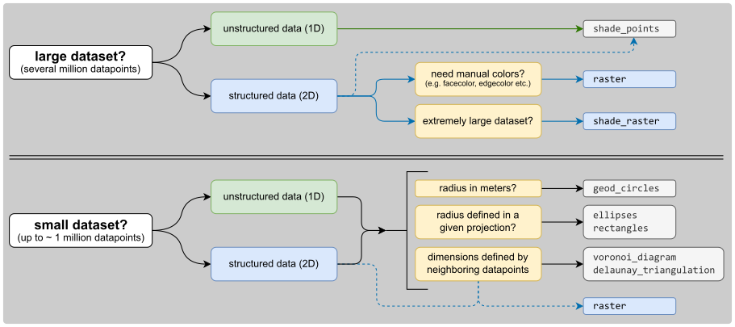

⚙ Usage
=========

🚀 Basics
---------

🌐 Initialization of Maps objects
~~~~~~~~~~~~~~~~~~~~~~~~~~~~~~~~~

| EOmaps is all about ``Maps`` objects.
| To start creating a new map (in this case a plot in ``epsg=4326``, e.g. lon/lat), simply use:

.. code-block:: python

    from eomaps import Maps
    m = Maps(crs=4326, layer="first layer", figsize=(10, 5))
    m.add_feature.preset.coastline()

- ``crs`` represents the projection used for plotting
- ``layer`` represents the name of the layer associated with the Maps-object (see below)
- all additional keyword arguments are forwarded to the creation of the matplotlib-figure
  (e.g.: ``figsize``, ``frameon``, ``edgecolor`` etc).

Possible ways for specifying the crs for plotting are:

- If you provide an integer, it is identified as an epsg-code (e.g. ``4326``, ``3035``, etc.)

  - 4326 hereby defaults to `PlateCarree` projection

- All other CRS usable for plotting are accessible via ``Maps.CRS``,
  e.g.: ``crs=Maps.CRS.Orthographic()``, ``crs=Maps.CRS.GOOGLE_MERCATOR`` or ``crs=Maps.CRS.Equi7Grid_projection("EU")``.
  (``Maps.CRS`` is just an accessor for ``cartopy.crs``)

▤ Layers
~~~~~~~~~

| Each ``Maps`` object represents an individual plot-layer of the map.
| Once you have created your first ``Maps`` object, you can create **additional layers on the same map** by using:

.. code-block:: python

    m = Maps()                           # same as `m = Maps(layer=0)`
    m2 = m.new_layer()                   # "m2" is just another Maps-object on the same layer as "m"!

    m_ocean = m.new_layer(layer="ocean") # create a new layer named "ocean"
    m_ocean.add_feature.preset.ocean()   # features on this layer will only be visible if the "ocean" layer is visible!
    m.show_layer("ocean")                # show the "ocean" layer

    m.all.add_feature.preset.coastline() # to add a feature to all layers, simply add it to the `all` layer with `m.all...`

    m.util.layer_selector()              # get a utility widget to simplify switching between existing layers

- ``m2``, ``m_ocean`` and ``m.all`` are just ordinary ``Maps`` objects that share the figure and plot-axes with ``m``
- If you don't provide an explicit layer name, the new Maps-object will use the same layer as its parent!
  (you can have multiple ``Maps`` objects on the same layer!)

.. admonition:: Map-features and colorbars are layer-sensitive!

    Features, datasets, colormaps etc. added to a ``Maps`` object are only visible if the associated layer is visible!
    To manually switch between layers, use ``m.show_layer("the layer name")``, call ``m.show()`` or have a look at the :ref:`utility`.

.. admonition:: The "all" layer

    | There is one layer-name that has a special meaning... the ``"all"`` layer.
    | Any callbacks, features or plots added to this layer will be **executed on all other layers** as well!

    You can add features and callbacks to the ``all`` layer via:
    - using the shortcut ``m.all. ...``
    - creating a dedicated ``Maps`` object via ``m_all = Maps(layer="all")`` or ``m_all = m.new_layer("all")``
    - using the "layer" kwarg of functions e.g. ``m.plot_map(layer="all")``

.. currentmodule:: eomaps

.. autosummary::
    :toctree: generated
    :nosignatures:
    :template: only_names_in_toc.rst

    Maps
    Maps.new_layer
    Maps.all
    Maps.show_layer
    Maps.fetch_layers

🔵 Setting the data and plot-shape
~~~~~~~~~~~~~~~~~~~~~~~~~~~~~~~~~~~

To assign a dataset to a ``Maps`` object, use ``m.set_data(...)``.
The shapes that are used to represent the data-points are then assigned via ``m.set_shape``.

.. admonition:: What's used by default?

    By default, the plot-shape is assigned based on the associated dataset.

    - For datasets with less than 500 000 pixels, ``m.set_shape.ellipses()`` is used.
    - | For larger 2D datasets ``m.set_shape.shade_raster()`` is used
      | ... and ``m.set_shape.shade_points()`` is used for the rest.

.. code-block:: python

    m = Maps()                                # create a Maps-object
    m.set_data(data1, x, y, crs, ...)         # assign some data to the Maps-object
    m.set_shape.geod_circles(radius=1000,     # draw geodetic circles with 1km radius
                             n=100)           # use 100 intermediate points to represent the shape

    m.plot_map()                              # plot the data

    m2 = m.new_layer()                        # create a new Maps-object on the same layer
    m2.set_data(data, x, y, crs, ...)         # assign another dataset to the new Maps object
    m2.set_shape.rectangles(radius=1,         # represent the datapoints as 1x1 degree rectangles
                            radius_crs=4326)
    m2.plot_map()                             # plot the data

    m3 = m.new_layer("data")                  # create a new layer named "data"
    ...                                       # ...

.. currentmodule:: eomaps

.. autosummary::
    :toctree: generated
    :nosignatures:
    :template: only_names_in_toc.rst

    Maps.set_data
    Maps.set_shape

Possible shapes that work nicely for datasets with up to 1M data-points:

.. currentmodule:: eomaps._shapes.shapes

.. autosummary::
    :toctree: generated
    :nosignatures:
    :template: only_names_in_toc.rst

    geod_circles
    ellipses
    rectangles
    voronoi_diagram
    delaunay_triangulation
    raster

While ``raster`` still works nicely for large datasets , for extremely large datasets
(several million datapoints), it is recommended to use "shading" instead of representing
each data-point with a projected polygon.

Possible shapes that can be used to quickly generate a plot for millions of datapoints are:

.. autosummary::
    :toctree: generated
    :nosignatures:
    :template: only_names_in_toc.rst

    shade_points
    shade_raster

If shading is used, a dynamic averaging of the data based on the screen-resolution and the
currently visible plot-extent is performed (resampling based on the mean-value is used by default).

.. note::

    The "shade"-shapes require the additional ``datashader`` dependency!
    You can install it via:
    ``conda install -c conda-forge datashader``

To get an overview of the existing shapes and their main use-cases, here's a simple decision-tree:

.. image:: _static/minigifs/plot_shapes.gif

🗺 Plot the map and save it
~~~~~~~~~~~~~~~~~~~~~~~~~~~

If you want to plot a map based on a dataset, first set the data and then
call ``m.plot_map()``.

Any additional keyword-arguments passed to ``m.plot_map()`` are forwarded to the actual
plot-command for the selected shape.

Some useful arguments that are supported by most shapes (except "shade"-shapes) are:

    - "fc" or "facecolor" : the face-color of the shapes
    - "ec" or "edgecolor" : the edge-color of the shapes
    - "lw" or "linewidth" : the linewidth of the shapes
    - "alpha" : the alpha-transparency

.. code-block:: python

    m = Maps()
    m.add_feature.preset.coastline()

    m2 = m.new_layer("a data layer")
    m2.set_data(...)
    ...
    m2.plot_map(cmap="viridis", ec="g", lw=2, alpha=0.5)

To adjust the margins of the subplots, use ``m.subplots_adjust``, e.g.:

.. code-block:: python

    m = Maps()
    m.subplots_adjust(left=0.1, right=0.9, bottom=0.05, top=0.95)

.. currentmodule:: eomaps

.. autosummary::
    :toctree: generated
    :nosignatures:
    :template: only_names_in_toc.rst

    Maps.subplots_adjust

You can then continue to add :ref:`colorbar`, :ref:`annotations_and_markers`,
:ref:`scalebar`, :ref:`compass`,  :ref:`webmap_layers` or :ref:`geodataframe` to the map,
or you can start to add :ref:`utility` and :ref:`callbacks`.

Once the map is ready, a snapshot of the map can be saved at any time by using:

.. code-block:: python

    m.savefig( "snapshot1.png", dpi=300, ... )

.. currentmodule:: eomaps

.. autosummary::
    :toctree: generated
    :nosignatures:
    :template: only_names_in_toc.rst

    Maps.plot_map
    Maps.savefig

🌍 Customizing the plot
~~~~~~~~~~~~~~~~~~~~~~~

All arguments to customize the appearance of a dataset are passed to ``m.plot_map(...)``.

In general, the colors assigned to the shapes are specified by selecting a colormap (``cmap``)
and (optionally) setting appropriate limits via ``vmin`` and ``vmax``.

- ``cmap`` can be specified as (see `matplotlib-docs <https://matplotlib.org/stable/tutorials/colors/colormaps.html>`_ for more details):

  - a name of a pre-defined ``matplotlib`` colormap (e.g. ``"viridis"``, ``"RdYlBu"`` etc.)
  - or a general ``matplotlib`` colormap object

- ``vmin`` and ``vmax`` set the range of data-values that are mapped

  - (Any values outside this range will get the colormaps ``over`` and ``under`` colors assigned.)

.. code-block:: python

    m = Maps()
    m.set_data(...)
    m.plot_map(cmap="viridis", vmin=0, vmax=1)

------

Colors can also be set **manually** by providing one of the following arguments to ``m.plot_map(...)``:

- to set both **facecolor** AND **edgecolor** use ``color=...``
- to set the **facecolor** use ``fc=...`` or ``facecolor=...``
- to set the **edgecolor** use ``ec=...`` or ``edgecolor=...``

.. note::

    - Manual color specifications do NOT work with the ``shade`` shapes!
    - Providing manual colors will override the colors assigned by the ``cmap``!
    - The ``colorbar`` will NOT represent manually defined colors!

Uniform colors
**************

To apply a uniform color to all datapoints, you can use matpltolib's color-names or pass an RGB or RGBA tuple.

.. code-block:: python

    m.plot_map(fc="r")
    m.plot_map(fc="orange")
    m.plot_map(fc=(1, 0, 0.5))
    m.plot_map(fc=(1, 0, 0.5, .25))
    # for grayscale use a string of a number between 0 and 1
    m.plot_map(fc="0.3")

Explicit colors
***************

To explicitly color each datapoint with a pre-defined color, simply provide a list or array of the aforementioned types.

.. code-block:: python

    m.plot_map(fc=["r", "g", "orange"])
    # for grayscale use a string of a number between 0 and 1
    m.plot_map(fc=[".1", ".2", "0.3"])
    # or use RGB / RGBA tuples
    m.plot_map(fc=[(1, 0, 0.5), (.3, .4, .5), (1, 1, 0)])
    m.plot_map(fc=[(1, 0, 0.5, .25), (1, 0, 0.5, .75), (.1, .2, 0.5, .5)])

RGB composites
**************

To create an RGB or RGBA composite from 3 (or 4) datasets, pass the datasets as tuple:

- the datasets must have the same size as the coordinate arrays!
- the datasets must be scaled between 0 and 1

.. code-block:: python

    # if you pass a tuple of 3 or 4 arrays, they will be used to set the
    # RGB (or RGBA) colors of the shapes
    m.plot_map(fc=(<R-array>, <G-array>, <B-array>))
    m.plot_map(fc=(<R-array>, <G-array>, <B-array>, <A-array>))

    # you can fix individual color channels by passing a list with 1 element
    m.plot_map(fc=(<R-array>, [0.12345], <B-array>, <A-array>))

📊 Data classification
~~~~~~~~~~~~~~~~~~~~~~~

EOmaps provides an interface for `mapclassify <https://github.com/pysal/mapclassify>`_ to classify datasets prior to plotting.

There are 2 (synonymous) ways to assign a classification-scheme:

- ``m.set_classify_specs(scheme=..., ...)``: set classification scheme by providing name and relevant parameters.
- ``m.set_classify.<SCHEME>(...)``: use autocompletion to get available classification schemes (with appropriate docstrings)

  - The big advantage of this method is that it supports autocompletion (once the Maps-object has been instantiated)
    and provides relevant docstrings to get additional information on the classification schemes.

Available classifier names are also accessible via ``Maps.CLASSIFIERS``.

The preferred way for assigning a classification-scheme to a ``Maps`` object is:

.. code-block:: python

    m = Maps()
    m.set_data(...)
    m.set_shape.ellipses(...)
    m.set_classify.Quantiles(k=5)
    m.plot_map()

Alternatively, one can also use ``m.set_classify_specs`` to assign a classification scheme:

.. code-block:: python

    m = Maps()
    m.set_data(...)
    m.set_shape.ellipses(...)

    m.set_classify_specs(scheme="Quantiles", k=5)
    m.classify_specs.k = 10 # alternative way for setting classify-specs
    m.plot_map()

.. currentmodule:: eomaps

.. autosummary::
    :toctree: generated
    :nosignatures:
    :template: only_names_in_toc.rst

    Maps.set_classify
    Maps.set_classify_specs

Currently available classification-schemes are (see `mapclassify <https://github.com/pysal/mapclassify>`_ for details):

- BoxPlot (hinge)
- EqualInterval (k)
- FisherJenks (k)
- FisherJenksSampled (k, pct, truncate)
- HeadTailBreaks ()
- JenksCaspall (k)
- JenksCaspallForced (k)
- JenksCaspallSampled (k, pct)
- MaxP (k, initial)
- MaximumBreaks (k, mindiff)
- NaturalBreaks (k, initial)
- Quantiles (k)
- Percentiles (pct)
- StdMean (multiples)
- UserDefined (bins)

𝄜 Multiple maps in one figure
~~~~~~~~~~~~~~~~~~~~~~~~~~~~~~

``MapsGrid`` objects can be used to create (and manage) multiple maps in one figure.

A ``MapsGrid`` creates a grid of ``Maps`` objects (and/or ordinary ``matpltolib`` axes),
and provides convenience-functions to perform actions on all maps of the figure.

.. code-block:: python

    from eomaps import MapsGrid
    mg = MapsGrid(r=2, c=2, crs=..., layer=..., ... )
    # you can then access the individual Maps-objects via:
    mg.m_0_0
    mg.m_0_1
    mg.m_1_0
    mg.m_1_1

    m2 = mg.m_0_0.new_layer("newlayer")
    ...

    # there are many convenience-functions to perform actions on all Maps-objects:
    mg.add_feature.preset.coastline()
    mg.add_compass()
    ...

    # to perform more complex actions on all Maps-objects, simply loop over the MapsGrid object
    for m in mg:
        ...

    # set the margins of the plot-grid
    mg.subplots_adjust(left=0.1, right=0.9, bottom=0.05, top=0.95, hspace=0.1, wspace=0.05)

Make sure to checkout the :ref:`layout_editor` which greatly simplifies the arrangement of multiple axes within a figure!

Custom grids and mixed axes
***************************

Fully customized grid-definitions can be specified by providing ``m_inits`` and/or ``ax_inits`` dictionaries
of the following structure:

- The keys of the dictionary are used to identify the objects
- The values of the dictionary are used to identify the position of the associated axes
- The position can be either an integer ``N``, a tuple of integers or slices ``(row, col)``
- Axes that span over multiple rows or columns, can be specified via ``slice(start, stop)``

.. code-block:: python

    dict(
        name1 = N  # position the axis at the Nth grid cell (counting firs)
        name2 = (row, col), # position the axis at the (row, col) grid-cell
        name3 = (row, slice(col_start, col_end)) # span the axis over multiple columns
        name4 = (slice(row_start, row_end), col) # span the axis over multiple rows
        )

- ``m_inits`` is used to initialize ``Maps`` objects
- ``ax_inits`` is used to initialize ordinary ``matplotlib`` axes

The individual ``Maps``-objects and ``matpltolib-Axes`` are then accessible via:

.. code-block:: python

    mg = MapsGrid(2, 3,
                  m_inits=dict(left=(0, 0), right=(0, 2)),
                  ax_inits=dict(someplot=(1, slice(0, 3)))
                  )
    mg.m_left   # the Maps object with the name "left"
    mg.m_right   # the Maps object with the name "right"

    mg.ax_someplot   # the ordinary matplotlib-axis with the name "someplot"

❗ NOTE: if ``m_inits`` and/or ``ax_inits`` are provided, ONLY the explicitly defined objects are initialized!

- The initialization of the axes is based on matplotlib's `GridSpec <https://matplotlib.org/stable/api/_as_gen/matplotlib.gridspec.GridSpec.html>`_ functionality.
  All additional keyword-arguments (``width_ratios, height_ratios, etc.``) are passed to the initialization of the ``GridSpec`` object.

- To specify unique ``crs`` for each ``Maps`` object, provide a dictionary of ``crs`` specifications.

.. code-block:: python

    from eomaps import MapsGrid

    # initialize a grid with 2 Maps objects and 1 ordinary matplotlib axes
    mgrid = MapsGrid(2, 2,
                     m_inits=dict(top_row=(0, slice(0, 2)),
                                  bottom_left=(1, 0)),
                     crs=dict(top_row=4326,
                              bottom_left=3857),
                     ax_inits=dict(bottom_right=(1, 1)),
                     width_ratios=(1, 2),
                     height_ratios=(2, 1))

    mgrid.m_top_row # a map extending over the entire top-row of the grid (in epsg=4326)
    mgrid.m_bottom_left # a map in the bottom left corner of the grid (in epsg=3857)

    mgrid.ax_bottom_right # an ordinary matplotlib axes in the bottom right corner of the grid

.. currentmodule:: eomaps

.. autosummary::
    :toctree: generated
    :nosignatures:
    :template: only_names_in_toc.rst

    MapsGrid
    MapsGrid.join_limits
    MapsGrid.share_click_events
    MapsGrid.share_pick_events
    MapsGrid.set_data_specs
    MapsGrid.set_classify_specs
    MapsGrid.add_wms
    MapsGrid.add_feature
    MapsGrid.add_annotation
    MapsGrid.add_marker
    MapsGrid.add_gdf

🧱 Naming conventions and autocompletion
~~~~~~~~~~~~~~~~~~~~~~~~~~~~~~~~~~~~~~~~

The goal of EOmaps is to provide a comprehensive, yet easy-to-use interface.

To avoid having to remember a lot of names, a concise naming-convention is applied so
that autocompletion can quickly narrow-down the search to relevant functions and properties.

Once a few basics keywords have been remembered, finding the right functions and properties should be quick and easy.

.. note::

    EOmaps works best in conjunction with "dynamic autocompletion", e.g. by using an interactive
    console where you instantiate a ``Maps`` object first and then access dynamically updated properties
    and docstrings on the object.

    To clarify a bit more:

    - First, execute ``m = Maps()`` in an interactive console
    - then (inside the console, not inside the editor!) use autocompletion on ``m.`` to get
      autocompletion for dynamically updated attributes.

    For example the following accessors only work properly after the ``Maps`` object has been initialized:
    - ``m.add_wms``: browse available WebMap services
    - ``m.set_classify``: browse available classification schemes

The following list provides an overview of the naming-conventions used within EOmaps:

Add features to a map - "m.add_"
********************************
All functions that add features to a map start with ``add_``, e.g.:
- ``m.add_feature``, ``m.add_wms``, ``m.add_annotation``, ``m.add_marker``, ``m.add_gdf``, ...

WebMap services (e.g. ``m.add_wms``) are fetched dynamically from the respective APIs.
Therefore the structure can vary from one WMS to another.
The used convention is the following:
- You can navigate into the structure of the API by using "dot-access" continuously
- once you reach a level that provides layers that can be added to the map, the ``.add_layer.`` directive will be visible
- any ``<LAYER>`` returned by ``.add_layer.<LAYER>`` can be added to the map by simply calling it, e.g.:

   - ``m.add_wms.OpenStreetMap.add_layer.default()``
   - ``m.add_wms.OpenStreetMap.OSM_mundialis.add_layer.OSM_WMS()``

Set data specifications - "m.set_"
**********************************
All functions that set properties of the associated dataset start with ``set_``, e.g.:
- ``m.set_data``, ``m.set_classify``, ``m.set_shape``, ...

Create new Maps-objects - "m.new_"
**********************************
Actions that result in a new ``Maps`` objects start with ``new_``.
- ``m.new_layer``, ``m.new_inset_map``, ...

Callbacks - "m.cb."
*******************
Everything related to callbacks is grouped under the ``cb`` accessor.

- use ``m.cb.<METHOD>.attach.<CALLBACK>()`` to attach pre-defined callbacks

  - ``<METHOD>`` hereby can be one of ``click``, ``pick`` or ``keypress``
    (but there's no need to remember since autocompletion will do the job!).

- use ``m.cb.<METHOD>.attach(custom_cb)`` to attach a custom callback

.. _callbacks:

🛸 Callbacks - make the map interactive!
----------------------------------------

Callbacks are used to execute functions when you click on the map.

They can be attached to a map via:

.. code-block:: python

    m = Maps()
    ...
    m.cb.< METHOD >.attach.< CALLBACK >( **kwargs )

`< METHOD >` defines the way how callbacks are executed.

.. currentmodule:: eomaps._cb_container.cb_container

.. autosummary::
    :nosignatures:
    :template: only_names_in_toc.rst

    click
    pick
    keypress

`< CALLBACK >` indicates the action you want to assign o the event.
There are many pre-defined callbacks, but it is also possible to define custom
functions and attach them to the map.

.. Note::

    Callbacks are only executed if the layer of the associated ``Maps`` object is actually visible!
    (This assures that pick-callbacks always refer to the visible dataset.)

    To define callbacks that are executed independent of the visible layer, attach it to the ``"all"``
    layer using something like ``m.all.cb.click.attach.annotate()``.

+-----------------------------------------------------------------------------------+--------------------------------------------------+
| .. code-block:: python                                                            | .. image:: _static/minigifs/simple_callbacks.gif |
|                                                                                   |   :align: center                                 |
|     from eomaps import Maps                                                       |                                                  |
|     import numpy as np                                                            |                                                  |
|     x, y = np.mgrid[-45:45, 20:60]                                                |                                                  |
|                                                                                   |                                                  |
|     m = Maps(Maps.CRS.Orthographic())                                             |                                                  |
|     m.all.add_feature.preset.coastline()                                          |                                                  |
|     m.set_data(data=x+y**2, x=x, y=y, crs=4326)                                   |                                                  |
|     m.plot_map(pick_distance=10)                                                  |                                                  |
|                                                                                   |                                                  |
|     m2 = m.new_layer(copy_data_specs=True, layer="second_layer")                  |                                                  |
|     m2.plot_map(cmap="tab10")                                                     |                                                  |
|                                                                                   |                                                  |
|     # get an annotation if you RIGHT-click anywhere on the map                    |                                                  |
|     m.cb.click.attach.annotate(xytext=(-60, -60),                                 |                                                  |
|                                bbox=dict(boxstyle="round", fc="r"))               |                                                  |
|                                                                                   |                                                  |
|     # pick the nearest datapoint if you click on the MIDDLE mouse button          |                                                  |
|     m.cb.pick.attach.annotate(button=2)                                           |                                                  |
|     m.cb.pick.attach.mark(buffer=1, permanent=False, fc="none", ec="r", button=2) |                                                  |
|     m.cb.pick.attach.mark(buffer=4, permanent=False, fc="none", ec="r", button=2) |                                                  |
|                                                                                   |                                                  |
|     # peek at the second layer if you LEFT-click on the map                       |                                                  |
|     m.cb.click.attach.peek_layer("second_layer", how=.25, button=3)               |                                                  |
+-----------------------------------------------------------------------------------+--------------------------------------------------+

Pre-defined click & pick callbacks
~~~~~~~~~~~~~~~~~~~~~~~~~~~~~~~~~~

Callbacks that can be used with both `m.cb.click` and `m.cb.pick`:

.. currentmodule:: eomaps.callbacks.click_callbacks

.. autosummary::
    :toctree: generated
    :nosignatures:
    :template: only_names_in_toc.rst

    peek_layer
    annotate
    clear_annotations
    mark
    clear_markers
    get_values
    print_to_console

Callbacks that can be used only with `m.cb.pick`:

.. currentmodule:: eomaps.callbacks.pick_callbacks

.. autosummary::
    :toctree: generated
    :nosignatures:
    :template: only_names_in_toc.rst

    load
    highlight_geometry

Pre-defined keypress callbacks
~~~~~~~~~~~~~~~~~~~~~~~~~~~~~~

Callbacks that can be used with `m.cb.keypress`

.. currentmodule:: eomaps.callbacks.keypress_callbacks

.. autosummary::
    :toctree: generated
    :nosignatures:
    :template: only_names_in_toc.rst

    switch_layer
    fetch_layers

Custom callbacks
~~~~~~~~~~~~~~~~

Custom callback functions can be attached to the map via:

.. code-block:: python

    def some_callback(asdf, **kwargs):
        print("hello world")
        print("the value of 'asdf' is", asdf)
        print("the position of the clicked pixel in plot-coordinates", kwargs["pos"])
        print("the dataset-index of the nearest datapoint", kwargs["ID"])
        print("data-value of the nearest datapoint", kwargs["val"])
        ...

    # attaching custom callbacks works completely similar for "click", "pick" and "keypress"!
    m = Maps()
    ...
    m.cb.pick.attach(some_callback, double_click=False, button=1, asdf=1)
    m.cb.click.attach(some_callback, double_click=False, button=2, asdf=1)
    m.cb.keypress.attach(some_callback, key="x", asdf=1)

- ❗ for click callbacks the kwargs ``ID`` and ``val`` are set to ``None``!
- ❗ for keypress callbacks the kwargs ``ID`` and ``val`` and ``pos`` are set to ``None``!

Picking a dataset without plotting it first
~~~~~~~~~~~~~~~~~~~~~~~~~~~~~~~~~~~~~~~~~~~
It is possible to attach ``pick`` callbacks to a ``Maps`` object without plotting the data first
by using ``m.make_dataset_pickable()``.

.. code-block:: python

    m = Maps()
    m.add_feature.preset.coastline()
    m.set_data(... the dataset ...)
    m.make_dataset_pickable()
    # now it's possible to attach pick-callbacks even though the data is still "invisible"
    m.cb.pick.attach.annotate()

.. note::

    Using ``m.make_dataset_pickable()`` is ONLY necessary if you want to use ``pick``
    callbacks without actually plotting the data! Otherwise a call to ``m.plot_map()``
    is sufficient!

.. currentmodule:: eomaps.Maps

.. autosummary::
    :toctree: generated
    :nosignatures:
    :template: only_names_in_toc.rst

    make_dataset_pickable

.. _webmap_layers:

🛰 WebMap layers
----------------

WebMap services (TS/WMS/WMTS) can be attached to the map via:

.. code-block:: python

    m.add_wms.attach.< SERVICE > ... .add_layer.< LAYER >(...)

``< SERVICE >`` hereby specifies the pre-defined WebMap service you want to add,
and ``< LAYER >`` indicates the actual layer-name.

.. code-block:: python

    m = Maps(Maps.CRS.GOOGLE_MERCATOR) # (the native crs of the service)
    m.add_wms.OpenStreetMap.add_layer.default()

.. currentmodule:: eomaps

.. autosummary::
    :toctree: generated
    :nosignatures:
    :template: only_names_in_toc.rst

    Maps.add_wms

.. note::

    It is highly recommended (and sometimes even required) to use the native crs
    of the WebMap service in order to avoid re-projecting the images
    (which degrades image quality and sometimes takes quite a lot of time to finish...)

    - most services come either in ``epsg=4326`` or in ``Maps.CRS.GOOGLE_MERCATOR`` projection

.. table::
    :widths: 50 50
    :align: center

    +------------------------------------------------------------------------------------------------+-----------------------------------------+
    | .. code-block:: python                                                                         | .. image:: _static/minigifs/add_wms.png |
    |                                                                                                |   :align: center                        |
    |     from eomaps import Maps, MapsGrid                                                          |                                         |
    |     mg = MapsGrid(crs=Maps.CRS.GOOGLE_MERCATOR)                                                |                                         |
    |     mg.join_limits()                                                                           |                                         |
    |                                                                                                |                                         |
    |     mg.m_0_0.add_wms.OpenStreetMap.add_layer.default()                                         |                                         |
    |     mg.m_0_1.add_wms.OpenStreetMap.add_layer.stamen_toner()                                    |                                         |
    |                                                                                                |                                         |
    |     mg.m_1_1.add_wms.S1GBM.add_layer.vv()                                                      |                                         |
    |                                                                                                |                                         |
    |     # ... for more advanced                                                                    |                                         |
    |     layer = mg.m_1_0.add_wms.ISRIC_SoilGrids.nitrogen.add_layer.nitrogen_0_5cm_mean            |                                         |
    |     layer.set_extent_to_bbox() # set the extent according to the boundingBox                   |                                         |
    |     layer.info                 # the "info" property provides useful information on the layer  |                                         |
    |     layer()                    # call the layer to add it to the map                           |                                         |
    |     layer.add_legend()         # if a legend is provided, you can add it to the map!           |                                         |
    |                                                                                                |                                         |
    +------------------------------------------------------------------------------------------------+-----------------------------------------+

Pre-defined WebMap services:
~~~~~~~~~~~~~~~~~~~~~~~~~~~~

**Global:**

.. currentmodule:: eomaps._containers.wms_container

.. autosummary::
    :toctree: generated
    :nosignatures:
    :template: only_names_in_toc.rst

    OpenStreetMap
    ESA_WorldCover
    NASA_GIBS
    ISRIC_SoilGrids
    EEA_DiscoMap
    ESRI_ArcGIS
    S1GBM
    S2_cloudless
    GEBCO
    CAMS

**Services specific for Austria (Europe)**

.. currentmodule:: eomaps._containers

.. autosummary::
    :toctree: generated
    :nosignatures:
    :template: only_names_in_toc.rst

    Austria.AT_basemap
    Austria.Wien_basemap

.. note::
    Services might be nested directory structures!
    The actual layer is always added via the ``add_layer`` directive.

        :code:`m.add_wms.<...>. ... .<...>.add_layer.<LAYER NAME>()`

    Some of the services dynamically fetch the structure via HTML-requests.
    Therefore it can take a short moment before autocompletion is capable of
    showing you the available options!
    A list of available layers from a sub-folder can be fetched via:

        :code:`m.add_wms.<...>. ... .<LAYER NAME>.layers`

Using custom WebMap services
~~~~~~~~~~~~~~~~~~~~~~~~~~~~

It is also possible to use custom WMS/WMTS/XYZ services.
(see docstring of ``m.add_wms.get_service`` for more details and examples)

.. currentmodule:: eomaps._containers.wms_container

.. autosummary::
    :toctree: generated
    :nosignatures:
    :template: only_names_in_toc.rst

    get_service

.. code-block:: python

    m = Maps()
    # define the service
    service = m.add_wms.get_service(<... link to GetCapabilities.xml ...>,
                                    service_type="wms",
                                    res_API=False,
                                    maxzoom=19)
    # once the service is defined, you can use it just like the pre-defined ones
    service.layers   # >> get a list of all layers provided by the service

    # select one of the layers
    layer = service.add_layer. ... .< LAYER >
    layer.info                  # >> get some additional infos for the selected layer
    layer.set_extent_to_bbox()  # >> set the map-extent to the bbox of the layer

    # call the layer to add it to the map
    # (optionally providing additional kwargs for fetching map-tiles)
    layer(...)

Setting date, style and other WebMap properties
~~~~~~~~~~~~~~~~~~~~~~~~~~~~~~~~~~~~~~~~~~~~~~~

Some WebMap services allow passing additional arguments to set properties such as the **date** or the **style** of the map.
To pass additional arguments to a WebMap service, simply provide them when when calling the layer, e.g.:

.. code-block:: python

    m = Maps()
    m.add_wms.< SERVICE >. ... .add_layer.< LAYER >(time=..., styles=[...], ...)

To show an example, here's how to fetch multiple timestamps for the UV-index of the Copernicus Airquality service.
(provided by https://atmosphere.copernicus.eu/)

.. table::
    :widths: 50 50
    :align: center

    +-------------------------------------------------------------------------------------+----------------------------------------------+
    | .. code-block:: python                                                              | .. image:: _static/minigifs/advanced_wms.gif |
    |                                                                                     |   :align: center                             |
    |     from eomaps import Maps                                                         |                                              |
    |     import pandas as pd                                                             |                                              |
    |                                                                                     |                                              |
    |     m = Maps(layer="all", figsize=(8, 4))                                           |                                              |
    |     m.subplots_adjust(left=0.05, right=0.95)                                        |                                              |
    |     m.all.add_feature.preset.coastline()                                            |                                              |
    |     m.add_logo()                                                                    |                                              |
    |                                                                                     |                                              |
    |     layer = m.add_wms.CAMS.add_layer.composition_uvindex_clearsky                   |                                              |
    |     timepos = layer.wms_layer.timepositions   # available time-positions            |                                              |
    |     all_styles = list(layer.wms_layer.styles) # available styles                    |                                              |
    |                                                                                     |                                              |
    |     # create a list of timestamps to fetch                                          |                                              |
    |     start, stop, freq = timepos[1].split(r"/")                                      |                                              |
    |     times = pd.date_range(start, stop, freq=freq.replace("PT", ""))                 |                                              |
    |     times = times.strftime("%Y-%m-%dT%H:%M:%SZ")                                    |                                              |
    |                                                                                     |                                              |
    |     style = all_styles[0]     # use the first available style                       |                                              |
    |     for time in times[:6]:                                                          |                                              |
    |         # call the layer to add it to the map                                       |                                              |
    |         layer(time=time,                                                            |                                              |
    |               styles=[style],   # provide a list with 1 entry here                  |                                              |
    |               layer=time        # put each WebMap on an individual layer            |                                              |
    |               )                                                                     |                                              |
    |                                                                                     |                                              |
    |     layer.add_legend()  # add a legend for the WebMap service                       |                                              |
    |                                                                                     |                                              |
    |     # add a "slider" and a "selector" widget                                        |                                              |
    |     m.util.layer_selector(ncol=3, loc="upper center", fontsize=6, labelspacing=1.3) |                                              |
    |     m.util.layer_slider()                                                           |                                              |
    |                                                                                     |                                              |
    |     # attach a callback to fetch all layers if you press l on the keyboard          |                                              |
    |     cid = m.all.cb.keypress.attach.fetch_layers(key="l")                            |                                              |
    |     # fetch all layers so that they are cached and switching layers is fast         |                                              |
    |     m.fetch_layers()                                                                |                                              |
    |     m.show_layer(times[0])      # make the first timestamp visible                  |                                              |
    +-------------------------------------------------------------------------------------+----------------------------------------------+

.. _geodataframe:

🌵 GeoDataFrames and NaturalEarth features
------------------------------------------

💠 GeoDataFrames
~~~~~~~~~~~~~~~~~

A ``geopandas.GeoDataFrame`` can be added to the map via ``m.add_gdf()``.

.. currentmodule:: eomaps

.. autosummary::
    :toctree: generated
    :nosignatures:
    :template: only_names_in_toc.rst

    Maps.add_gdf

.. code-block:: python

    import geopandas as gpd

    gdf = gpd.GeoDataFrame(geometries=[...], crs=...)

    m = Maps()
    m.add_gdf(gdf, fc="r", ec="g", lw=2)

It is possible to make the shapes of a ``GeoDataFrame`` pickable
(e.g. usable with ``m.cb.pick`` callbacks) by providing a ``picker_name``
(and optionally specifying a ``pick_method``).

Once the ``picker_name`` is specified, pick-callbacks can be attached via:

- ``m.cb.pick[<PICKER NAME>].attach.< CALLBACK >()``

| For example, to highlight the clicked country, you could use:

.. table::
    :widths: 50 50
    :align: center

    +----------------------------------------------------------------------------+----------------------------------------------+
    | .. code-block:: python                                                     | .. image:: _static/minigifs/add_gdf_pick.gif |
    |                                                                            |   :align: center                             |
    |     from eomaps import Maps                                                |                                              |
    |     m = Maps()                                                             |                                              |
    |     # get the GeoDataFrame for a given NaturalEarth feature                |                                              |
    |     gdf = m.add_feature.cultural_110m.admin_0_countries.get_gdf()          |                                              |
    |                                                                            |                                              |
    |     # pick the shapes of the GeoDataFrame based on a "contains" query      |                                              |
    |     m.add_gdf(gdf, picker_name="countries", pick_method="contains")        |                                              |
    |                                                                            |                                              |
    |     # temporarily highlight the picked geometry                            |                                              |
    |     m.cb.pick["countries"].attach.highlight_geometry(fc="r", ec="g", lw=2) |                                              |
    |                                                                            |                                              |
    +----------------------------------------------------------------------------+----------------------------------------------+

🌴 NaturalEarth features
~~~~~~~~~~~~~~~~~~~~~~~~

Feature-layers provided by `NaturalEarth <https://www.naturalearthdata.com>`_ can be directly added to the plot via ``m.add_feature``.

.. currentmodule:: eomaps

.. autosummary::
    :toctree: generated
    :nosignatures:
    :template: only_names_in_toc.rst

    Maps.add_feature

The general call-signature is:

.. code-block:: python

    m = Maps()
    # just call the feature to add it to the map
    m.add_feature.< CATEGORY >.< FEATURE >(...)

    # if you only want to get the associated GeoDataFrame, you can use
    gdf = m.add_feature.< CATEGORY >.< FEATURE >.get_gdf()

Where ``< CATEGORY >`` specifies the resolution and general category of the feature, e.g.:

- ``cultural_10m``, ``cultural_50m``, ``cultural_110m``: cultural features (e.g. countries, states etc.)
- ``physical_10m``, ``physical_50m``, ``physical_110m``: physical features (e.g. coastline, land, ocean etc.)

The most commonly used features are available under the ``preset`` category:

.. currentmodule:: eomaps._containers._NaturalEarth_presets

.. autosummary::
    :toctree: generated
    :nosignatures:
    :template: only_names_in_toc.rst

    coastline
    ocean
    land
    countries

+-------------------------------------------------------------------------+-------------------------------------------------+
| .. code-block:: python                                                  | .. image:: _static/minigifs/add_feature.gif     |
|                                                                         |   :align: center                                |
|     from eomaps import Maps                                             |                                                 |
|     m = Maps()                                                          |                                                 |
|     m.add_feature.preset.coastline()                                    |                                                 |
|     m.add_feature.preset.ocean()                                        |                                                 |
|     m.add_feature.preset.land()                                         |                                                 |
|     m.add_feature.preset.countries()                                    |                                                 |
|                                                                         |                                                 |
|     m.add_feature.physical_110m.lakes(ec="b")                           |                                                 |
|     m.add_feature.cultural_110m.admin_0_pacific_groupings(ec="m", lw=2) |                                                 |
|                                                                         |                                                 |
|     # (only if geopandas is installed)                                  |                                                 |
|     places = m.add_feature.cultural_110m.populated_places.get_gdf()     |                                                 |
|     m.add_gdf(places, markersize=places.NATSCALE/10, fc="r")            |                                                 |
|                                                                         |                                                 |
+-------------------------------------------------------------------------+-------------------------------------------------+

.. note::

    If ``geopandas`` is installed, ``GeoDataFrames`` are used to visualize the features, and all aforementioned
    functionalities of ``m.add_gdf`` can also directly be used with ``m.add_feature``!

.. _annotations_and_markers:

🏕 Annotations and Markers
--------------------------

🔴 Markers
~~~~~~~~~~~

Static markers can be added to the map via ``m.add_marker()``.

- If a dataset has been plotted, you can mark any datapoint via its ID, e.g. ``ID=...``
- To add a marker at an arbitrary position, use ``xy=(...)``

  - By default, the coordinates are assumed to be provided in the plot-crs
  - You can specify arbitrary coordinates via ``xy_crs=...``

- The radius is defined via ``radius=...``

  - By default, the radius is assumed to be provided in the plot-crs
  - You can specify the radius in an arbitrary crs via ``radius_crs=...``

- The marker-shape is set via ``shape=...``

  - Possible arguments are ``"ellipses"``, ``"rectangles"``, ``"geod_circles"``

- Additional keyword-arguments are passed to the matplotlib collections used to draw the shapes
  (e.g. "facecolor", "edgecolor", "linewidth", "alpha", etc.)

- Multiple markers can be added in one go by using lists for ``xy``, ``radius``, etc.

🛸 For dynamic markers checkout ``m.cb.click.attach.mark()`` or ``m.cb.pick.attach.mark()``

.. currentmodule:: eomaps.Maps

.. autosummary::
    :toctree: generated
    :nosignatures:
    :template: only_names_in_toc.rst

    add_marker

.. table::
    :widths: 50 50
    :align: center

    +---------------------------------------------------------------------------+-----------------------------------------+
    | .. code-block:: python                                                    | .. image:: _static/minigifs/markers.png |
    |                                                                           |   :align: center                        |
    |     from eomaps import Maps                                               |                                         |
    |     m = Maps(crs=4326)                                                    |                                         |
    |     m.add_feature.preset.coastline()                                      |                                         |
    |                                                                           |                                         |
    |     # ----- SINGLE MARKERS                                                |                                         |
    |     # by default, MARKER DIMENSIONS are defined in units of the plot-crs! |                                         |
    |     m.add_marker(xy=(0, 0), radius=20, shape="rectangles",                |                                         |
    |                  fc="y", ec="r", ls=":", lw=2)                            |                                         |
    |     m.add_marker(xy=(0, 0), radius=10, shape="ellipses",                  |                                         |
    |                  fc="darkorange", ec="r", ls=":", lw=2)                   |                                         |
    |                                                                           |                                         |
    |     # MARKER DIMENSIONS can be specified in any CRS!                      |                                         |
    |     m.add_marker(xy=(12000000, 0), xy_crs=3857,                           |                                         |
    |                  radius=5000000, radius_crs=3857,                         |                                         |
    |                  fc=(.5, .5, 0, .4), ec="r", lw=3, n=100)                 |                                         |
    |                                                                           |                                         |
    |     # GEODETIC CIRCLES with radius defined in meters                      |                                         |
    |     m.add_marker(xy=(-135, 35), radius=3000000, shape="geod_circles",     |                                         |
    |                  fc="none", ec="r", hatch="///", lw=2, n=100)             |                                         |
    |                                                                           |                                         |
    |     # ----- MULTIPLE MARKERS                                              |                                         |
    |     x = [-80, -40, 40, 80]    # x-coordinates of the markers              |                                         |
    |     fc = ["r", "g", "b", "c"] # the colors of the markers                 |                                         |
    |                                                                           |                                         |
    |     # N markers with the same radius                                      |                                         |
    |     m.add_marker(xy=(x, [-60]*4), radius=10, fc=fc)                       |                                         |
    |                                                                           |                                         |
    |     # N markers with different radius and properties                      |                                         |
    |     m.add_marker(xy=(x, [0]*4),  radius=[15, 10, 5, 2],                   |                                         |
    |                  fc=fc, ec=["none", "r", "g", "b"], alpha=[1, .5, 1, .5]) |                                         |
    |                                                                           |                                         |
    |     # N markers with different widths and heights                         |                                         |
    |     radius = ([15, 10, 5, 15], [5, 15, 15, 2])                            |                                         |
    |     m.add_marker(xy=(x, [60]*4), radius=radius, fc=fc)                    |                                         |
    +---------------------------------------------------------------------------+-----------------------------------------+

📑 Annotations
~~~~~~~~~~~~~~

Static annotations can be added to the map via ``m.add_annotation()``.

- The location is defined completely similar to ``m.add_marker()`` above.

  - You can annotate a datapoint via its ID, or arbitrary coordinates in any crs.

- Additional arguments are passed to matplotlibs ``plt.annotate`` and ``plt.text``

  - This gives a lot of flexibility to style the annotations!

🛸 For dynamic annotations checkout ``m.cb.click.attach.annotate()`` or ``m.cb.pick.attach.annotate()``

.. table::
    :widths: 50 50
    :align: center

    +-----------------------------------------------------------------------------------+---------------------------------------------+
    | .. code-block:: python                                                            | .. image:: _static/minigifs/annotations.png |
    |                                                                                   |   :align: center                            |
    |     from eomaps import Maps                                                       |                                             |
    |     import numpy as np                                                            |                                             |
    |     x, y = np.mgrid[-45:45, 20:60]                                                |                                             |
    |                                                                                   |                                             |
    |     m = Maps(crs=4326)                                                            |                                             |
    |     m.set_data(x+y, x, y)                                                         |                                             |
    |     m.add_feature.preset.coastline(ec="k", lw=.75)                                |                                             |
    |     m.plot_map()                                                                  |                                             |
    |                                                                                   |                                             |
    |     # annotate any point in the dataset via the data-index                        |                                             |
    |     m.add_annotation(ID=345)                                                      |                                             |
    |     # annotate an arbitrary position (in the plot-crs)                            |                                             |
    |     m.add_annotation(                                                             |                                             |
    |         xy=(20,25), text="A formula:\n $z=\sqrt{x^2+y^2}$",                       |                                             |
    |         fontweight="bold", bbox=dict(fc=".6", ec="none", pad=2))                  |                                             |
    |     # annotate coordinates defined in arbitrary crs                               |                                             |
    |     m.add_annotation(                                                             |                                             |
    |         xy=(2873921, 6527868), xy_crs=3857, xytext=(5,5),                         |                                             |
    |         text="A location defined \nin epsg 3857", fontsize=8,                     |                                             |
    |         rotation=-45, bbox=dict(fc="skyblue", ec="k", ls="--", pad=2))            |                                             |
    |                                                                                   |                                             |
    |     # functions can be used for more complex text                                 |                                             |
    |     def text(m, ID, val, pos, ind):                                               |                                             |
    |         return f"lon={pos[0]}\nlat={pos[1]}"                                      |                                             |
    |                                                                                   |                                             |
    |     props = dict(xy=(-1.5, 38.45), text=text,                                     |                                             |
    |                  arrowprops=dict(arrowstyle="-|>", fc="fuchsia",                  |                                             |
    |                                  mutation_scale=15))                              |                                             |
    |                                                                                   |                                             |
    |     m.add_annotation(**props, xytext=(20, 20), color="darkred")                   |                                             |
    |     m.add_annotation(**props, xytext=(-60, 20), color="purple")                   |                                             |
    |     m.add_annotation(**props, xytext=(-60, -40), color="dodgerblue")              |                                             |
    |     m.add_annotation(**props, xytext=(20, -40), color="olive")                    |                                             |
    |                                                                                   |                                             |
    |     # multiple annotations can be added in one go (xy=([...], [...]) also works!) |                                             |
    |     m.add_annotation(ID=[2500, 2700, 2900], text=lambda ID, **kwargs: str(ID),    |                                             |
    |                      color="w", fontweight="bold", rotation=90,                   |                                             |
    |                      arrowprops=dict(width=5, fc="b", ec="orange", lw=2),         |                                             |
    |                      bbox=dict(boxstyle="round, rounding_size=.8, pad=.5",        |                                             |
    |                                fc="b", ec="orange", lw=2))                        |                                             |
    |                                                                                   |                                             |
    |     m.add_annotation(ID=803, xytext=(-80,60),                                     |                                             |
    |                      bbox=dict(ec="r", fc="gold", lw=3),                          |                                             |
    |                      arrowprops=dict(                                             |                                             |
    |                          arrowstyle="fancy", relpos=(.48,-.2),                    |                                             |
    |                          mutation_scale=40, fc="r",                               |                                             |
    |                          connectionstyle="angle3, angleA=90, angleB=-25"))        |                                             |
    +-----------------------------------------------------------------------------------+---------------------------------------------+

▭ Rectangular areas
~~~~~~~~~~~~~~~~~~~

To indicate rectangular areas in any given crs, simply use ``m.indicate_extent``:

.. currentmodule:: eomaps.Maps

.. autosummary::
    :toctree: generated
    :nosignatures:
    :template: only_names_in_toc.rst

    indicate_extent

.. table::
    :widths: 50 50
    :align: center

    +-----------------------------------------------------------------------+-------------------------------------------------+
    | .. code-block:: python                                                | .. image:: _static/minigifs/indicate_extent.png |
    |                                                                       |   :align: center                                |
    |     from eomaps import Maps                                           |                                                 |
    |     m = Maps(crs=3035)                                                |                                                 |
    |     m.add_feature.preset.coastline(ec="k")                            |                                                 |
    |                                                                       |                                                 |
    |     # indicate a lon/lat rectangle                                    |                                                 |
    |     m.indicate_extent(-20, 35, 40, 50, hatch="//", fc="none", ec="r") |                                                 |
    |                                                                       |                                                 |
    |     # indicate some rectangles in epsg:3035                           |                                                 |
    |     hatches = ["*", "xxxx", "...."]                                   |                                                 |
    |     colors = ["yellow", "r", "darkblue"]                              |                                                 |
    |     for i, h, c in zip(range(3), hatches, colors):                    |                                                 |
    |         pos0 = (2e6 + i*2e6, 7e6, 3.5e6 + i*2e6, 9e6)                 |                                                 |
    |         pos1 = (2e6 + i*2e6, 7e6 + 3e6, 3.5e6 + i*2e6, 9e6 + 3e6)     |                                                 |
    |                                                                       |                                                 |
    |         m.indicate_extent(*pos0, crs=3857, hatch=h, lw=0.25, ec=c)    |                                                 |
    |         m.indicate_extent(*pos1, crs=3857, hatch=h, lw=0.25, ec=c)    |                                                 |
    |                                                                       |                                                 |
    |     # indicate a rectangle in Equi7Grid projection                    |                                                 |
    |     try: # (requires equi7grid package)                               |                                                 |
    |         m.indicate_extent(1000000, 1000000, 4800000, 4800000,         |                                                 |
    |                           crs=Maps.CRS.Equi7Grid_projection("EU"),    |                                                 |
    |                           fc="g", alpha=0.5, ec="k")                  |                                                 |
    |     except:                                                           |                                                 |
    |         pass                                                          |                                                 |
    +-----------------------------------------------------------------------+-------------------------------------------------+

.. _colorbar:

🌈 Colorbars (with a histogram)
-------------------------------

| Before adding a colorbar, you must plot the data using ``m.plot_map()``.
| A colorbar with a colored histogram on top can then be added to the map via ``m.add_colorbar``.

.. note::
    Colorbars are only visible if the layer at which the data was plotted is visible!

    .. code-block:: python

        m = Maps(layer=0)
        ...
        m.add_colorbar()   # this colorbar is only visible on the layer 0

        m2 = m.new_layer("data")
        ...
        m2.add_colorbar()  # this colorbar is only visible on the "data" layer

.. currentmodule:: eomaps

.. autosummary::
    :toctree: generated
    :nosignatures:
    :template: only_names_in_toc.rst

    Maps.add_colorbar

.. table::
    :widths: 70 30
    :align: center

    +--------------------------------------------------------------------+------------------------------------------+
    | .. code-block:: python                                             | .. image:: _static/minigifs/colorbar.png |
    |                                                                    |   :align: center                         |
    |   from eomaps import Maps                                          |                                          |
    |   import numpy as np                                               |                                          |
    |   x, y = np.mgrid[-45:45, 20:60]                                   |                                          |
    |                                                                    |                                          |
    |   m = Maps()                                                       |                                          |
    |   m.add_feature.preset.coastline()                                 |                                          |
    |   m.set_data(data=x+y, x=x, y=y, crs=4326)                         |                                          |
    |   m.set_classify_specs(scheme=Maps.CLASSIFIERS.EqualInterval, k=5) |                                          |
    |   m.plot_map()                                                     |                                          |
    |   m.add_colorbar(label="what a nice colorbar", histbins="bins")    |                                          |
    |                                                                    |                                          |
    +--------------------------------------------------------------------+------------------------------------------+

.. note::
    | You must plot a dataset first! (e.g. by calling ``m.plot_map()``)
    | The colorbar always represents the dataset that was used in the last call to ``m.°^^^^plot_map()``.
    | If you need multiple colorbars, use an individual ``Maps`` object for each dataset! (e.g. via ``m2  = m.new_layer()``)

To manually change the position of a previously created colorbar (or the relative size between the colorbar
and the histogram), use `m.figure.set_colorbar_position()`.

.. currentmodule:: eomaps._containers.map_objects

.. autosummary::
    :toctree: generated
    :nosignatures:
    :template: only_names_in_toc.rst

    set_colorbar_position

🌠 Using the colorbar as a "dynamic shade indicator"
~~~~~~~~~~~~~~~~~~~~~~~~~~~~~~~~~~~~~~~~~~~~~~~~~~~~~

If you use ``shade_raster`` or ``shade_points`` as plot-shape, the colorbar can be used to indicate the
distribution of the shaded pixels within the current field of view by setting ``dynamic_shade_indicator=True``.

    +--------------------------------------------------------------------+--------------------------------------------------+
    | .. code-block:: python                                             | .. image:: _static/minigifs/dynamic_colorbar.gif |
    |                                                                    |   :align: center                                 |
    |   from eomaps import Maps                                          |                                                  |
    |   import numpy as np                                               |                                                  |
    |   x, y = np.mgrid[-45:45, 20:60]                                   |                                                  |
    |                                                                    |                                                  |
    |   m = Maps()                                                       |                                                  |
    |   m.add_feature.preset.coastline()                                 |                                                  |
    |   m.set_data(data=x+y, x=x, y=y, crs=4326)                         |                                                  |
    |   m.set_shape.shade_raster()                                       |                                                  |
    |   m.plot_map()                                                     |                                                  |
    |   m.add_colorbar(dynamic_shade_indicator=True, histbins=20)        |                                                  |
    |                                                                    |                                                  |
    +--------------------------------------------------------------------+--------------------------------------------------+

.. _scalebar:

📏 Scalebars
------------

A scalebar can be added to a map via ``s = m.add_scalebar()``:

.. currentmodule:: eomaps

.. autosummary::
    :toctree: generated
    :nosignatures:
    :template: only_names_in_toc.rst

    Maps.add_scalebar

.. table::
    :widths: 70 30
    :align: center

    +-----------------------------------+------------------------------------------+
    | .. code-block:: python            | .. image:: _static/minigifs/scalebar.gif |
    |                                   |   :align: center                         |
    |   from eomaps import Maps         |                                          |
    |   m = Maps(Maps.CRS.Sinusoidal()) |                                          |
    |   m.add_feature.preset.ocean()    |                                          |
    |   s = m.add_scalebar()            |                                          |
    +-----------------------------------+------------------------------------------+

.. Note::

    The scalebar is a pickable object!
    Click on it with the LEFT mouse button to drag it around, and use the RIGHT
    mouse button to make it fixed again.

    If the scalebar is picked (indicated by a red border), you can use the following
    keys for adjusting some of the ScaleBar properties:

    - ``delte``: remove the scalebar from the plot
    - ``+``  and ``-``: rotate the scalebar
    - ``up/down/left/right``: increase the size of the frame
    - ``alt + up/down/left/right``: decrease the size of the frame

The returned ``ScaleBar`` object provides the following useful methods:

.. currentmodule:: eomaps.scalebar

.. autosummary::
    :toctree: generated
    :nosignatures:
    :template: only_names_in_toc.rst

    ScaleBar.remove
    ScaleBar.set_position
    ScaleBar.get_position
    ScaleBar.set_label_props
    ScaleBar.set_patch_props
    ScaleBar.set_scale_props
    ScaleBar.cb_offset_interval
    ScaleBar.cb_rotate_interval

.. _compass:

🧭 Compass (or North Arrow)
---------------------------

A compass can be added to the map via ``m.add_compass()``:

.. currentmodule:: eomaps

.. autosummary::
    :toctree: generated
    :nosignatures:
    :template: only_names_in_toc.rst

    Maps.add_compass

.. table::
    :widths: 70 30
    :align: center

    +--------------------------------------+-----------------------------------------+
    | .. code-block:: python               | .. image:: _static/minigifs/compass.gif |
    |                                      |   :align: center                        |
    |   from eomaps import Maps            |                                         |
    |   m = Maps(Maps.CRS.Stereographic()) |                                         |
    |   m.add_feature.preset.ocean()       |                                         |
    |                                      |                                         |
    |   m.add_compass()                    |                                         |
    +--------------------------------------+-----------------------------------------+

The compass object is dynamically updated if you pan/zoom the map, and it can be
dragged around on the map with the mouse.

The returned ``compass`` object has the following useful methods assigned:

.. currentmodule:: eomaps.scalebar.Compass

.. autosummary::
    :toctree: generated
    :nosignatures:
    :template: only_names_in_toc.rst

    set_patch
    set_scale
    set_pickable
    remove

.. _utility:

🦜 Utility widgets
------------------

Some helpful utility widgets can be added to a map via ``m.util.<...>``

.. currentmodule:: eomaps

.. autosummary::
    :nosignatures:
    :template: only_names_in_toc.rst

    Maps.util

Layer switching
~~~~~~~~~~~~~~~

To simplify switching between layers, there are currently 2 widgets available:

- ``m.util.layer_selector()`` : Add a set of clickable buttons to the map that activates the corresponding layers.
- ``m.util.layer_slider()`` : Add a slider to the map that iterates through the available layers.

By default, the widgets will show all available layers (except the "all" layer) and the widget will be
**automatically updated** whenever a new layer is created on the map.

- To show only a subset of layers, provide an explicit list via: ``layers=[...layer names...]``.
- To exclude certain layers from the widget, use ``exclude_layers=[...layer-names to exclude...]``
- To remove a previously created widget ``s`` from the map, simply use ``s.remove()``

.. currentmodule:: eomaps.utilities.utilities

.. autosummary::
    :toctree: generated
    :nosignatures:
    :template: only_names_in_toc.rst

    layer_selector
    layer_slider

.. table::
    :widths: 70 30
    :align: center

    +------------------------------------+-------------------------------------------------+
    | .. code-block:: python             | .. image:: _static/minigifs/layer_selector.gif  |
    |                                    |    :align: center                               |
    |   from eomaps import Maps          |                                                 |
    |   m = Maps(layer="coastline")      |                                                 |
    |   m.add_feature.preset.coastline() |                                                 |
    |                                    |                                                 |
    |   m2 = m.new_layer(layer="ocean")  |                                                 |
    |   m2.add_feature.preset.ocean()    |                                                 |
    |                                    |                                                 |
    |   s = m.util.layer_selector()      |                                                 |
    +------------------------------------+-------------------------------------------------+

🔬 Inset-maps - zoom-in on interesting areas
--------------------------------------------

Inset maps that show zoomed-in regions can be created with ``m.new_inset_map()``.

.. code-block:: python

    m = Maps()                                  # the "parent" Maps-object (e.g. the "big" map)
    m.add_feature.preset.coastline()
    m2 = m.new_inset_map(xy=(5, 5), radius=10)  # a new Maps-object that represents the inset-map
    m2.add_feature.preset.ocean()               # it can be used just like any other Maps-objects!

- An inset-map is defined by it's center-position and a radius
- The used boundary-shape can be one of:

  - "ellipses" (e.g. projected ellipses with a radius defined in a given crs)
  - "rectangles" (e.g. projected rectangles with a radius defined in a given crs)
  - "geod_circles" (e.g. geodesic circles with a radius defined in meters)

For convenience, inset-map objects have the following special methods defined:

- ``m.set_inset_position()``: Set the size and (center) position of the inset-map relative to the figure size.
- ``m.indicate_inset_extent()``: Indicate the extent of the inset-map on arbitrary Maps-objects.

Checkout the associated example on how to use inset-maps: :ref:`EOmaps_examples_inset_maps`

Make sure to checkout the :ref:`layout_editor` which can be used to quickly re-position (and re-size) inset-maps with the mouse!

.. table::
    :widths: 60 40
    :align: center

    +----------------------------------------------------------------+--------------------------------------------+
    | .. code-block:: python                                         | .. image:: _static/minigifs/inset_maps.png |
    |                                                                |   :align: center                           |
    |     m = Maps(Maps.CRS.PlateCarree(central_longitude=-60))      |                                            |
    |     m.add_feature.preset.ocean()                               |                                            |
    |     m2 = m.new_inset_map(xy=(5, 45), radius=10,                |                                            |
    |                          plot_position=(.3, .5), plot_size=.7, |                                            |
    |                          edgecolor="r", linewidth=4,           |                                            |
    |                          indicate_extent=dict(fc=(1,0,0,.5),   |                                            |
    |                                               ec="r", lw=1)    |                                            |
    |                          )                                     |                                            |
    |     m2.add_feature.preset.coastline()                          |                                            |
    |     m2.add_feature.preset.countries()                          |                                            |
    |     m2.add_feature.preset.ocean()                              |                                            |
    |                                                                |                                            |
    |     m2.add_feature.cultural_10m.urban_areas(fc="r")            |                                            |
    |     m2.add_feature.physical_10m.rivers_europe(ec="b", lw=0.25) |                                            |
    |     m2.add_feature.physical_10m.lakes_europe(fc="b")           |                                            |
    |                                                                |                                            |
    +----------------------------------------------------------------+--------------------------------------------+

.. currentmodule:: eomaps.Maps

.. autosummary::
    :toctree: generated
    :nosignatures:
    :template: only_names_in_toc.rst

    new_inset_map

.. _layout_editor:

🏗️ Layout Editor
-----------------

EOmaps provides a **Layout Editor** that can be used to quickly re-arrange the positions of all axes of a figure.
You can use it to simply drag the axes the mouse to the desired locations and change their size with the scroll-wheel.

**Keyboard shortcuts** are assigned as follows:

.. table::
    :widths: 52 45
    :align: center

    +-----------------------------------------------------------------------------------------+-----------------------------------------------+
    | press ``ALT + L``: enter the **Layout Editor** mode                                     | .. image:: _static/minigifs/layout_editor.gif |
    |                                                                                         |     :align: center                            |
    | - press ``ALT + L`` again or `escape` to exit the **Layout Editor**                     |                                               |
    |                                                                                         |                                               |
    | **Pick** and **re-arrange** the axes as you like with the mouse                         |                                               |
    |                                                                                         |                                               |
    | - **Resize** picked axes with the **scroll-wheel** (or with the ``+`` and ``-`` keys)   |                                               |
    | - For **"histogram-colorbars"**:                                                        |                                               |
    |                                                                                         |                                               |
    |   - Hold down ``shift`` to change horizontal/vertical size                              |                                               |
    |   - Hold down ``h`` to change ratio between colorbar and histogram                      |                                               |
    |                                                                                         |                                               |
    | Press keys ``1-9`` to set the grid-spacing for the **"snap-to-grid"** functionality     |                                               |
    |                                                                                         |                                               |
    | - Press ``0`` to deactivate **"snap-to-grid"**                                          |                                               |
    |                                                                                         |                                               |
    +-----------------------------------------------------------------------------------------+-----------------------------------------------+

Save and restore layouts
~~~~~~~~~~~~~~~~~~~~~~~~

Once a layout (e.g. the desired position of the axes within a figure) has been arranged,
the layout can be saved and re-applied with:

- 🌟 ``m.get_layout()``: get the current layout (or dump the layout as a json-file)
- 🌟 ``m.apply_layout()``: apply a given layout (or load and apply the layout from a json-file)

It is also possible to enter the **Layout Editor** and save the layout automatically on exit with:

- 🌟 ``m.edit_layout(filepath=...)``: enter LayoutEditor and save layout as a json-file on exit

.. note::

    A layout can only be restored if the number (and order) of the axes remains the same!
    In other words:
    - you always need to save a new layout-file after adding additional axes (or colorbars!) to a map

.. currentmodule:: eomaps.Maps

.. autosummary::
    :toctree: generated
    :nosignatures:
    :template: only_names_in_toc.rst

    get_layout
    apply_layout
    edit_layout

📦 Reading data (NetCDF, GeoTIFF, CSV...)
-----------------------------------------

EOmaps provides some basic capabilities to read and plot directly from commonly used file-types.

By default, the ``Maps.from_file`` and ``m.new_layer_from_file`` functions try to plot the data
with ``shade_raster`` (if it fails it will fallback to ``shade_points`` and finally to ``ellipses``).

.. note::

    At the moment, the readers are intended as a "shortcut" to read well-structured datasets!
    If they fail, simply read the data manually and then set the data as usual via ``m.set_data(...)``.

    Under the hood, EOmaps uses the following libraries to read data:

    - GeoTIFF (``rioxarray`` + ``xarray.open_dataset``)
    - NetCDF (``xarray.open_dataset``)
    - CSV (``pandas.read_csv``)

Read relevant data from a file
~~~~~~~~~~~~~~~~~~~~~~~~~~~~~~

``m.read_file.<filetype>(...)`` can be used to read all relevant data (e.g. values, coordinates & crs) from a file.

.. code-block:: python

    m = Maps()
    data = m.read_file.NetCDF(
        "the filepath",
        parameter="adsf",
        coords=("longitude", "latitude"),
        data_crs=4326,
        isel=dict(time=123)
        )
    m.set_data(**data)
    ...
    m.plot_map()

.. currentmodule:: eomaps.reader

.. autosummary::
    :toctree: generated
    :nosignatures:
    :template: only_names_in_toc.rst

    read_file.GeoTIFF
    read_file.NetCDF
    read_file.CSV

Initialize Maps-objects from a file
~~~~~~~~~~~~~~~~~~~~~~~~~~~~~~~~~~~

``Maps.from_file.<filetype>(...)`` can be used to directly initialize a ``Maps`` object from a file.
(This is particularly useful if you have a well-defined file-structure that you need to access regularly)

.. code-block:: python

    m = Maps.from_file.GeoTIFF(
        "the filepath",
        classify_specs=dict(Maps.CLASSFIERS.Quantiles, k=10),
        cmap="RdBu"
        )
    m.add_colorbar()
    m.cb.pick.attach.annotate()

.. currentmodule:: eomaps.reader

.. autosummary::
    :toctree: generated
    :nosignatures:
    :template: only_names_in_toc.rst

    from_file.GeoTIFF
    from_file.NetCDF
    from_file.CSV

Add new layers to existing Maps-objects from a file
~~~~~~~~~~~~~~~~~~~~~~~~~~~~~~~~~~~~~~~~~~~~~~~~~~~

Similar to ``Maps.from_file``, a new layer based on a file can be added to an existing ``Maps`` object via ``Maps.new_layer_from_file.<filetype>(...)``.

.. code-block:: python

    m = Maps8()
    m.add_feature.preset.coastline()

    m2 = m.new_layer_from_file(
        "the filepath",
        parameter="adsf",
        coords=("longitude", "latitude"),
        data_crs=4326,
        isel=dict(time=123),
        classify_specs=dict(Maps.CLASSFIERS.Quantiles, k=10),
        cmap="RdBu"
        )

.. currentmodule:: eomaps

.. currentmodule:: eomaps.reader

.. autosummary::
    :toctree: generated
    :nosignatures:
    :template: only_names_in_toc.rst

    new_layer_from_file.GeoTIFF
    new_layer_from_file.NetCDF
    new_layer_from_file.CSV

🔸 Miscellaneous
----------------
some additional functions and properties that might come in handy:

.. currentmodule:: eomaps

.. autosummary::
    :toctree: generated
    :nosignatures:

    Maps.join_limits
    Maps.get_crs
    Maps.indicate_masked_points
    Maps.BM
    Maps.parent
    Maps.crs_plot
    Maps.add_colorbar
    Maps.show
    Maps.show_layer
