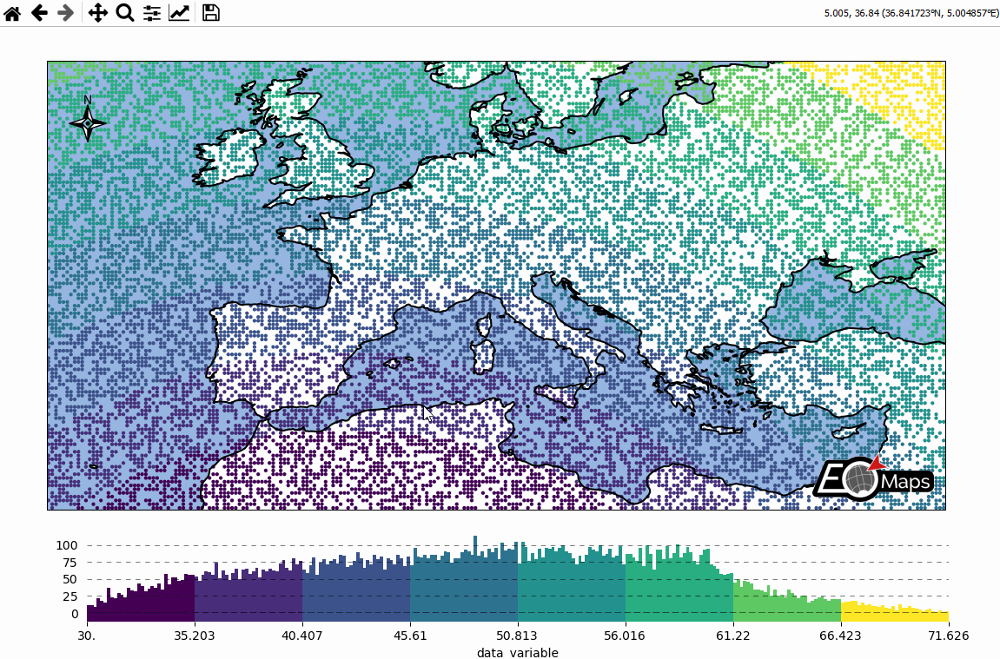
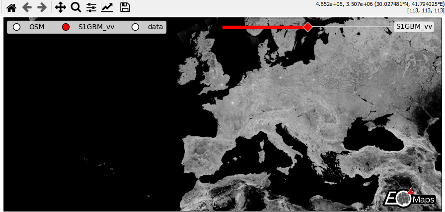
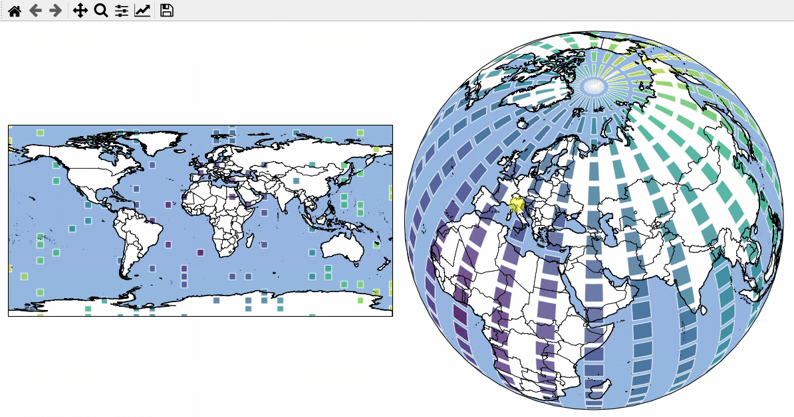
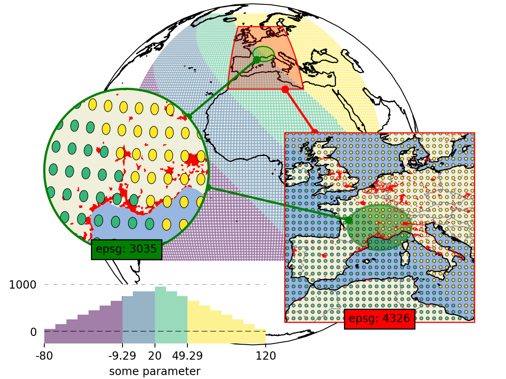
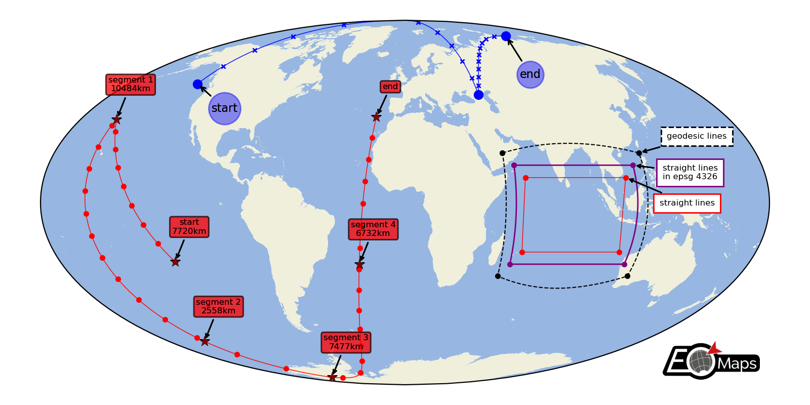

.. include:: substitutions.rst

.. _EOmaps_examples:

🗺 EOmaps examples
==================

... a collection of examples that show how to create beautiful interactive maps.

.. include:: example_galery.rst

.. _example_basics:

Basic data visualization
-------------------------

There are 3 basic steps required to visualize your data:

1. Initialize a Maps-object with ``m = Maps()``
2. Set the data and its specifications via ``m.set_data``
3. Call ``m.plot_map()`` to generate the map!

|toggleStart|

.. literalinclude:: example_basics.py

|toggleEnd|

.. _example_customization:

Customize the appearance of the plot
------------------------------------

-  use ``m.set_plot_specs()`` to set the general appearance of the plot
-  after creating the plot, you can access individual objects via ``m.figure.<...>`` … most importantly:

   -  ``f`` : the matplotlib figure
   -  ``ax``, ``ax_cb``, ``ax_cb_plot`` : the axes used for plotting the map, colorbar and histogram
   -  ``gridspec``, ``cb_gridspec`` : the matplotlib GridSpec instances for the plot and the colorbar
   -  ``coll`` : the collection representing the data on the map

|toggleStart|

.. literalinclude:: example_customization.py

|toggleEnd|

.. image:: ../_static/example_images/example_customization.png
  :width: 75%

.. _example_multiple_maps:

Data-classification and multiple Maps in a figure
-------------------------------------------------

-  Create grids of maps via ``MapsGrid``
-  | Classify your data via ``m.set_classify_specs(scheme, **kwargs)``
   | (using classifiers provided by the ``mapclassify`` module)
-  | Add individual callback functions to each subplot via
   | ``m.cb.click.attach``, ``m.cb.pick.attach``
-  | Share events between Maps-objects of the MapsGrid via
   | ``mg.share_click_events()`` and ``mg.share_pick_events()``

|toggleStart|

.. literalinclude:: example_multiple_maps.py

|toggleEnd|

.. image:: ../_static/example_images/example_multiple_maps.gif
  :width: 75%

.. _example_callbacks:

Callbacks - turn your maps into interactive widgets
---------------------------------------------------

-  **Callback functions** can easily be attached to the plot to turn it
   into an interactive plot-widget!

   - | there’s a nice list of (customizable) pre-defined callbacks accessible via:
     | ``m.cb.click``, ``m.cb.pick``, ``m.cb.keypress`` and ``m.cb.dynamic``

      -  use ``annotate`` (and ``clear_annotations``) to create text-annotations
      -  use ``mark`` (and ``clear_markers``) to add markers
      -  use ``peek_layer`` (and ``switch_layer``) to compare multiple layers of data
      -  ... and many more: ``plot``, ``print_to_console``, ``get_values``, ``load`` ...

   -  | ... but you can also define a custom one and connect it via
      | ``m.cb.click.attach(<my custom function>)`` (works also with ``pick`` and ``keypress``)!

|toggleStart|

.. literalinclude:: example_callbacks.py

|toggleEnd|

.. image:: ../_static/example_images/example_callbacks.gif
  :width: 75%

.. _example_overlays:

Overlays, markers and annotations
---------------------------------

(… plot-generation might take a bit longer since overlays need to be downloaded first!)

- add basic overlays with `m.add_overlay`
- add static annotations / markers with `m.add_annotation` and `m.add_marker`
- use “connected” Maps-objects to get multiple interactive data-layers!

|toggleStart|

.. literalinclude:: example_overlays.py

|toggleEnd|

.. image:: ../_static/example_images/example_overlays.gif
  :width: 75%

The data displayed in the above gif is taken from:
    - NaturalEarth (https://www.naturalearthdata.com/)

.. _example_webmaps:

WebMap services and layer-switching
-----------------------------------

- add WebMap services using ``m.add_wms`` and ``m.add_wmts``
- compare different data-layers and WebMap services using ``m.cb.click.peek_layer`` and ``m.cb.keypress.switch_layer``

|toggleStart|

.. literalinclude:: example_webmaps.py

|toggleEnd|

The data displayed in the above gif is taken from:
    - Sentinel-1 Global Backscatter Model (https://researchdata.tuwien.ac.at/records/n2d1v-gqb91)
    - OpenStreetMap hosted by Mundialis (https://www.mundialis.de/en/ows-mundialis/)

.. _example_vector_data:

Vector data - interactive geometries
-------------------------------------

EOmaps can be used to assign callbacks to vektor-data (e.g. ``geopandas.GeoDataFrames``).

- to make a GeoDataFrame pickable, first use ``m.add_gdf(picker_name="MyPicker")``

    - now you can assign callbacks via ``m.cb.pick__MyPicker.attach...`` just as you
      would do with the ordinary ``m.cb.click`` or ``m.cb.pick`` callbacks

.. Note::
    For large datasets that are visualized as simple rectangles, ellipses etc.
    it is recommended to use EOmaps to visualize the data with ``m.plot_map()``
    since the generation of the plot and the identification of the picked pixels
    will be much faster!

    If the GeoDataFrame contains multiple different geometry types
    (e.g. Lines, Patches, etc.) a unique pick-collection will be assigned
    for each of the geometry types!

|toggleStart|

.. literalinclude:: example_vector_data.py

|toggleEnd|

The data displayed in the above gif is taken from:
    - NaturalEarth (https://www.naturalearthdata.com/)

.. _example_scalebars:

Using Scalebars
---------------

EOmaps has a nice customizable scalebar feature!
    - use ``s = m.add_scalebar(lon, lat, azim)`` to attach a scalebar to the plot
    - once the scalebar is there, you can drag it around and change its
      properties via ``s.set_position``, ``s.set_scale_props()``,
      ``s.set_label_props()`` and ``s.set_patch_props()``

.. Note::
    You can also simply drag the scalebar with the mouse!

    - LEFT-click on it to make it interactive!
    - RIGHT-click anywhere on the map to make it fixed again

    There are also some useful keyboard shortcuts you can use while the
    scalebar is interactive

    - use ``+``/``-`` to rotate the scalebar
    - use ``alt`` + ``+``/``-`` to set the text-offset
    - use the ``arrow-keys`` to increase the frame-widths
    - use ``alt`` + ``arrow-keys`` to decrease the frame-widths
    - use ``delete`` to remove the scalebar from the plot

|toggleStart|

.. literalinclude:: example_scalebars.py

|toggleEnd|

.. image:: ../_static/example_images/example_scalebars.gif
  :width: 75%

The data displayed in the above gif is taken from:
    - NaturalEarth (https://www.naturalearthdata.com/)

.. _example_timeseries:

Data analysis widgets - Timeseries and histograms
-------------------------------------------------

Callback-functions can be used to trigger updates on other plots.
This example shows how to use EOmaps to analyze a database that is associated with a map.

- create a grid of ``Maps`` objects and ordinary matplotlib axes via ``MapsGrid``
- define a custom callback to update the plots if you click on the map

|toggleStart|

.. literalinclude:: example_timeseries.py

|toggleEnd|

.. image:: ../_static/example_images/example_timeseries.gif
  :width: 75%

.. _example_row_col_selector:

Data analysis widgets - Select 1D slices of a 2D dataset
--------------------------------------------------------

Use custom callback functions to perform arbitrary tasks on the data when clicking on the map.

- Identify clicked row/col in a 2D dataset
- Highlight the found row and column using a new layer

(requires EOmaps >= v3.1.4)

|toggleStart|

.. literalinclude:: example_row_col_selector.py

|toggleEnd|

.. image:: ../_static/example_images/example_row_col_selector.gif
  :width: 75%

.. _example_inset_maps:

Inset-maps - get a zoomed-in view on selected areas
---------------------------------------------------

Quickly create nice inset-maps to show details for specific regions.

- the location and extent of the inset can be defined in any given crs

  - (or as a geodesic circle with a radius defined in meters)

- the inset-map can have a different crs than the "parent" map

(requires EOmaps >= v4.1)

|toggleStart|

.. literalinclude:: example_inset_maps.py

|toggleEnd|

.. _example_lines:

Lines and Annotations
---------------------

Draw lines defined by a set of anchor-points and add some nice annotations.

Connect the anchor-points via:

- geodesic lines
- straight lines
- reprojected straight lines defined in a given projection

(requires EOmaps >= v4.3.1)

|toggleStart|

.. literalinclude:: example_lines.py

|toggleEnd|

.. _example_gridlines:

Gridlines and Grid Labels
-------------------------

Draw custom grids and add grid labels.

(requires EOmaps >= v6.5)

|toggleStart|

.. literalinclude:: example_gridlines.py

|toggleEnd|

.. image:: ../_static/example_images/example_gridlines.png
  :width: 75%

.. _example_contour:

Contour plots and Contour Levels
--------------------------------

Use the ``contour``-shape to draw contour-plots of regular (or irregular data)
or to indicate contour-levels on top of other plots.

(requires EOmaps >= v7.1)

|toggleStart|

.. literalinclude:: example_contour.py

|toggleEnd|

.. image:: ../_static/example_images/example_contour.png
  :width: 75%
