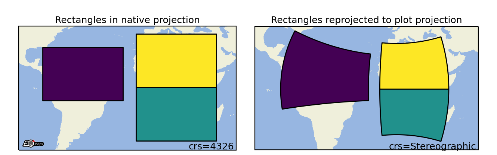
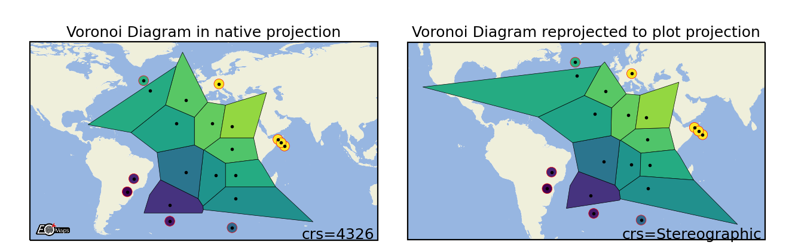
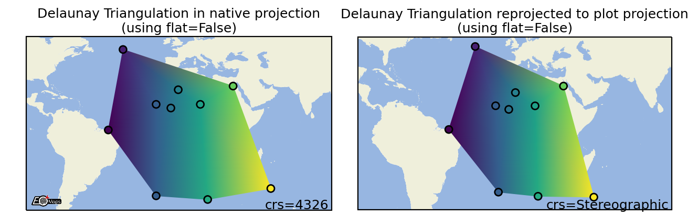
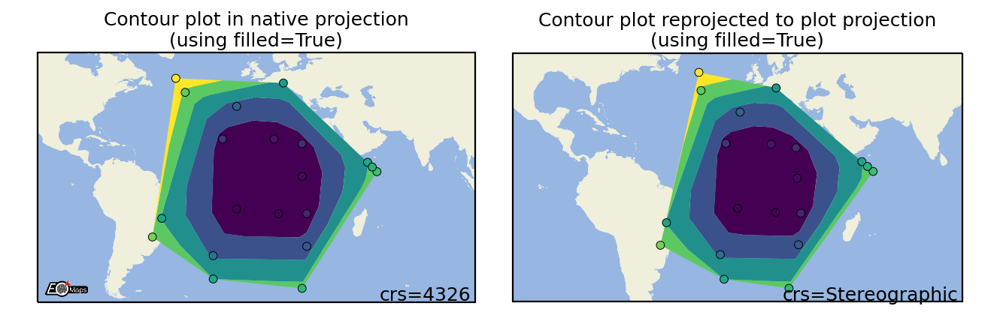
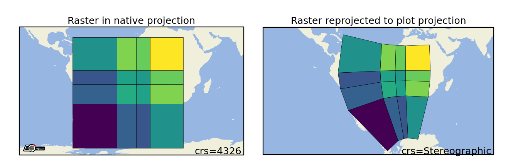
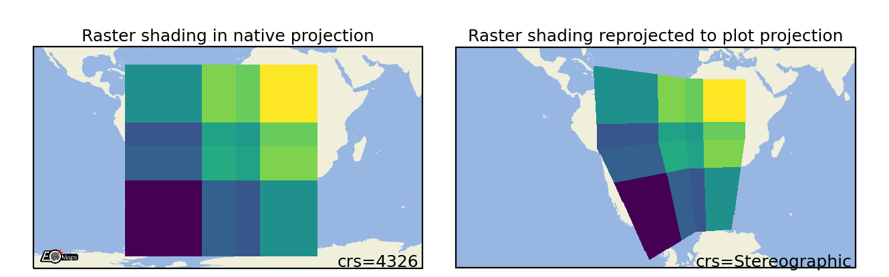
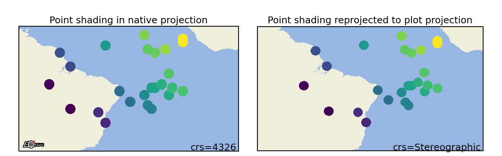

.. _visualize_data:

🔴 Data Visualization
----------------------

.. contents:: Contents:
    :depth: 1
    :local:

.. currentmodule:: eomaps.eomaps

Quick overview
~~~~~~~~~~~~~~

To visualize a dataset, first assign the dataset to the :py:class:`Maps` object,
then select how you want to visualize the data and finally call :py:meth:`Maps.plot_map`.

1. :ref:`Assign the data <assign_the_data>` to a :py:class:`Maps` object via :py:meth:`Maps.set_data`
2. (optional) :ref:`Set the shape <set_the_shape>` used to represent the data via  :py:class:`Maps.set_shape`
3. (optional) :ref:`Classify the data <classify_the_data>` via  :py:class:`Maps.set_classify`
4. :ref:`Plot the data <plot_the_data>` by calling :py:meth:`Maps.plot_map`

.. code-block:: python
    :name: test_data_visualization_quick

    from eomaps import Maps
    m = Maps()
    m.add_feature.preset("ocean", "land")

    m_data = m.new_layer()                         # Create a new layer for the data
    m_data.set_data(                               # Assign the data
        data=[1, 2, 3, 4, 5],                      #    Data values
        x=[-10, 20, 30, 40, 50],                   #    x coordinate values
        y=[-50, -20, 0, 20, 40],                   #    y coordinate values
        crs=4326                                   #    Coordinate system of (x, y)
        )

    m_data.set_shape.geod_circles(radius=1e6)      # Draw geodesic circles
    m_data.set_classify.EqualInterval(k=3)         # Classify into 3 equal intervals
    m_data.plot_map(vmin=0, ec="k", cmap="magma")  # Plot the data
    m_data.add_colorbar(hist_bins="bins")          # Add a colorbar

.. note::

    A :py:class:`Maps` object can only manage a single dataset!

    To plot multiple datasets on the same map, use :py:meth:`Maps.new_layer` to get a unique :py:class:`Maps` object for each dataset!
    To quickly create a new layer that uses the same dataset, cassification and shape as the parent, use:

    .. code-block:: python

        m_1 = m.new_layer(inherit_data=True,            # m_1 inherits the data from m
                          inherit_classification=True,  # m_1 inherits the classification and colormap from m
                          inherit_shape=True            # m_1 inherits the plot-shape from m
                          )

.. _assign_the_data:

1) Assign the data
~~~~~~~~~~~~~~~~~~

To assign a dataset to a :py:class:`Maps` object, use :py:meth:`Maps.set_data`.

.. autosummary::
    :nosignatures:

    Maps.set_data

A dataset is fully specified by setting the following properties:

- ``data`` : The data-values
- ``x``, ``y``: The coordinates of the provided data
- ``crs``: The coordinate-reference-system of the provided coordinates
- ``parameter`` (optional): The parameter name
- ``encoding`` (optional): The encoding of the data
- ``cpos``, ``cpos_radius`` (optional): the pixel offset

The following data-types are currently accepted as input:

.. dropdown:: **pandas.DataFrames**
    :icon: square-fill
    :color: info

    .. tab-set::

        .. tab-item:: Assignments

            - ``data``: pandas.DataFrame
            - ``x``, ``y``: The column-names to use as coordinates (``string``)
            - ``parameter``: The column-name to use as data-values (``string``)

        .. tab-item:: basic DataFrame

            .. code-block:: python
                :name: test_assign_pandas_01

                from eomaps import Maps
                import pandas as pd

                df = pd.DataFrame(dict(lon=[1,2,3], lat=[2,5,4], data=[12, 43, 2]))
                m = Maps()
                m.set_data(df, x="lon", y="lat", crs=4326, parameter="data")
                m.plot_map()

        .. tab-item:: multiindex DataFrame

            .. code-block:: python
                :name: test_assign_pandas_02

                from eomaps import Maps
                import pandas as pd

                data = dict(param=[10, 29, 39])
                index = pd.MultiIndex.from_arrays([[10,20,30], [10,20,30]], names=("lon", "lat"))
                df = pd.DataFrame(data=data, index=index)

                m = Maps()
                m.set_data(df, x="lon", y="lat", crs=4326, parameter="param")
                m.plot_map()

.. dropdown:: **numpy.Array** | **pandas.Series** | **list**
    :icon: square-fill
    :color: info

    .. tab-set::

        .. tab-item:: Assignments

            - ``data``, ``x``, ``y``: ``numpy.array``, ``pandas.Series`` or ``list``

              - either data and coordinates have the same 1D/2D shape or
              - 2D ``data=(m, n)`` and 1D coordinates ``x=(m,)``, ``y=(n,)``

            - ``parameter``: (optional) parameter name (``string``)

        .. tab-item:: 1D list

            .. code-block:: python
                :name: test_assign_list

                from eomaps import Maps

                x, y, data = [1,2,3], [2, 5, 4], [12, 43, 2]
                m = Maps()
                m.set_data(data, x=x, y=y, crs=4326, parameter="param_name")
                m.plot_map()

        .. tab-item:: 1D numpy

            .. code-block:: python
                :name: test_assign_numpy_1d

                from eomaps import Maps
                import numpy as np

                x, y, data = np.array([1,2,3]), np.array([5, 7, 9]), np.array([1, 2, 3])
                m = Maps()
                m.set_data(data=data, x=x, y=y, crs=4326, parameter="param_name")
                m.plot_map()

        .. tab-item:: 2D numpy

            .. code-block:: python
                :name: test_assign_numpy_2d

                from eomaps import Maps
                import numpy as np

                x, y = np.meshgrid(np.array([1,2,3]), np.array([5, 7, 9]))
                data = np.random.randint(0, 10, x.shape)
                m = Maps()
                m.set_data(data=data, x=x, y=y, crs=4326, parameter="param_name")
                m.plot_map()

        .. tab-item:: 2D + 1D numpy

            .. code-block:: python
                :name: test_assign_numpy_1d2d

                from eomaps import Maps
                import numpy as np

                x, y = np.linspace(-20, 20, 100), np.linspace(15, 34, 50)
                data = np.random.randint(0, 100, size=(100, 50)
                m = Maps()
                m.set_data(data=data, x=x, y=y, crs=4326, parameter="param_name")
                m.plot_map()

        .. tab-item:: pandas Series

            .. code-block:: python
                :name: test_assign_series

                from eomaps import Maps
                import pandas as pd

                x, y, data = pd.Series([1,2,3]), pd.Series([2, 5, 4]), pd.Series([12, 43, 2])
                m = Maps()
                m.set_data(data, x=x, y=y, crs=4326, parameter="param_name")
                m.plot_map()

.. dropdown:: **xarray.Dataset**
    :icon: square-fill
    :color: info

    .. tab-set::

        .. tab-item:: Assignments

            - ``data``: xarray.Dataset
            - ``x``, ``y``: The variables to use as coordinates (``string``)
            - ``parameter``: The variable to use as data-values (``string``)

        .. tab-item:: 2D data and coords

            .. code-block:: python
                :name: test_assign_xarray_2d

                from eomaps import Maps
                import xarray as xar
                import numpy as np

                param = np.random.randint(0, 10, (2,2,3))
                lon = [[-20, 20], [23, 54]]
                lat = [[-10, 20], [-10, 20]]
                time = [1,2,3]

                ds = xar.Dataset(
                    data_vars=dict(my_param=(["x", "y", "time"], param)),
                    coords=dict(lon=(["x", "y"], lon), lat=(["x", "y"], lat), time=time),
                )

                m = Maps()
                m.set_data(data=ds.sel(time=1), x="lon", y="lat", parameter="my_param", crs=4326)
                m.plot_map()

        .. tab-item:: 1D coords 2D data

            .. code-block:: python
                :name: test_assign_xarray_1d2d

                from eomaps import Maps
                import xarray as xar
                import numpy as np

                param = np.random.randint(0, 10, (2,2,3))
                lon = [-20, 20]
                lat = [30, 60]
                time = [1,2,3]

                ds = xar.Dataset(
                    data_vars=dict(my_param=(["lon", "lat", "time"], param)),
                    coords=dict(lon=lon, lat=lat, time=time),
                )

                m = Maps()
                m.set_data(data=ds.sel(time=1), x="lon", y="lat", parameter="my_param", crs=4326)
                m.plot_map()

.. note::

    Make sure to use a individual :py:class:`Maps` object (e.g. with ``m2 = m.new_layer()``) for each dataset!
    Calling :py:meth:`Maps.plot_map` multiple times on the same :py:class:`Maps` object will remove
    and override the previously plotted dataset!

.. admonition:: A note on data-reprojection...

    EOmaps handles the reprojection of the data from the input-crs to the plot-crs.

    - Plotting data in its native crs will omit the reprojection step and is therefore a lot faster!
    - If your dataset is 2D (e.g. a raster), it is best (for speed and memory) to provide the coordinates as 1D vectors!

       - 1D coordinate vectors will be broadcasted using matrix-indexing! (e.g. ``x[nx], y[ny] -> data[nx, ny]``)
       - Note that reprojecting 1D coordinate vectors to a different crs will result in (possibly very large) 2D coordinate arrays!

.. _set_the_shape:

2) Plot shapes
~~~~~~~~~~~~~~

To specify how a dataset is visualized on the map, you have to set the *"plot-shape"* via :py:meth:`Maps.set_shape`.

.. currentmodule:: eomaps.eomaps

.. autosummary::
    :nosignatures:

    Maps.set_shape

Available shapes (see bleow for details on each plot-shape!):

 .. include:: ../../_shape_table.rst

.. admonition:: A note on speed and performance

    Some ways to visualize the data require more computational effort than others!
    Make sure to select an appropriate shape based on the size of the dataset you want to plot!

    .. currentmodule:: eomaps.eomaps

    EOmaps dynamically pre-selects the data with respect to the current plot-extent before the actual plot is created!
    If you do not need to see the whole extent of the data, make sure to **set the desired plot-extent**
    via :py:meth:`Maps.set_extent` or :py:meth:`Maps.set_extent_to_location` **BEFORE** calling :py:meth:`Maps.plot_map` to get a (possibly huge) speedup!

    The suggested "suitable datasizes" mentioned below always refer to the number of datapoints that are
    visible in the desired plot-extent.

    .. currentmodule:: eomaps.eomaps

    For very large datasets, make sure to have a look at the :py:class:`raster <Maps.set_shape.raster>`, :py:class:`shade_raster <Maps.set_shape.shade_raster>`, and :py:class:`shade_points <Maps.set_shape.shade_points>` shapes
    which use fast aggregation techniques to resample the data prior to plotting. This way datasets with billions of datapoints can be
    visualized fast.

.. admonition:: Optional dependencies

    :py:class:`shade_raster <Maps.set_shape.shade_raster>`, and :py:class:`shade_points <Maps.set_shape.shade_points>` require the `datashader <https://datashader.org/>`_ package!
    You can install it via:

    .. code-block:: python

       mamba install -c conda-forge datashader

.. admonition:: What's used by default?

    By default, the plot-shape is assigned based on the associated dataset.

    - For datasets with less than 500 000 pixels, :py:class:`ellipses <Maps.set_shape.ellipses>` is used.
    - | For larger 2D datasets :py:class:`raster <m.set_shape.raster>` is used
      | ... and :py:class:`shade_points <Maps.set_shape.shade_points` is attempted to be used for the rest.

.. _shp_ellipses:

Ellipses
********

.. autosummary::
    :nosignatures:

    Maps.set_shape.ellipses

.. list-table::
   :header-rows: 1

   * - Suitable data size
     - Supported data structures
   * - up to ~500k datapoints
     - 1D, 2D or mixed

.. image:: ../../_static/shape_imgs/ellipses.png
    :width: 50%

.. code-block:: python

    m.set_shape.ellipses(radius=(2, 5),   # ellipse dimensions [rx , ry]
                         radius_crs=4326, # projection in which the ellipse is defined
                         n=50             # number of calculated points on the ellipse
                         )

.. _shp_rectangles:

Rectangles
**********

.. autosummary::
    :nosignatures:

    Maps.set_shape.rectangles

.. list-table::
   :header-rows: 1

   * - Suitable data size
     - Supported data structures
   * - up to ~500k datapoints
     - 1D, 2D or mixed

.. code-block:: python

    m.set_shape.rectangles(radius=(2, 5),   # rectangle dimensions [rx , ry]
                           radius_crs=4326, # projection in which the rectangle is defined
                           n=50             # number of calculated points on the ellipse
                           )

.. _shp_geod_circles:

Geodesic Circles
****************

.. autosummary::
    :nosignatures:

    Maps.set_shape.geod_circles

.. list-table::
   :header-rows: 1

   * - Suitable data size
     - Supported data structures
   * - up to ~500k
     - 1D, 2D or mixed

.. image:: ../../_static/shape_imgs/geod_circles.png
    :width: 50%

.. code-block:: python

    m.set_shape.geod_circles(radius=(2, 5),  # radius in meters
                             n=50             # number of calculated points on the circle
                             )

.. _shp_voronoi:

Voronoi Diagram
***************

.. autosummary::
    :nosignatures:

    Maps.set_shape.voronoi_diagram

.. list-table::
   :header-rows: 1

   * - Suitable data size
     - Supported data structures
   * - up to ~500k datapoints
     - 1D, 2D or mixed

.. code-block:: python

    m.set_shape.voronoi_diagram(masked=True,      # mask too large polygons
                                mask_radius=10,   # min. size for masked polygons
                                )

.. _shp_delaunay:

Delaunay Triangulation
**********************

.. autosummary::
    :nosignatures:

    Maps.set_shape.delaunay_triangulation

.. list-table::
   :header-rows: 1

   * - Suitable data size
     - Supported data structures
   * - up to ~500k datapoints
     - 1D, 2D or mixed

.. image:: ../../_static/shape_imgs/delaunay_triangulation_flat.png
    :width: 50%

.. code-block:: python

    m.set_shape.delaunay_triangulation(flat=False,       # color=mean of triplet (True) or interpolated values (False)
                                       masked=True,      # mask too large polygons
                                       mask_radius=10,   # min. size for masked polygons
                                       mask_crs="in",     # projection of the mask dimension
                                      )

.. _shp_contour:

Contour plots
*************

.. autosummary::
    :nosignatures:

    Maps.set_shape.contour

.. list-table::
   :header-rows: 1

   * - Suitable data size
     - Supported data structures
   * - up to a few million datapoints
     - 1D, 2D or mixed

.. image:: ../../_static/shape_imgs/contour.png
    :width: 50%

.. code-block:: python

    m.set_shape.contour(filled=True)   # filled contour polygons (True) or contour lines (False)

.. _shp_hexbin:

Hexbin plots
************

.. autosummary::
    :nosignatures:

    Maps.set_shape.hexbin

.. list-table::
   :header-rows: 1

   * - Suitable data size
     - Supported data structures
   * - up to a few million datapoints
     - 1D, 2D or mixed

.. image:: ../../_static/shape_imgs/hexbin.png
    :width: 50%

.. code-block:: python

    m.set_shape.hexbin(size=(40, 20),      # number of hexagons in x- and y-direction
                       aggregator="mean",  # the aggregation method to use
                       )

.. _shp_scatter:

Scatter Points
**************

.. autosummary::
    :nosignatures:

    Maps.set_shape.scatter_points

.. list-table::
   :header-rows: 1

   * - Suitable data size
     - Supported data structures
   * - ~500k datapoints
     - 1D, 2D or mixed

.. image:: ../../_static/shape_imgs/scatter_points.png
    :width: 50%

.. code-block:: python

    m.set_shape.scatter_points(size=[1, 2, 3],   # the marker size in points**2
                               marker="*",       # the marker shape to use
                               )

.. _shp_raster:

Raster
******

.. autosummary::
    :nosignatures:

    Maps.set_shape.raster

.. list-table::
   :header-rows: 1

   * - Suitable data size
     - Supported data structures
   * - billions of datapoints (large datasets are pre-aggregated)
     - 2D or 1D coordinates + 2D data

.. code-block:: python

    m.set_shape.raster(maxsize=5e5,         # data size at which aggregation kicks in
                       aggregator='mean',   # aggregation method to use
                       valid_fraction=0.5,  # % of masked values in aggregation bin for masked result
                       interp_order=0,      # spline interpolation order for "spline" aggregator

.. _shp_shade_raster:

Shade Raster
************

.. autosummary::
    :nosignatures:

    Maps.set_shape.shade_raster
    Maps.set_shade_dpi

.. list-table::
   :header-rows: 1

   * - Suitable data size
     - Supported data structures
     - Optional dependencies
   * - billions of datapoints (large datasets are pre-aggregated)
     - 2D or 1D coordinates + 2D data
     - `datashader <https://datashader.org/>`_

.. code-block:: python

    m.set_shape.shade_raster(aggregator='mean',    # aggregation method
                             shade_hook=None,      # datashader shade hook callback
                             agg_hook=None,        # datashader aggregation hook callback
                             )

.. _shp_shade_points:

Shade Points
************

.. autosummary::
    :nosignatures:

    Maps.set_shape.shade_raster
    Maps.set_shade_dpi

.. list-table::
   :header-rows: 1

   * - Suitable data size
     - Supported data structures
     - Optional dependencies
   * - no limit (large datasets are pre-aggregated)
     - 1D, 2D or mixed
     - `datashader <https://datashader.org/>`_

.. code-block:: python

    m.set_shape.shade_raster(aggregator='mean',    # aggregation method
                             shade_hook=None,      # datashader shade hook callback
                             agg_hook=None,        # datashader aggregation hook callback
                             )

.. _classify_the_data:

3) Classify the data
~~~~~~~~~~~~~~~~~~~~

.. currentmodule:: eomaps.eomaps

EOmaps provides an interface for `mapclassify <https://github.com/pysal/mapclassify>`_ to classify datasets prior to plotting.

To assign a classification scheme to a :py:class:`Maps` object, use ``m.set_classify.< SCHEME >(...)``.

- Available classifier names are accessible via ``Maps.CLASSIFIERS``.

.. autosummary::
    :nosignatures:

    Maps.set_classify

.. grid:: 1 1 1 2

    .. grid-item::

         .. code-block:: python
            :name: test_classify_data

            from eomaps import Maps
            import numpy as np

            data = np.random.normal(0, 1, (50, 50))
            x = np.linspace(-45, 45, 50)
            y = np.linspace(-45, 45, 50)

            m = Maps(figsize=(4, 5))
            m.add_feature.preset.coastline(lw=2)
            m.add_feature.preset.ocean(zorder=99, alpha=0.5)
            m.set_data(data, x, y)
            m.set_shape.ellipses()
            m.set_classify.StdMean(multiples=[-1.5, -.5, .5, 1.5])
            m.plot_map(vmin=-3, vmax=3)

            cb = m.add_colorbar(pos=0.2, label="StdMean classification")
            cb.tick_params(labelsize=7)

    .. grid-item::

        .. image:: ../../_static/minigifs/classify_data_01.png
            :width: 75%

Currently available classification-schemes are (see `mapclassify <https://github.com/pysal/mapclassify>`_ for details):

- `BoxPlot(hinge) <https://pysal.org/mapclassify/generated/mapclassify.BoxPlot.html>`_
- `EqualInterval(k) <https://pysal.org/mapclassify/generated/mapclassify.EqualInterval.html>`_
- `FisherJenks(k) <https://pysal.org/mapclassify/generated/mapclassify.FisherJenks.html>`_
- `FisherJenksSampled(k, pct, truncate) <https://pysal.org/mapclassify/generated/mapclassify.FisherJenksSampled.html>`_
- `HeadTailBreaks() <https://pysal.org/mapclassify/generated/mapclassify.HeadTailBreaks.html>`_
- `JenksCaspall(k) <https://pysal.org/mapclassify/generated/mapclassify.JenksCaspall.html>`_
- `JenksCaspallForced(k) <https://pysal.org/mapclassify/generated/mapclassify.JenksCaspallForced.html>`_
- `JenksCaspallSampled(k, pct) <https://pysal.org/mapclassify/generated/mapclassify.JenksCaspallSampled.html>`_
- `MaxP(k, initial) <https://pysal.org/mapclassify/generated/mapclassify.MaxP.html>`_
- `MaximumBreaks(k, mindiff) <https://pysal.org/mapclassify/generated/mapclassify.MaximumBreaks.html>`_
- `NaturalBreaks(k, initial) <https://pysal.org/mapclassify/generated/mapclassify.NaturalBreaks.html>`_
- `Quantiles(k) <https://pysal.org/mapclassify/generated/mapclassify.Quantiles.html>`_
- `Percentiles(pct) <https://pysal.org/mapclassify/generated/mapclassify.Percentiles.html>`_
- `StdMean(multiples) <https://pysal.org/mapclassify/generated/mapclassify.StdMean.html>`_
- `UserDefined(bins) <https://pysal.org/mapclassify/generated/mapclassify.UserDefined.html>`_

.. _plot_the_data:

4) Plot the data
~~~~~~~~~~~~~~~~

Now that the data is assigned to a :py:class:`Maps` object, you can trigger plotting the data via :py:meth:`Maps.plot_map`.

Any additional keyword-arguments passed to :py:meth:`Maps.plot_map` are forwarded to the actual
``matplotlib`` plot-command for the selected shape.

Useful arguments that are supported by all shapes are:

    - ``"cmap"`` : the colormap to use
    - ``"vmin"``, "vmax" : the range of values used when assigning the colors
    - ``"alpha"`` : the color transparency
    - ``"zorder"`` : the "stacking-order" of the feature

Arguments that are supported by all shapes except ``shade`` shapes are:
    - ``"fc"`` or ``"facecolor"`` : set the face color for the whole dataset
    - ``"ec"`` or ``"edgecolor"`` : set the edge color for the whole dataset
    - ``"lw"`` or ``"linewidth"`` : the line width of the shapes

By default, the plot-extent of the axis is adjusted to the extent of the data **if the extent has not been set explicitly before**.
To always keep the extent as-is, use ``m.plot_map(set_extent=False)``.

.. grid:: 1 1 1 2

    .. grid-item::

        .. code-block:: python
            :name: test_plot_data

            from eomaps import Maps
            m = Maps()
            m.add_feature.preset.ocean()

            m.set_data(
                data=[1, 2, 3, 4, 5],
                x = [-10, 20, 40, 60, 70],
                y = [-10, 20, 50, 70, 30])
            m.set_shape.geod_circles(radius=7e5)
            m.plot_map(cmap="viridis", set_extent=False)

    .. grid-item::

        .. image:: ../../_static/data_visualization/plot_data.png
            :width: 75%

You can then continue to add a :ref:`colorbar` or create :ref:`zoomed_in_views_on_datasets`.

.. currentmodule:: eomaps.eomaps

.. autosummary::
    :nosignatures:

    Maps.plot_map
    Maps.savefig

Customize the plot
~~~~~~~~~~~~~~~~~~

.. currentmodule:: eomaps.eomaps

All arguments to customize the appearance of a dataset are passed to :py:meth:`Maps.plot_map`.

In general, the colors assigned to the shapes are specified by

- selecting a colormap (``cmap``)

  - either a name of a pre-defined ``matplotlib`` colormap (e.g. ``"viridis"``, ``"RdYlBu"`` etc.)
  - or a general ``matplotlib`` colormap object (see `matplotlib-docs <https://matplotlib.org/stable/tutorials/colors/colormaps.html>`_ for more details)

- (optionally) setting appropriate data-limits via ``vmin`` and ``vmax``.

  - ``vmin`` and ``vmax`` set the range of data-values that are mapped to the colorbar-colors
  - Any values outside this range will get the colormaps ``over`` and ``under`` colors assigned.

.. grid:: 1 1 1 2

    .. grid-item::

        .. code-block:: python
            :name: test_customize_the_plot

            from eomaps import Maps
            m = Maps()
            m.set_frame(rounded=0.2)
            m.add_feature.preset.ocean()
            m.add_feature.preset.land(fc="k")

            m.set_data(
                data=[1, 2, 3, 4, 5],
                x = [-10, 20, 40, 60, 70],
                y = [-10, 20, 50, 70, 30])
            m.set_shape.geod_circles(radius=1e6)
            m.plot_map(
                cmap="tab10", # the colormap to use
                vmin=2,       # min value for cmap
                vmax=4,       # max value for cmap
                alpha=0.8,    # transparency
                ec="w",       # edgecolor
                lw=1.5,       # linewidth
                ls="--"       # linestyle
                )

    .. grid-item::

        .. image:: ../../_static/data_visualization/customize_plot.png
            :width: 75%

------

Colors can also be set **manually** by providing one of the following arguments to :py:meth:`Maps.plot_map`:

- to set both **facecolor** AND **edgecolor** use ``color=...``
- to set the **facecolor** use ``fc=...`` or ``facecolor=...``
- to set the **edgecolor** use ``ec=...`` or ``edgecolor=...``

.. note::

    - Manual color specifications do **not** work with the ``shade_raster`` and ``shade_points`` shapes!
    - Providing manual colors will **override** the colors assigned by the ``cmap``!
    - The ``colorbar`` does **not** represent manually defined colors!

Uniform colors
**************

To apply a uniform color to all datapoints, you can use `matpltolib's named colors <https://matplotlib.org/stable/gallery/color/named_colors.html>`_ or pass an RGB or RGBA tuple.

- ``m.plot_map(fc="orange")``
- ``m.plot_map(fc=(0.4, 0.3, 0.2))``
- ``m.plot_map(fc=(1, 0, 0.2, 0.5))``

.. grid:: 1 1 1 2

    .. grid-item::

        .. code-block:: python
            :name: test_uniform_colors

            from eomaps import Maps

            m = Maps()
            m.add_feature.preset("coastline", "ocean")
            m.set_data(data=None, x=[10,20,30], y=[10,20,30])

            # Use any of matplotlibs "named colors"
            m1 = m.new_layer(inherit_data=True)
            m1.set_shape.ellipses(radius=10)
            m1.plot_map(fc="r", zorder=0)

            m2 = m.new_layer(inherit_data=True)
            m2.set_shape.ellipses(radius=8)
            m2.plot_map(fc="orange", zorder=1)

            # Use RGB tuples (r, g, b)
            m3 = m.new_layer(inherit_data=True)
            m3.set_shape.ellipses(radius=6)
            m3.plot_map(fc=(1, 0, 0.5), zorder=2)

            # Use RGBA tuples (r, g, b, alpha)
            m4 = m.new_layer(inherit_data=True)
            m4.set_shape.ellipses(radius=4)
            m4.plot_map(fc=(1, 1, 1, .75), zorder=3)

            # For grayscale use a string of a number between 0 and 1
            m5 = m.new_layer(inherit_data=True)
            m5.set_shape.ellipses(radius=2)
            m5.plot_map(fc="0.3", zorder=4)

    .. grid-item::

        .. image:: ../../_static/data_visualization/uniform_colors.png
            :width: 75%

Explicit colors
***************

To explicitly color each datapoint with a pre-defined color, simply provide a list or array of the aforementioned types.

.. grid:: 1 1 1 2

    .. grid-item::

        .. code-block:: python
            :name: test_explicit_colors

            from eomaps import Maps

            m = Maps()
            m.add_feature.preset("coastline", "ocean")
            m.set_data(data=None, x=[10, 20, 30], y=[10, 20, 30])

            # Use any of matplotlibs "named colors"
            # (https://matplotlib.org/stable/gallery/color/named_colors.html)
            m1 = m.new_layer(inherit_data=True)
            m1.set_shape.ellipses(radius=10)
            m1.plot_map(fc=["indigo", "g", "orange"], zorder=1)

            # Use RGB tuples
            m2 = m.new_layer(inherit_data=True)
            m2.set_shape.ellipses(radius=6)
            m2.plot_map(fc=[(1, 0, 0.5),
                            (0.3, 0.4, 0.5),
                            (1, 1, 0)], zorder=2)

            # Use RGBA tuples
            m3 = m.new_layer(inherit_data=True)
            m3.set_shape.ellipses(radius=8)
            m3.plot_map(fc=[(1, 0, 0.5, 0.25),
                            (1, 0, 0.5, 0.75),
                            (0.1, 0.2, 0.5, 0.5)], zorder=3)

            # For grayscale use a string of a number between 0 and 1
            m4 = m.new_layer(inherit_data=True)
            m4.set_shape.ellipses(radius=4)
            m4.plot_map(fc=[".1", ".2", "0.3"], zorder=4)

    .. grid-item::

        .. image:: ../../_static/data_visualization/explicit_colors.png
            :width: 75%

RGB/RGBA composites
*******************

To create an RGB or RGBA composite from 3 (or 4) datasets, pass the datasets as tuple:

- the datasets must have the same size as the coordinate arrays!
- the datasets must be scaled between 0 and 1

If you pass a tuple of 3 or 4 arrays, they will be used to set the
RGB (or RGBA) colors of the shapes, e.g.:

- ``m.plot_map(fc=(<R-array>, <G-array>, <B-array>))``
- ``m.plot_map(fc=(<R-array>, <G-array>, <B-array>, <A-array>))``

You can fix individual color channels by passing a list with 1 element, e.g.:

- ``m.plot_map(fc=(<R-array>, [0.12345], <B-array>, <A-array>))``

.. grid:: 1 1 1 2

    .. grid-item::

        .. code-block:: python
            :name: test_rgba_composites

            from eomaps import Maps
            import numpy as np

            x, y = np.meshgrid(np.linspace(-30, 30, 50),
                               np.linspace(-30, 30, 50))

            # values must be between 0 and 1
            r = np.random.randint(0, 100, x.shape) / 100
            g = np.random.randint(0, 100, x.shape) / 100
            b = [0.4]
            a = np.random.randint(0, 100, x.shape) / 100

            m = Maps()
            m.add_feature.preset.ocean()
            m.set_data(data=None, x=x, y=y)
            m.plot_map(fc=(r, g, b, a))

    .. grid-item::

        .. image:: ../../_static/data_visualization/rgba_composite.png
            :width: 75%

.. _colorbar:

🌈 Colorbars (with a histogram)
~~~~~~~~~~~~~~~~~~~~~~~~~~~~~~~~

.. currentmodule:: eomaps.eomaps

Before adding a colorbar, you must plot the data using ``m.plot_map(vmin=..., vmax=...)``.

- ``vmin`` and ``vmax`` hereby specify the value-range used for assigning colors (e.g. the limits of the colorbar).
- If no explicit limits are provided, the min/max values of the data are used.
- For more details, see :ref:`visualize_data`.

Once a dataset has been plotted, a colorbar with a colored histogram on top can be added to the map by calling :py:meth:`Maps.add_colorbar`.

.. note::
    | The colorbar always represents the dataset that was used in the last call to :py:meth:`Maps.plot_map`.
    | If you need multiple colorbars, use an individual :py:class:`Maps` object for each dataset! (e.g. via ``m2  = m.new_layer()``)

.. note::
    Colorbars are only visible if the layer at which the data was plotted is visible!

.. grid:: 1 1 1 2

    .. grid-item::

         .. code-block:: python
            :name: test_colorbars

            from eomaps import Maps
            import numpy as np

            data = np.random.normal(0, 1, (50, 50))
            x = np.linspace(-45, 45, 50)
            y = np.linspace(-45, 45, 50)

            m = Maps(layer="all")
            m.add_feature.preset.coastline()
            m.add_feature.preset.ocean(zorder=99, alpha=0.5)
            m.util.layer_selector(loc="upper left")

            mA = m.new_layer("A")
            mA.set_data(data, x, y)
            mA.set_classify.Quantiles(k=5)
            mA.plot_map(vmin=-3, vmax=3)
            cbA = mA.add_colorbar(label="Quantile classification")
            cbA.tick_params(rotation=45)

            mB = m.new_layer("B")
            mB.set_data(data, x, y)
            mB.set_classify.EqualInterval(k=5)
            mB.plot_map(vmin=-3, vmax=3)
            cbB = mB.add_colorbar(label="EqualInterval classification")
            cbB.tick_params(labelcolor="darkblue", labelsize=9)

            m.subplots_adjust(bottom=0.1)
            m.show_layer(mA.layer)

    .. grid-item::

        .. image:: ../../_static/data_visualization/colorbar.gif

.. autosummary::
    :nosignatures:

    Maps.add_colorbar

The returned ``ColorBar``-object has the following useful methods defined:

.. currentmodule:: eomaps.colorbar

.. autosummary::
    :nosignatures:

    ColorBar.set_position
    ColorBar.set_labels
    ColorBar.set_hist_size
    ColorBar.tick_params
    ColorBar.set_visible

Set colorbar tick labels based on bins
**************************************

.. currentmodule:: eomaps.colorbar

To label the colorbar with custom names for a given set of bins, use :py:meth:`ColorBar.set_bin_labels`:

.. grid:: 1 1 1 2

    .. grid-item::

         .. code-block:: python
            :name: test_colorbar_bin_labels

            import numpy as np
            from eomaps import Maps
            # specify some random data
            lon, lat = np.mgrid[-45:45, -45:45]
            data = np.random.normal(0, 50, lon.shape)

            # use a custom set of bins to classify the data
            bins = np.array([-50, -30, -20, 20, 30, 40, 50])
            names = np.array(["below -50", "A", "B", "C", "D", "E", "F", "above 50"])

            m = Maps()
            m.add_feature.preset.coastline()
            m.set_data(data, lon, lat)
            m.set_classify.UserDefined(bins=bins)
            m.plot_map(cmap="tab10")
            m.add_colorbar()

            # set custom colorbar-ticks based on the bins
            m.colorbar.set_bin_labels(bins, names)

    .. grid-item::

        .. image:: ../../_static/data_visualization/colorbar_ticks.png

.. autosummary::
    :nosignatures:

    ColorBar.set_bin_labels

Using the colorbar as a "dynamic shade indicator"
*************************************************

.. note::

    This will only work if you use ``m.set_shape.shade_raster()`` or ``m.set_shape.shade_points()`` as plot-shape!

For shade shapes, the colorbar can be used to indicate the distribution of the shaded
pixels within the current field of view by setting ``dynamic_shade_indicator=True``.

.. grid:: 1 1 1 2

    .. grid-item::

         .. code-block:: python
            :name: test_colorbar_dynamic_shade_indicator

            from eomaps import Maps
            import numpy as np
            x, y = np.mgrid[-45:45, 20:60]

            m = Maps()
            m.add_feature.preset.coastline()
            m.set_data(data=x+y, x=x, y=y, crs=4326)
            m.set_shape.shade_raster()
            m.plot_map()
            m.add_colorbar(dynamic_shade_indicator=True, hist_bins=20)

    .. grid-item::

        .. image:: ../../_static/data_visualization/dynamic_colorbar.gif
