.. |toggleStart| raw:: html

   

   
<a>🐍 source-code 🐍</a>

.. |toggleEnd| raw:: html

   

    

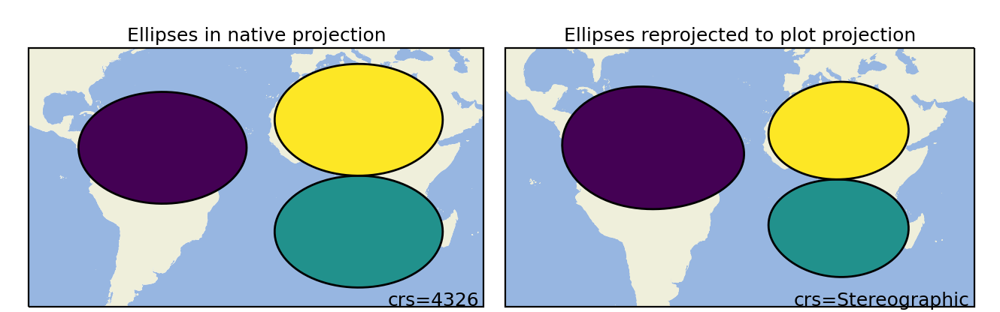

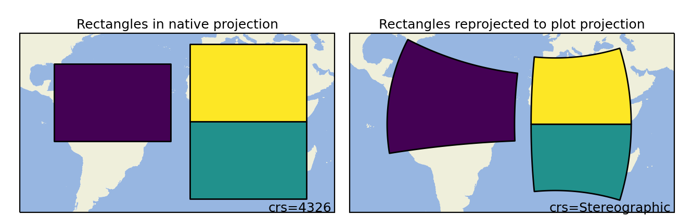

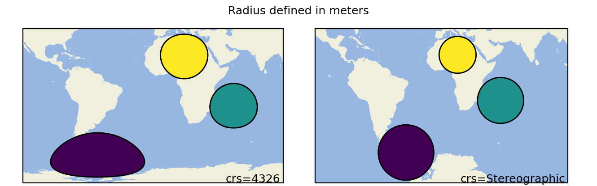

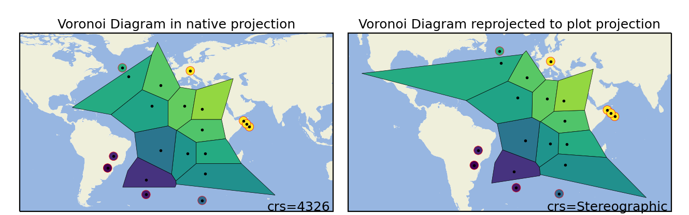

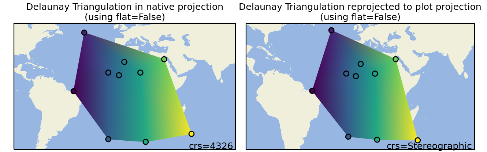

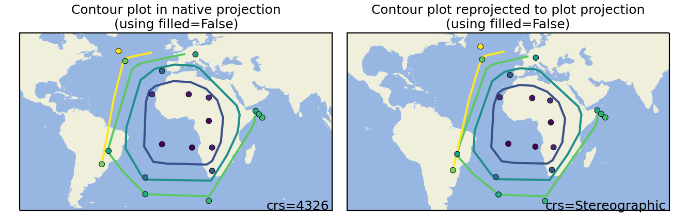

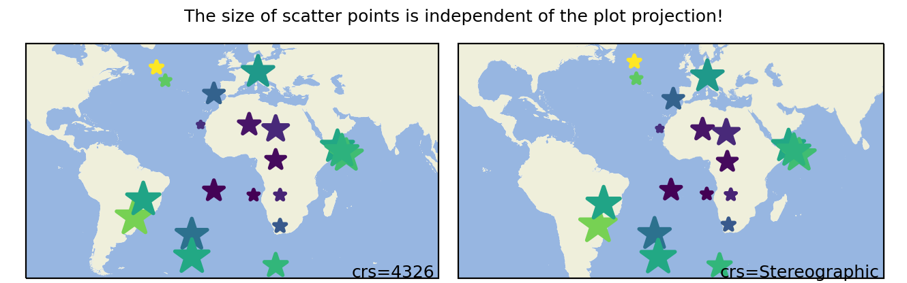

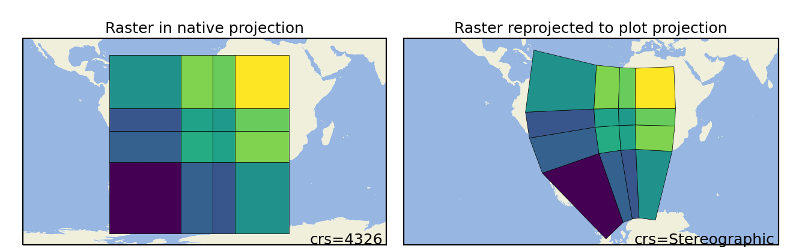

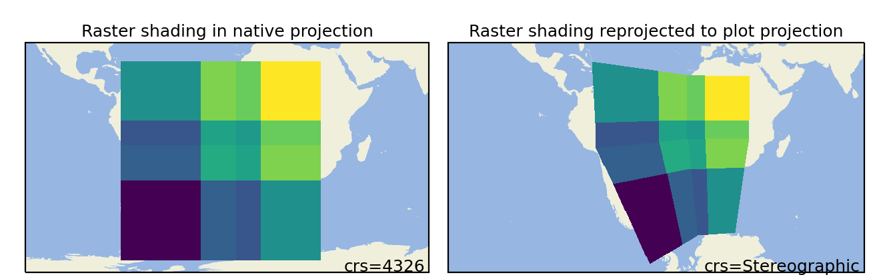

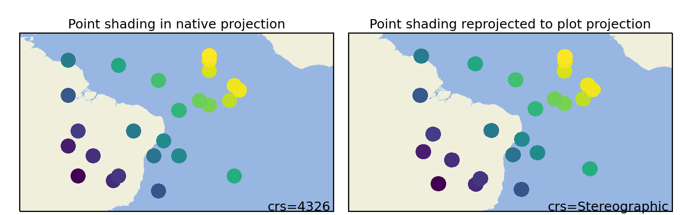

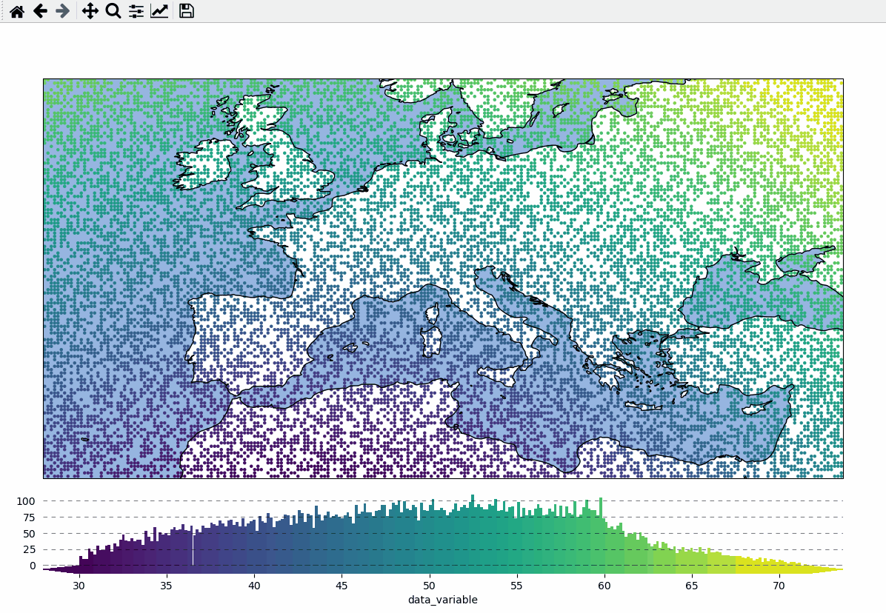

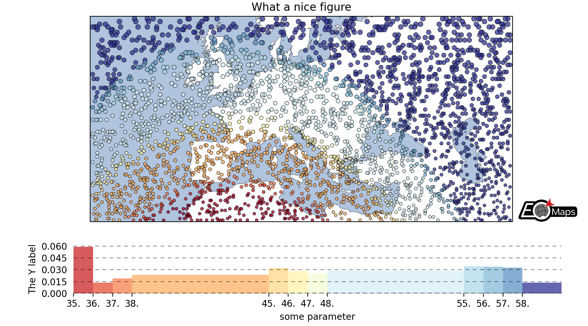

.. |eximg03| image:: _static/fig3.gif
   :width: 100%
   :align: middle
   :target: EOmaps_examples.html#ex-3

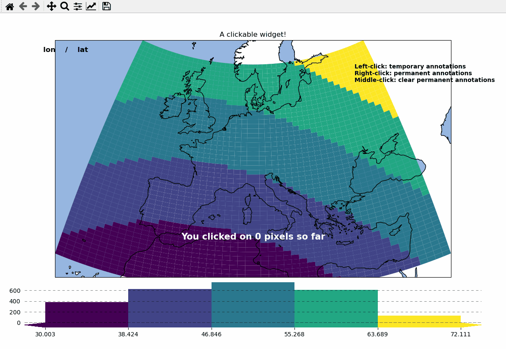

.. |eximg05| image:: _static/fig5.gif
   :width: 100%
   :align: middle
   :target: EOmaps_examples.html#ex-5

.. |eximg06| image:: _static/fig6.gif
   :width: 100%
   :align: middle
   :target: EOmaps_examples.html#ex-6

.. |eximg07| image:: _static/fig7.gif
   :width: 100%
   :align: middle
   :target: EOmaps_examples.html#ex-7

.. |eximg08| image:: _static/fig8.gif
   :width: 100%
   :align: middle
   :target: EOmaps_examples.html#ex-8

.. |eximg09| image:: _static/fig9.gif
   :width: 100%
   :align: middle
   :target: EOmaps_examples.html#ex-9

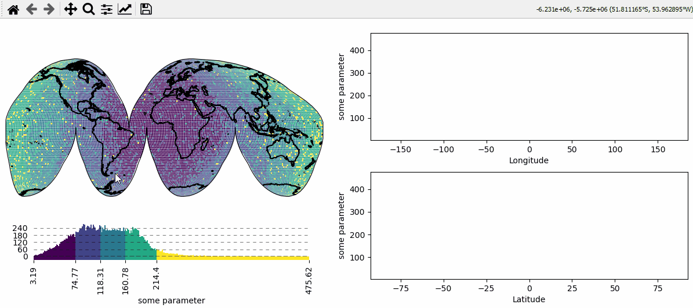

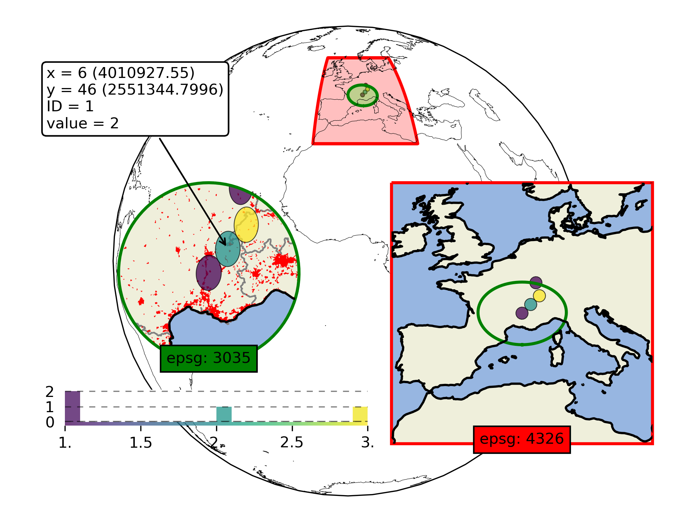

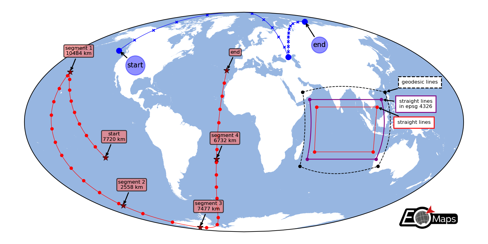

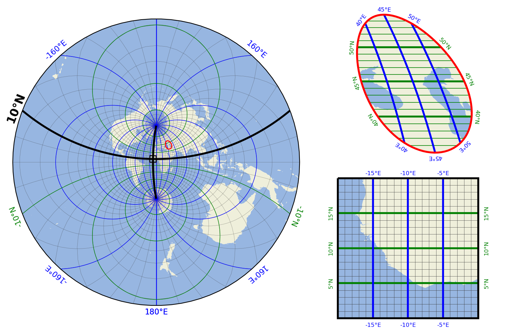

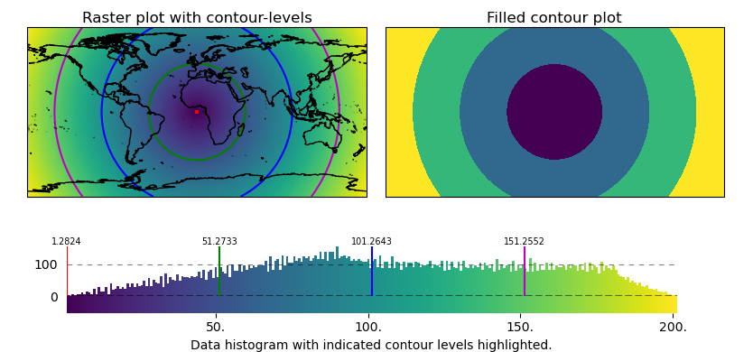

.. |eximg15| replace:: ...
